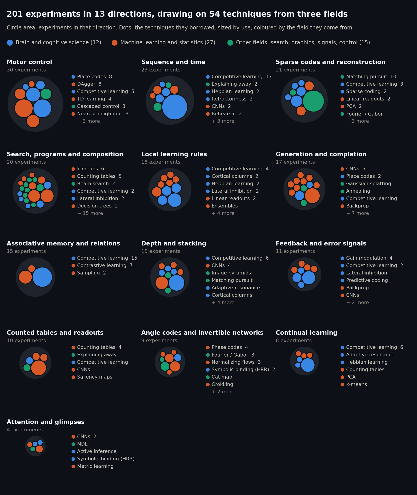

# Zenith

An exploration of learning algorithms. The questions behind them: can a system learn locally,
keep what it learned when new things arrive, and both recognise and generate from the same
memory? Every experiment keeps its code, its numbers and a written reading, including the ideas
that failed.

---

## What I found so far

- **Learning without forgetting works when only the winner learns.** Taught digits 0–4 and then
  5–9, a layer where only the winning group of templates learns kept the old digits at 0.9526
  (from 0.9757). A standard network trained the same way fell to 0.0000.
  [`2026_08_31/continual_fixed/`](experiments/2026_08_31/continual_fixed/)
- **Counting what wins did better than stacking layers.** One wide layer of 5x5 patch templates,
  read by counting which templates won for which digit, reaches 0.9730 on MNIST with nothing
  fitted, and 0.9869 with one linear map on top (0.8989 on Fashion-MNIST). Nothing stacked on
  top of it did better. A CNN still leads, at 0.9908.
  [`2026_09_01/stack/`](experiments/2026_09_01/stack/)
- **Top-down feedback did not help recognition.** In March the stack without feedback read MNIST
  better in all five feedback settings, and in August the line was tested again and closed.
  Feedback came back as a decoder learned from local mismatch, where it earns its place in
  drawing rather than naming. [`2026_03_20/`](experiments/2026_03_20/),
  [`2026_08_23/`](experiments/2026_08_23/), [`2026_09_26/`](experiments/2026_09_26/)
- **In control, a slow counted memory steering a fast reflex works; reward alone did not.** The
  cascade chases a target in 100 of 100 episodes. Learning a drone policy from reward alone
  left it worse than it started: success 0.000 after 8,000 episodes, against 0.942 for the
  teacher. [`2026_08_29/cascade/`](experiments/2026_08_29/cascade/),
  [`2026_08_31/drone_rl/`](experiments/2026_08_31/drone_rl/)
- **Recognition as a search for an explanation: promising, not yet ahead.** Causes built as trees
  of Gaussian splats, each keeping how far its parts may vary, name MNIST digits at 0.9593 with
  nothing fitted by gradient, and draw each digit from its label. That beats the same learning
  rule on raw pixels (0.9322) with an eighth of the numbers, but not keeping every training
  image (0.9666). [`2026_09_29/splat_causes/`](experiments/2026_09_29/splat_causes/)

## Directions

The chart above as a table. Worked and failed follow each experiment's own write-up; the rest
were mixed or exploratory.

| direction | experiments | worked | failed | techniques borrowed |
|---|---|---|---|---|
| Motor control | 30 | 9 | 13 | DAgger, Place codes, Competitive learning, TD learning, Cascaded control, Nearest neighbour, Cortical columns, Sparse coding, World models |
| Sequence and time | 23 | 11 | 5 | Competitive learning, Explaining away, CNNs, Hebbian learning, Refractoriness, Rehearsal, Ensembles, Matching pursuit, Place codes |
| Sparse codes and reconstruction | 21 | 10 | 3 | Matching pursuit, Competitive learning, Linear readouts, PCA, Sparse coding, Adaptive resonance, Cortical columns, Fourier / Gabor, Place codes |
| Search, programs and composition | 20 | 7 | 3 | k-means, Counting tables, Beam search, Competitive learning, Decision trees, DAgger, Lateral inhibition, Adaptive resonance, SOAR / Copycat, CNNs, EM, Gaussian splatting, Hashing, Hebbian learning, LRTA\*, Matching pursuit, MDL, Nearest neighbour, Pictorial structures, DreamCoder, Sparse coding |
| Local learning rules | 18 | 9 | 5 | Competitive learning, Cortical columns, Hebbian learning, Lateral inhibition, Linear readouts, Ensembles, LVQ, PCA, Quantization, Sampling |
| Generation and completion | 17 | 11 | 2 | CNNs, Place codes, Backprop, Competitive learning, Counting tables, Diffusion, Gaussian splatting, Linear readouts, PCA, Random projection, Rehearsal, Annealing, VAE |
| Associative memory and relations | 15 | 3 | 6 | Competitive learning, Contrastive learning, Sampling |
| Depth and stacking | 15 | 11 | 3 | Competitive learning, CNNs, Adaptive resonance, Cortical columns, Counting tables, Hebbian learning, Image pyramids, Matching pursuit, Rehearsal, k-means |
| Feedback and error signals | 11 | 6 | 3 | Gain modulation, Competitive learning, Backprop, CNNs, Lateral inhibition, LVQ, Predictive coding, Sampling |
| Counted tables and readouts | 10 | 5 | 2 | Counting tables, Explaining away, Competitive learning, CNNs, Saliency maps |
| Angle codes and invertible networks | 9 | 8 | 1 | Phase codes, Fourier / Gabor, Normalizing flows, Symbolic binding (HRR), Cat map, Grokking, Random projection, Self-supervised |
| Continual learning | 8 | 4 | 4 | Competitive learning, Adaptive resonance, Counting tables, Hebbian learning, PCA, k-means |
| Attention and glimpses | 4 | 2 | 0 | CNNs, Active inference, Metric learning, MDL, Symbolic binding (HRR) |

## The recurring building block

Many of the experiments share one unit. A layer is a set of stored patterns, called templates,
each a unit-length vector. Templates compete for every input, and only the winners move a
little toward what they saw. What an input is, what it looks like and what comes next are all
read back out of the same templates. These experiments use no loss function, no
backpropagation and no batches: inputs arrive one at a time, and learning something new should
not erase what was learned before. Other experiments set the unit aside to test a different
idea, such as networks made of angles trained with gradients, search over programs, or trees of
splats. CNNs and linear maps appear throughout as the baselines to beat.

## Best results

Test accuracy unless stated, with learning switched off while testing. Single-seed numbers are
marked. Every folder is under `experiments/`.

| Task | Result | How | Folder |
|---|---|---|---|
| MNIST | 0.9869 ± 0.0009 (3 seeds) | one wide layer of 5x5 patch templates, win counts kept per image position, one linear map on top | [`2026_09_01/stack/`](experiments/2026_09_01/stack/) |
| MNIST, nothing fitted | 0.9730 | the same layer, read only by counting which templates won for which digit | [`2026_09_01/`](experiments/2026_09_01/) |
| MNIST, small | 0.9492 with 103k parameters | two layers of competing templates, each passing on only which template won | [`2026_08_31/kmeans/`](experiments/2026_08_31/kmeans/) |
| MNIST, whole-digit templates | 0.946 (3 seeds) | one group of templates over image + label, step size set by how sure each template is | [`2026_09_03/purity_plasticity/`](experiments/2026_09_03/purity_plasticity/) |
| Fashion-MNIST | 0.8989 ± 0.0017 (3 seeds); linear model on pixels 0.8512 | as for MNIST | [`2026_09_01/stack/`](experiments/2026_09_01/stack/) |
| No forgetting: digits 0–4, then 5–9 | old digits 0.9757 → 0.9526 (a standard network: 0.9765 → 0.0000) | 40 groups of templates; only the winning group learns | [`2026_08_31/continual_fixed/`](experiments/2026_08_31/continual_fixed/) |
| Filling in a deleted slice of a curve | error 0.033 vs 0.149 for a standard network | a second layer over windows of the first layer's answers | [`2026_08_29/two_layer/`](experiments/2026_08_29/two_layer/) |
| Simulated drone, chasing a target | 100/100 episodes, teacher parity | a slow counted memory (10 Hz) steering a fast reflex (50 Hz) | [`2026_08_29/cascade/`](experiments/2026_08_29/cascade/) |
| Cart-pole swing-up | 87/100 (single run) | two-track pole rig, imitation of an energy-pumping teacher | [`2026_08_28/pole2track/`](experiments/2026_08_28/pole2track/) |
| MNIST, causes as trees of splats | 0.9593 (single run); same rule on pixels 0.9322 | whole-digit causes, each a tree of Gaussian splats with a spread per part, learned by counting | [`2026_09_29/splat_causes/`](experiments/2026_09_29/splat_causes/) |

## Day by day

The full log

Each day folder has a README indexing its experiments; each experiment folder has its scripts,
a README with the full writeup, and a `results/` folder.

**March — the AxonForge era.** Built as nodes in AxonForge, a personal node-graph tool.

- [**2026-03-16**](experiments/2026_03_16/) — The first learning rules for one layer on MNIST,
  ending in contrast-residual learning (0.917 MNIST, 0.826 Fashion with a linear readout).
- [**2026-03-19**](experiments/2026_03_19/) — Signed residual learning: every template takes
  part with its signed similarity, tracked for how dense the code becomes.
- [**2026-03-20**](experiments/2026_03_20/) — Top-down gain feedback in a two-layer stack; the
  stack without feedback read MNIST better in all five settings.
- [**2026-03-22**](experiments/2026_03_22/) — The label as an extra input row, read back from
  how the layer fills it in (0.77 with 100 templates, near chance with 500).
- [**2026-03-26**](experiments/2026_03_26/) — Competition as partial correlations: diverse
  templates, poor reconstruction (notes only).
- [**2026-03-28**](experiments/2026_03_28/) — Plain top-1: only the best-matching template
  learns, and no single template takes over (notes only).
- [**2026-03-29**](experiments/2026_03_29/) — The top-1 unit as a memory on synthetic sparse
  patterns: completion, generalisation, and a hidden permutation.

**August — rebuilding the unit, time and control.**

- [**2026-08-05**](experiments/2026_08_05/) — The hidden-permutation arc: recognising pairs
  does not turn into generating them, but giving each group of templates a local window nearly
  doubled generation.
- [**2026-08-23**](experiments/2026_08_23/) — Top-down feedback tested and closed; the unit
  rebuilt from patches into the consolidated unit, trained on the GPU, used on CelebA faces.
- [**2026-08-24**](experiments/2026_08_24/) — Sparse messages between layers, the top-layer
  memory, and a program of feedback experiments on the spatial rig.
- [**2026-08-26**](experiments/2026_08_26/) — Bits per weight, five rigs for learning over
  time, and first motor control (cart-pole, pole from angle only, a reaching arm).
- [**2026-08-27**](experiments/2026_08_27/) — Can the arrow of time come from completion up
  the layer stack instead of explicit "next" slots?
- [**2026-08-28**](experiments/2026_08_28/) — Reconstruction quality becomes the objective;
  a deep cart-pole swing-up and the first drone rigs.
- [**2026-08-29**](experiments/2026_08_29/) — Filling in a curve with one, two and
  convolutional layers; then the drone over time, up to the cascade that chases 100/100.
- [**2026-08-30**](experiments/2026_08_30/) — Templates that explain the input together:
  crisp rebuilds, meaningless templates, and what can still be built on them.
- [**2026-08-31**](experiments/2026_08_31/) — Competition (only the winner learns) is what
  creates identity; every representation has a readout it is good at.

**September — counting, search, and a second line of work.**

- [**2026-09-01**](experiments/2026_09_01/) — One wide layer plus counted tables is the best
  thing so far (0.9869 MNIST, 0.8989 Fashion), and nothing stacked on top beat it.
- [**2026-09-03**](experiments/2026_09_03/) — Which templates may move: forgetting, how much
  learning the templates is worth, and a drone that sees.
- [**2026-09-07**](experiments/2026_09_07/) — Olshausen & Field's sparse coding rerun on our
  patches, and why most of its templates die.
- [**2026-09-12**](experiments/2026_09_12/) — A sparse code that names the groups it finds,
  then groups of groups, by counting and search.
- [**2026-09-13**](experiments/2026_09_13/) — Search in place of backprop, settling in place
  of search; strokes appear when active cells share the input.
- [**2026-09-14**](experiments/2026_09_14/) — A theory-first reset, then a second layer as a
  counted belief network.
- [**2026-09-15**](experiments/2026_09_15/) — A machine that writes its own programs, learned
  by counting.
- [**2026-09-16**](experiments/2026_09_16/) — Start of a line imported from another project:
  a memory that looks at an image a little at a time (74.6% MNIST).
- [**2026-09-17**](experiments/2026_09_17/) — A library of parts built by counting alone.
- [**2026-09-18**](experiments/2026_09_18/) — Codes as angles moved by prediction error, and
  whether credit survives four levels.
- [**2026-09-20**](experiments/2026_09_20/) — What a layer of angle-coded units learns to
  measure, and a two-track build that reads MNIST at 92.4%.
- [**2026-09-21**](experiments/2026_09_21/) — Networks made of angles, trained with
  gradients: an exactly invertible network at 96.2% MNIST.
- [**2026-09-23**](experiments/2026_09_23/) — The basics again, in conversation: cortical
  layers, thalamic loops, bands and phases. Then a test of the idea that a level needs only a
  coarser image, not the level below. It lost to a CNN with everything else equal, and with
  one filter bank per scale it lost to raw pixels. Dropped.
- [**2026-09-26**](experiments/2026_09_26/) — Three days on reasoning as composition in
  time, attention as a window, and the feedback path as a decoder learned from local
  mismatch. Nine experiments: the decoder renders and imagines from a coarse grid but cannot
  invent the codes of parts it has not seen, and a painter that takes parts from memory and
  keeps what makes the whole read as the goal gives sharp, consistent faces, a faint mustache
  on a woman who stays a woman, and, with only lines and ovals, a drawing in the stack's own
  style.
- [**2026-09-27**](experiments/2026_09_27/) — Search in place of the stack, in conversation:
  a palette, the actions compose, store and substitute, values distributed along the path
  instead of weights. The flat test of two actions on full MNIST: naming pairs compressed the
  description and added nothing, and choosing a move per goal was beaten by applying the
  same move to every image. The search was not built.
- [**2026-09-29**](experiments/2026_09_29/) — From "fuzzy search" to a design in conversation:
  causes as trees of splats, each keeping how far its parts may vary, every choice priced as
  the cost of the explanation. Built on whole MNIST digits with nothing fitted by gradient:
  0.9593, beating the same learning rule on raw pixels by 2.7 points with an eighth of the
  numbers, below keeping every training image (0.9666). It also draws each digit from its
  label and fills in a hidden half, faintly.

---

## Notes

- This is a personal research log, not a library. Code is written to answer one question at a
  time and is not maintained afterwards.
- The folders were reorganised on 2026-09-23. Scripts that import code from another
  experiment folder may still point at the old layout, so some will not run as they are.
- The March node files (`learning*.py` and the helpers in `2026_03_16/shared_nodes/`) only ran
  inside AxonForge and are kept as a record. Most March scripts also read MNIST from
  AxonForge's data cache, which no longer exists.
- The 2026-09-16 to 09-21 scripts come from another project and read data from that
  project's layout. `torch` was added to the project on 2026-09-23.
- Trained weights and checkpoints (`*.npz`, `*.npy`, `*.pt`) are not in git. Datasets go in
  `data/` (`mnist/digits`, `mnist/fashion`, `celeba`, `cifar10`).
- `viewer.py` replays any trained drone or pole controller. `READING_LIST.md` gives the
  established names and papers for the ideas used here.
