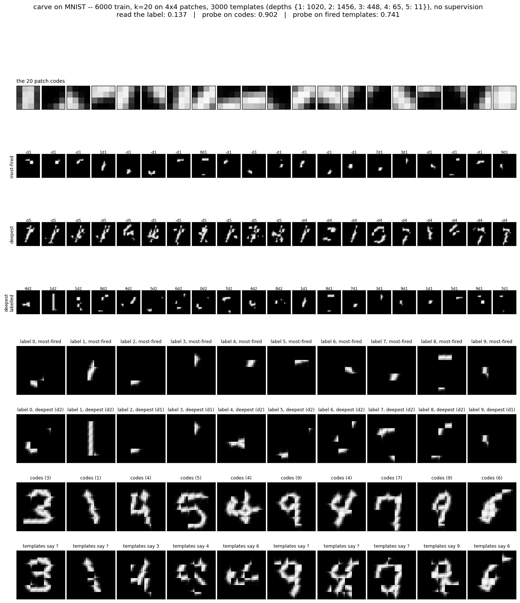

# Carve on MNIST, no supervision

2026-09-12. The carve engine from [`../carve`](../carve/README.md) on real
digits. Two runs, 6,000 train / 2,000 test: a first at 800 templates (2.5 min),
then 3,000 templates with depth reporting (15 min -- over budget, noted below).
The point was to see what the templates look like, not to get a number.



## The tower is real -- second run, 3,000 templates

```
templates by depth        {1: 1020,  2: 1456,  3: 448,  4: 65,  5: 11}
labelled ones by depth    {1: 121,   2: 11,    3: 0,    4: 0,   5: 0}
carved at round           {0: 684,   1: 1518,  2: 798}
```

Five levels. More templates at depth 2 than depth 1, and 76 at depths 4 and 5.
The `deepest` row of the board is the thing to look at: **the depth-4 and
depth-5 templates are whole digits** -- a 7, a 1, a 4, a 0, a 3 -- assembled
from named fragments of named fragments. Nobody told the engine there were
digits. It grouped what kept company, then grouped the groups, and at the
fourth grouping the things it was holding were digit-shaped.

That is what the design was for, and the first run couldn't show it because
the budget filled with fragments before anything could be grouped.

```
                             800 templates      3,000 templates
read the label                     0.155               0.137
probe on which templates fired     0.727               0.741
reconstruction error               0.072               0.062
templates firing per image           4.2                 5.9
```

Reconstruction improved -- row eight of the board now redraws most of each
digit, where the first run redrew scattered pieces. The fired-template probe
crept up. And reading the label got *worse*, which is the finding:

**The label never climbs.** 121 labelled templates at depth 1, 11 at depth 2,
none above. The template that recognises a whole 7 has no idea it is a 7; the
templates that know "7" are three-patch fragments that fire on 30% of images.
A label is a global property, and it can only join a clique locally -- with
the two or three patches it co-occurs with most. Once those patches are named,
the name climbs and the label stays at the bottom.

*Caveat on the 0.137:* the label was read from each fired template's **direct**
members only. A depth-5 template whose grandchild carries "7" did not vote for
7. That is a bug in the test, now fixed (`label_votes` expands all the way
down), but this run did not save its engine so it could not be re-scored.
The next run saves it. The number will move; the structural point -- labels
attach at depth 1--2 and the digit-shaped templates are unlabelled -- will not.

The run took 15 minutes against a 5-minute budget: 6.3 min to train, and 8
min to read 5,000 images for the probes at 3,000 templates. Next time: save
the engine, probe on fewer images.

---

## First run, 800 templates

## The setup

```
codes     k-means, k=20, on the 4x4 patches that have ink (98,677 of them),
          one dictionary for all 49 positions. A patch is ONE light:
          slot = position*20 + cluster. Blank patches emit nothing.
          -> about 16 lights per image, out of 980.
label     ten more lights, one-hot, in the same vector. Not a target.
engine    ../carve, with two changes: count every round rather than only the
          final vector (the absorbed-as-absent bug), and keep a fired count.
          800 templates, evidence bar 0.6, warm-up 1,000, min age 300.
```

No patches learned, no convolution, no gradient, no teacher. The label is just
something else that co-occurs.

## What the templates look like

**Small.** The 40 most-fired templates (rows two and three of the board) are
each two or three patches — a stroke fragment, a bend, two dots that tend to
appear together. Some carry a label (`1L`, `8L`, `9L`); most don't (`-L`).
None is a digit. None is even a whole stroke.

That is what the carve rule produces on this data, and it is not wrong. The
friendliest pair in any residual is two adjacent patches of the same stroke,
and the growth rule adds a third only if it keeps company with *both* at 70%
of that. A patch two steps down the stroke doesn't. So cliques are local, and
they are the smallest coherent thing — which is the minimum lump size, three.

What should have happened next is the upper level grouping fragments into
strokes and strokes into digits. It barely started:

```
800 templates:  644 from lights,  156 from templates,  63 contain a label
cap reached after ~2,000 inputs -- 1,000 past the warm-up
```

The budget filled with light-level fragments before the upper level had
material to work with, and with no pruning there is no way to recycle. Every
template after input 2,000 is frozen.

## The five tests

```
1  read the label from what fired      0.155   (30% of images got any label; 0.512 on those)
2  generate from a label               10/10 have a template to expand -- see row four
3  linear probe on the raw codes       0.902   the baseline
4  linear probe on which templates     0.727   (4.2 fire per image)
   fired
5  reconstruction from templates alone 0.072 mean error vs 0.130 for all-black
```

**Reading the label fails**, and for a structural reason. A label co-occurs
with *many* fragments across its class, so its friendship with any one small
pair is diluted — it is a global property being asked to join a local clique.
Sixty-three templates managed it; they fire on 30% of test images, and when
one does it is right about half the time. The label wants to be read at the
top of the tower, and the tower is one floor high.

**Generation from a label is a fragment.** Row four: "from label 8" is two
horizontal bars. The most-fired template containing that label expands to what
it is — two or three patches. The picture is honest about the vocabulary.

**The fragments carry class information collectively.** A linear probe on
which templates fired reaches 0.727 from 4.2 binary features per image, against
0.902 from the 16 raw codes. So the explanation is a lossy summary — four
fragments in place of sixteen codes — that keeps most of what separates the
classes. That is the one number here that says the templates are *about*
something.

**Reconstruction captures about half the ink.** Row six against row five: the
templates alone redraw the parts of each digit they have fragments for and
leave the rest black.

## What it says

The machine does on MNIST what it did on the toy world: finds the smallest
groups of things that keep company, then runs out of room. On the toy world
the smallest groups were the atoms, which was the answer. On digits the
smallest groups are three-patch fragments, which is a first floor and nothing
more.

Two things are binding, and they are the same two the toy world flagged:

**The budget.** 800 templates and no pruning means the vocabulary is whatever
got carved in the first thousand inputs. Either a much larger cap, or the
prune-by-contribution rule that `../carve` argued should fall out of the
objective and never implemented.

**The label is in the wrong place.** As a light in the clique it can only join
things it co-occurs with locally, and it co-occurs with nothing locally. It
should be read against the top of the tower — which is what the two-floor
version did, and what the project's own counted-table champion does.

## Files

```
mnist.py     the whole thing: codebook, encoding, engine, five tests, board
results/     board.png, summary.npz
```
