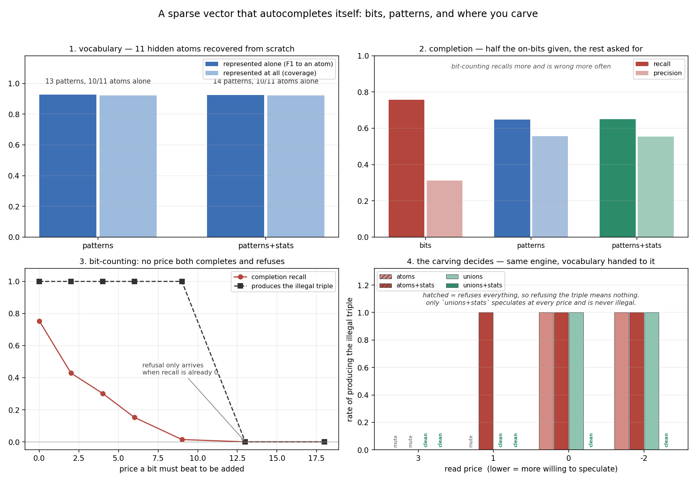
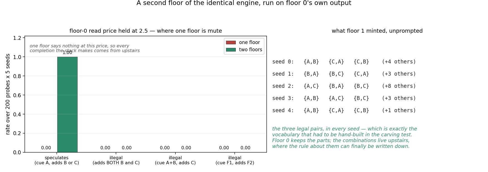

# A sparse vector that autocompletes itself

2026-09-12. No images, no convolution, no layers, no templates. One sparse
binary vector of 100 bits with known hidden structure, and two engines that
learn to fill in its missing half by counting.

The question behind it: **if you stop counting pairs of bits and start counting
pairs of *patterns*, what do you actually buy?** The argument for doing it was
that raising the unit of description lowers the order of statistics you need —
a constraint that is third-order over bits can be second-order over patterns.
This tests that, and the answer has a condition attached that was not part of
the argument.



---

## The world

Eleven hidden **atoms** of 6 bits each, scattered at random through a 100-bit
vector. A sample is the union of some atoms, then each atom bit is dropped with
probability 0.05 and two random bits are switched on. Roughly 24 bits on out of
100.

Three pieces of structure, each chosen to test something different:

```
triangle    A, B, C     arrive as a PAIR or not at all, never all three
                        every PAIR is positively correlated, only the TRIPLE is absent
                        -> third-order illegality

exclusion   F1, F2      never together
                        -> second-order illegality

ambiguity   G, H        share four of their six bits; G arrives with CTX1,
            CTX1,CTX2   H with CTX2. The shared bits cannot say which it is.
```

The triangle is the important one. It is built so a pair count over bits is
*actively tempted*: given A and B, every pairwise fact says C belongs.

## The engines

**`bits`** — the Hopfield-with-counts baseline from the notes. Count how often
each bit fires, how often each pair fires together, and store the popularity
correction `log [ P(i,j) / P(i)P(j) ]`. To complete: repeatedly add whichever
off-bit has the best summed evidence from the on-bits, until nothing clears the
price.

**`patterns`** — a vocabulary where **a pattern is a tally over bits**:
`cnt[P][i] / use[P]` is the probability bit *i* is on when pattern *P* is
active. Explaining a vector is greedy: add the pattern with the best gain until
nothing pays.

```
score(S) = Σ  log( P(i | S) / P(i) )        how well S accounts for the bits
         + Σ  log( co[P][Q]·T / use[P]use[Q] )    whether these patterns belong together
         − μ · |S|                          the price of using a pattern
```

Causes combine as a noisy-OR with the base rate as the leak, so an unexplained
bit scores exactly zero and every gain is measured against chance. Patterns are
updated by responsibility — for a noisy-OR, given the bit is on,
`P(this pattern fired) = p / q` — so two patterns can both be responsible and
the shares do not sum to one.

**`patterns+stats`** — the same, with the `co[P][Q]` term switched on. This is
the only difference between the two pattern arms.

New patterns are minted from whatever no pattern claims, and the lump is carved
using the bit-level table: start from the strongest pair in the residual, add
the bit with the best average evidence against everything already in, stop when
that falls below `tau` of the seed. **That is the only place the two levels
touch** — level 0 tells level 1 which bits belong in the same thing.

8000 training vectors, 5 seeds, μ = 3. About 4 seconds per seed.

---

## 1. Vocabulary — it finds the atoms

```
                alone F1   alone/11   coverage   patterns
patterns           0.926       10.0      0.921       12.8
patterns+stats     0.925       10.0      0.921       13.6
```

Per atom, seed 0: **A, B, C, F1, F2, F3, F4 all at F1 = 1.00** — recovered
exactly, alone, from scratch. Only G, H and their contexts fall short (0.73,
0.77), which is honest: G and H genuinely share four bits, so no carving can
give both of them a clean private pattern.

At μ = 5 all 11 come out alone, at the cost of completion. Nothing here is
delicate.

## 2. Completion — neither engine dominates

```
                 recall   precision
bits              0.757       0.312
patterns          0.648       0.556
patterns+stats    0.651       0.555
```

Bit-counting recalls more and is wrong twice as often. Reading a vector through
a vocabulary makes it conservative: it adds what a pattern vouches for and
little else.

## 3. Exclusion — pair counts handle second-order illegality

Cue F1, ask for a completion: **F2 appears 0.000 of the time in every arm**,
including the bit baseline. Two things that never co-occur have a strongly
negative pair count, and that is enough. No level-raising required.

## 4. Triangle — and this is where it gets interesting

Cue A and B, ask for a completion:

```
                 produces C
bits                  1.000
patterns              0.000
patterns+stats        0.000
```

Which looks like the level-raising argument confirmed. It is not, and the check
that catches it is asking whether the engine ever adds anything *at all* on the
strength of company:

```
                 adds one of B,C given A alone
bits                                    1.000
patterns                                0.000
patterns+stats                          0.000
```

**The pattern engine refuses the illegal triple by refusing everything.** It
never adds a pattern that explains no observed bit, so of course it never adds
the third one. That is not a learned constraint, it is silence.

Sweeping the read price — how much a pattern must be worth before it is added
on company alone — shows there is no setting in between:

```
arm               mu_read   speculates   produces illegal triple
patterns              3.0        0.000                     0.000
patterns              1.0        0.000                     0.000
patterns              0.0        1.000                     1.000
patterns             -2.0        1.000                     1.000
patterns+stats        1.0        1.000                     1.000
patterns+stats        0.0        1.000                     1.000
```

Two regimes, mute or illegal, and nothing between them. The pattern-pair
statistics shift the threshold and change nothing else.

And the baseline is in exactly the same position — there is no bit price that
both completes and refuses:

```
price    recall   precision   illegal triple
  0.0     0.754       0.288            1.000
  4.0     0.302       0.846            1.000
  9.0     0.014       0.974            1.000
 13.0     0.000       1.000            0.000     <- refusal arrives with recall already at zero
```

---

## The carving test — what was actually wrong with the argument

The reason is visible once you look at what the vocabulary carved. It learned
**A, B and C as three separate patterns**. And over those three patterns, every
pair occurs and only the triple is absent — the triangle is *still third-order
one level up*. Nothing was gained by raising the level, because the level was
raised to the wrong thing.

The claim needs its condition. So: hand the engine a vocabulary instead of
letting it find one, change only where it carves, and change nothing else.

```
atoms     A, B, C as three patterns          triangle stays third-order
unions    A+B, B+C, A+C as three patterns    triangle becomes second-order
```

Rate of producing the illegal triple, 3 seeds:

```
vocabulary      mu_read=3   mu_read=1   mu_read=0   mu_read=-2
atoms               mute        mute        1.00         1.00
atoms+stats         mute        1.00        1.00         1.00
unions              1.00*       1.00*       1.00         1.00
unions+stats        1.00*       1.00*       1.00*        1.00*

 * speculates (adds one of B,C given A alone) and NEVER produces the triple
   mute = refuses everything, so refusing the triple means nothing
```

**`unions+stats` is the only cell that works, and it works at every price.** It
fills in a legal partner from a single cue, every time, and never once produces
the combination that does not exist. Take the pattern-pair statistics away and
the same vocabulary breaks as soon as the price drops to 0. Keep the statistics
and carve at the atoms instead, and no price works at all.

So both halves are load-bearing, and the carving is the half nobody was
watching:

> Raising the unit of description does lower the order of the statistics you
> need — **but only if the vocabulary carves at the legal combinations rather
> than at the parts.** And the price term, which is what makes the vocabulary
> economical and makes it find the atoms, pushes in exactly the opposite
> direction.

Nine patterns of 12 bits (the unions) against eleven of 6 (the atoms) is the
cheaper description by the count that this engine minimises, and it is the one
that cannot hold the constraint. The engine is optimising for the wrong thing,
and it is optimising for it correctly.

---

## Three bugs worth recording, because each was a real design error

**The prior on a young pattern.** A freshly minted pattern with `alpha = 0.5`
and `use = 1` claims probability 0.25 on every one of the ~100 bits it has
never seen. Its penalty for predicting ~76 absent bits then buries it before it
can ever be picked a second time. Frequent atoms were being minted and pruned
over and over — F1 alone was minted 223 times in one run and never survived.
Fixed by `alpha_p = 0.05` and minting with weight 3.

**The residual test.** Deciding "which bits are still unexplained" from the
noisy-OR including the base-rate leak means a bit that is merely *common* counts
as explained. Filler atoms with a base rate of 0.57 were never in any residual,
so they never got a pattern. The residual has to ask what the *patterns* claim,
ignoring the leak.

**The responsibility split.** Dividing each on-bit between the active patterns
proportionally, with the base rate taking a share, drives a pattern's
probability to `1 − base` rather than to 1. Common bits ended up below every
threshold and patterns came out with empty supports. The noisy-OR posterior
`p / q` is the correct one and causes need not sum to one.

A fourth, less interesting: without a "you already have a name for this" check
at mint time, a dropped bit makes the right pattern lose a round and a duplicate
gets created — 80 patterns for 11 atoms, mostly near-copies of F1 to F4.

## What this says about where to go

The statistics were never the problem. Pair counts over patterns work, and work
robustly, *given* the right units. The open problem is entirely **how the
vocabulary decides what a thing is** — and the pressure currently doing that job
is a description-length price that provably prefers the carving which cannot
express the constraint.

Which is a sharper question than the one this started with, and it is not a
question about counting.

---

## A second floor — and the hand-built vocabulary mints itself

The carving test above ends on a hand-built vocabulary, which is unsatisfying:
somebody had to know the answer. So: run the **identical engine** on floor 0's
own output and see what it does.

The message between floors needs no design. Floor 0's explanation of a panel —
*which patterns it used* — is already a sparse on/off vector, over patterns
instead of bulbs. Feed it to the same class. Nothing else changes.



**Floor 1 mints the unions unprompted, in every seed.**

```
seed 0    {A,B}  {C,A}  {C,B}        (+4 others)
seed 1    {B,A}  {B,C}  {C,A}        (+3 others)
seed 2    {A,C}  {B,A}  {B,C}        (+8 others)
seed 3    {A,B}  {A,C}  {B,C}        (+3 others)
seed 4    {A,B}  {C,A}  {C,B}        (+1 others)
```

Those three are exactly the lumps that had to be supplied by hand. Nobody told
it that A and B go together — it counted which floor-0 patterns keep company,
by the same arithmetic floor 0 uses on bulbs.

### Reading goes up, then down

Floor 0 explains what it can see. That set is lifted to floor 1, which explains
*it*. Floor 1 then says which floor-0 patterns it expects, and floor 0 is read
again with that expectation added as a bonus — in the same currency both floors
already use, surprise against chance.

One rule matters, and getting it wrong wasted the first attempt: **floor 0 never
speculates.** Its price is held fixed across both passes, so the only thing that
can admit a pattern with no bulbs of its own is the floor above vouching for it.
When I instead let floor 0 lower its own price, it invented the illegal triple
before floor 1 ever saw the panel, and floor 1 spent its time explaining an
already-broken reading.

That also fixes the operating point. Floor 0 reads at price 2.5, where **a single
floor is mute** — so every completion the stack makes is demonstrably coming from
upstairs.

```
                 speculates   adds BOTH B,C   cue A+B adds C   cue F1 adds F2
one floor              0.00            0.00             0.00             0.00
two floors             1.00            0.00             0.00             0.00
```

5 seeds, 200 probes each. Cue A alone and it supplies a partner every time. Cue
A and B and it adds nothing, because the one floor-1 pattern that explains them
predicts nothing else. The illegal triple never appears, at the price where the
single floor could not have produced anything at all.

**So the parts stay downstairs where they are economical, and the combinations
live upstairs where the rule about them can be written as a fact between two
things.** The recursion is not decoration — it is the repair for the failure in
the section above, and it needed no new machinery, only the same engine pointed
at its own output.

### Two caveats, both real

**Handing floor 0 a perfect vocabulary makes it worse, not better.** With the
eleven atoms supplied, floor 1 fails to mint the unions in 1 seed of 5 and the
stack then fails exactly as one floor does (illegal 0.20 averaged, 1.00 on that
seed). The failure is in floor 1's *minting*, not in the reading — when the
unions are there the read is perfect, and when they are not it is not. Nothing
about the up-down loop is fragile; the carving still is.

**The carve rule needed an absolute floor, and only upstairs.** Requiring merely
that the seed pair be better than nothing means two *independent* things alone
in a residual become a pattern — floor 1 was minting junk like `{A, G}` from
blocks that have nothing to do with each other. Requiring real company fixes it.
But the same floor is harmful downstairs, where genuine atoms can have modest
internal evidence (the filler atoms here sit at 0.49), so it is off at floor 0
and on at floor 1. A threshold that is right at one level is wrong at another,
which is worth knowing before stacking a third.

## Files

```
world.py     the 100-bit world and its three pieces of structure
engines.py   BitTally (pairs of bits) and PatternEngine (patterns, pairs of patterns)
run.py       the four checks, both price sweeps, and the carving test
stack.py     two floors of the identical engine, and the up-then-down read
stack_run.py the second-floor experiment
figs.py      results/board.png
figs_stack.py results/stack.png
```
