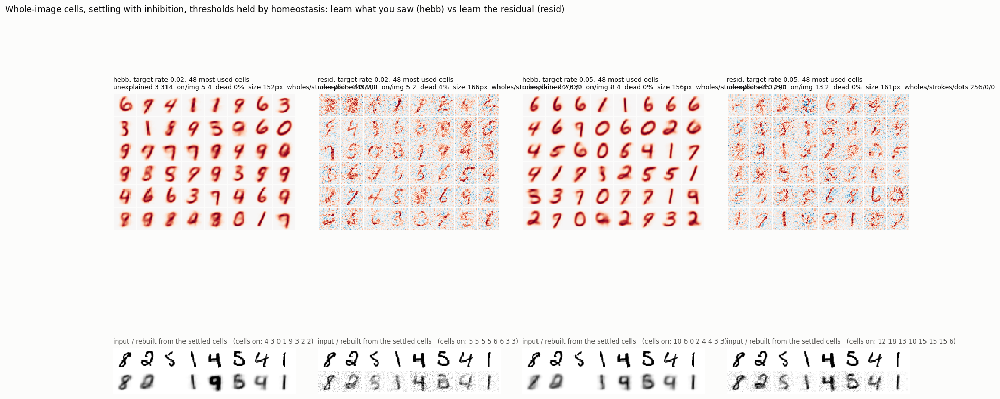
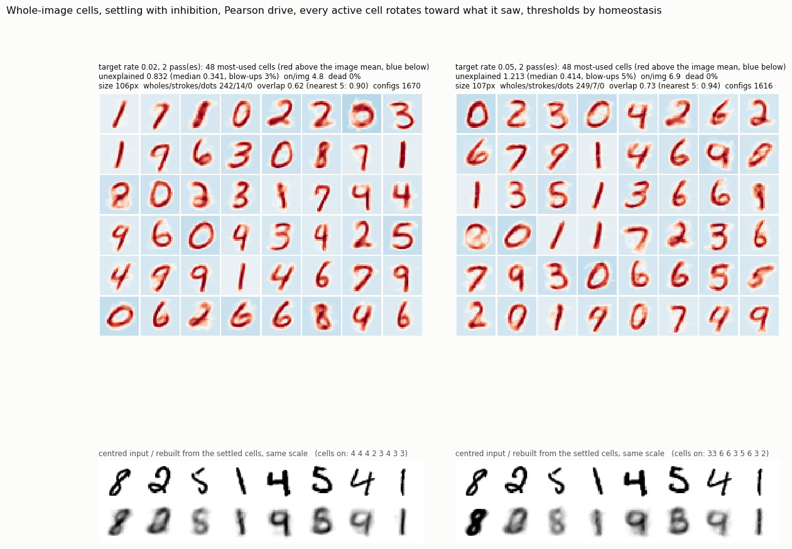
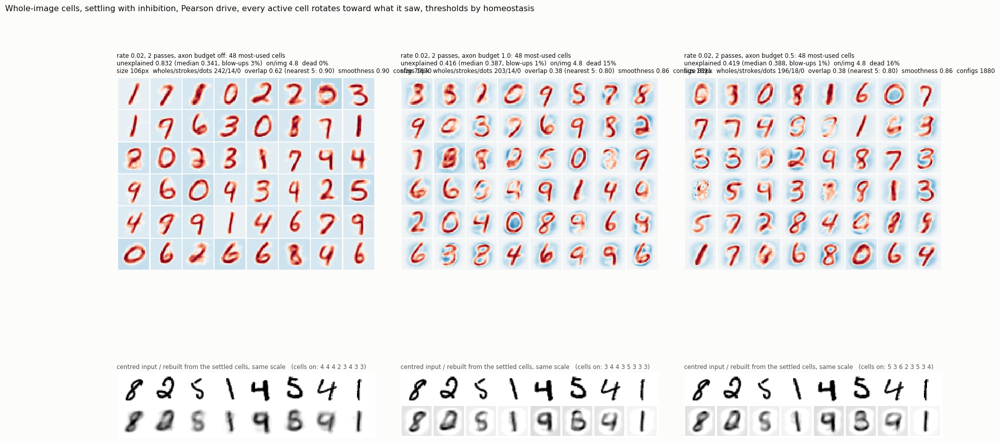
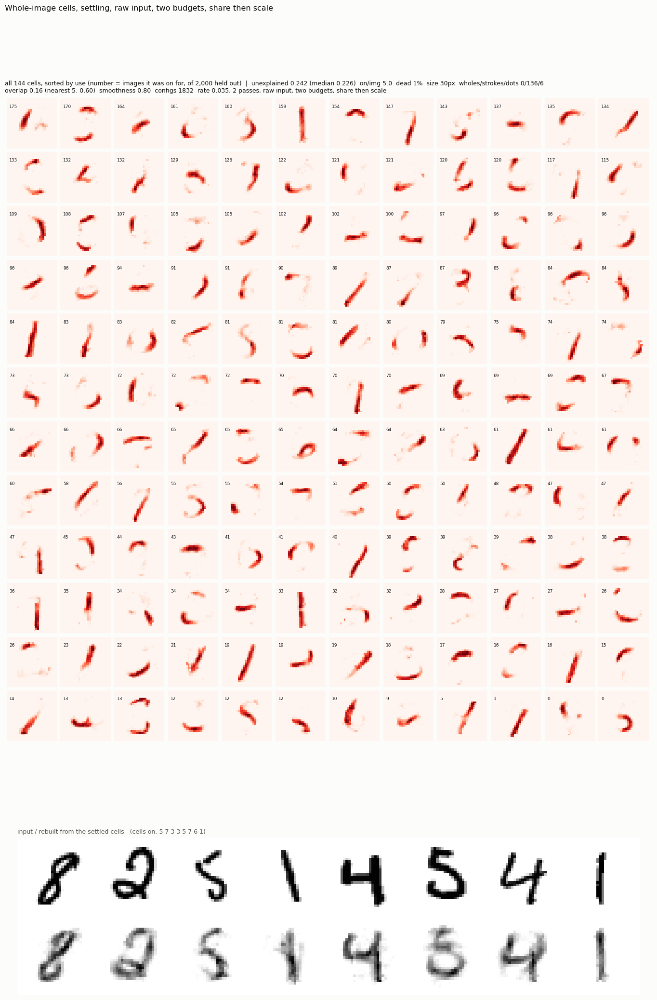
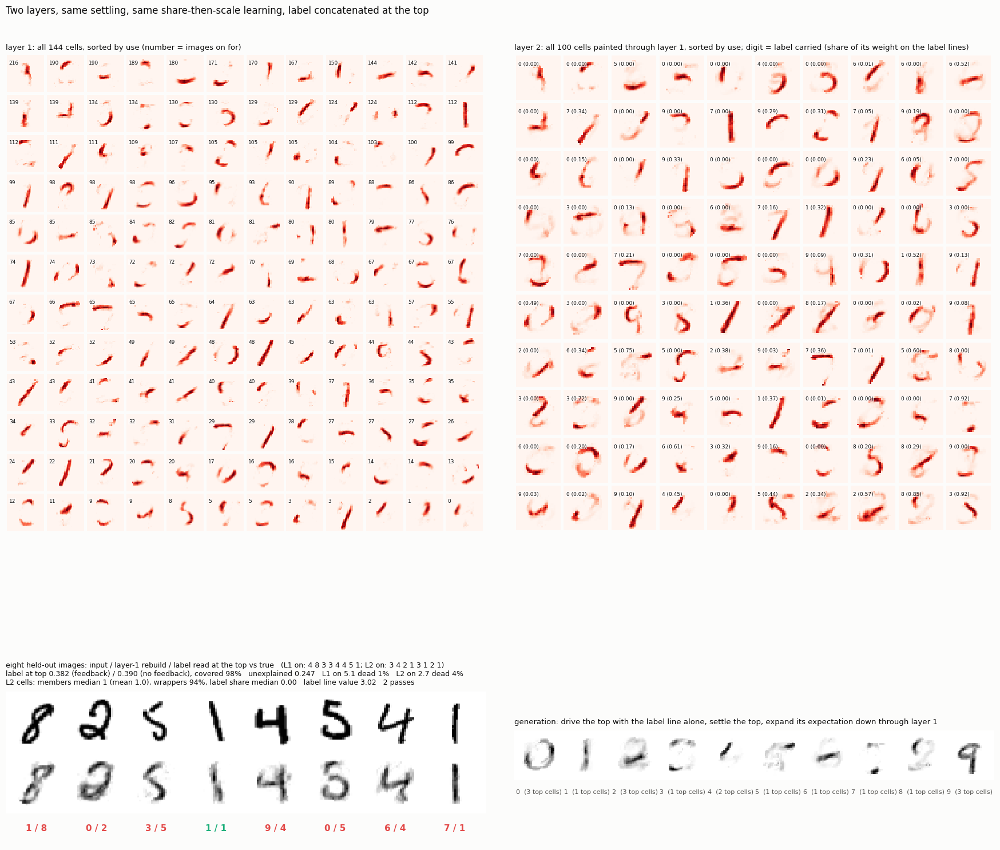

# Whole-image cells, settling, learn what you saw

2026-09-13, night. The proposal: same settling, cells over the whole image, no
residual anywhere; after settling, each active cell moves toward the input it
fired on, in proportion to its activity, weights held at unit norm. No price:
each cell holds its own threshold to a target firing rate. The residual rule
runs beside it under identical settling. Two target rates. From random
weights, one pass over 8,000 images, scored on 2,000 held out. Three seconds
per run.



```
                       unexplained   on/img   dead   size px   wholes/strokes/dots   overlap between cells
hebb, rate 0.02           3.314        5.4     0%     152        249 /  7 / 0        0.79 mean, 0.95 to the 5 nearest
hebb, rate 0.05           2.632        8.4     0%     156        251 /  5 / 0
resid, rate 0.02          0.408        5.2     4%     166        247 /  0 / 0        0.17 mean, 0.37 to the 5 nearest
resid, rate 0.05          0.294       13.2     0%     161        256 /  0 / 0
```

**Learning what you saw gives whole digits, clean ones, and nothing else.**
The Hebbian cells are the best-looking prototypes of the day: every one a
complete digit, 249 of 256 over sixty pixels. That is the prediction from
this morning, and it holds under settling with inhibition exactly as under
the beam: a cell that learns the whole input it fired on becomes the average
of the images it fires on, which is a digit.

**And the settling then breaks on them.** Whole digits overlap heavily in
pixel space, 0.79 on average and 0.95 between a cell and its nearest five.
Inhibition proportional to overlap cannot separate cells that are 95 percent
the same, and the dynamics with 256 such cells are unstable: activities thrash
on some images, others end with no cell on at all, and the unexplained energy
averages 3.3 times the input's, which is not a rebuild but a blow-up. On the
eight held-out images the rebuilds that did settle are a wrong prototype
(the 2 rebuilt as a 0, the 4 as a 9) or blank. Inhibition separates cells
that are different; it cannot make near-duplicates different.

**The residual rule gives noisy wholes with a passable rebuild.** From random
weights and a newborn learning rate the first update makes each cell a whole
residual, and the slow refinement after that cannot break a whole into parts.
Unexplained 0.29 to 0.41, rebuilds recognisable, templates speckled with
negative weight. Parts under this rule need many more active cells and a
small steady rate over many passes, the sparse-coding regime, and one pass at
count-based rates is not that regime.

## What this settles

With cells that see the whole image, neither rule produces parts. Learning
what you saw makes prototypes that are too alike for inhibition to tell
apart. Learning the residual makes noisy prototypes. The neuron-level answer
to both is the one anatomy gives: a cell does not see the whole image. With
limited windows, wholes cannot form, overlap between cells in different
windows is zero, so the settling is stable by construction, and the layer
above composes because that is all it can reach.

## Files

```
hebb.py     python hebb.py <hebb|resid> <target rate>
board.py    the figure
results/    board.png, <rule>_r<rate>.json / .npz, logs
```

---

## Same cells, Pearson drive, geodesic rotation

The user's requested version: inputs and templates mean-centred and unit
length, so a cell's drive is a Pearson correlation; every cell that settles
on rotates toward what it saw by the angle η times its correlation, on the
unit sphere (the reference unit's rotation, applied to every active cell,
no winner picked); thresholds by homeostasis; two passes. No residual, no
windows, no adoption.



```
                     unexplained mean / median   blow-ups   on/img   size px   wholes/strokes/dots   overlap mean / nearest 5   configs
rate 0.02, 2 passes       0.832 / 0.341            3%        4.8      106        242 / 14 / 0          0.62 / 0.91            1670
rate 0.05, 2 passes       1.213 / 0.414            5%        6.9      107        249 /  7 / 0          0.73 / 0.94            1616
```

Centring removed the shared blob and the overlap between cells fell from
0.79 to 0.62, but the cells are still whole digits, each still 0.9 correlated
with its five nearest, and the settling still blows up on a few percent of
images, which is what drags the mean unexplained above the median. The
typical image is rebuilt with a third to two fifths of its centred energy
left over from five wholes. Pearson and rotation did not change what
whole-image cells learn when every active cell learns the whole input: the
average of the images it fires on, which is a digit.

## Files added

```
pearson.py         python pearson.py <target rate> [passes]
pearson_board.py   the figure
```

---

## Same cells, plus a shared budget per input line

Every axon has a bounded total weight across all 256 cells, proportional to
how often its pixel carries ink. After each learning step, columns over
their budget are scaled down proportionally (share and divide, never a hard
assignment), then rows back to unit length, twice. Rate 0.02, two passes.



```
                       unexplained mean / median   blow-ups   dead   size px   wholes/strokes   overlap mean / nearest 5   smoothness
budget off                  0.832 / 0.341            3%        0%     106        242 / 14          0.62 / 0.91            0.90
budget, full share          0.416 / 0.387            1%       15%      79        203 / 14          0.38 / 0.80            0.86
budget, half share          0.419 / 0.388            1%       16%      81        196 / 18          0.38 / 0.80            0.86
```

**No dither.** The user's prediction held: dividing a synapse proportionally,
rather than assigning it, keeps the templates continuous. Lag-1 smoothness
stays at 0.86 against 0.90 without the budget, and the tiles are clean digits
with a negative surround, not speckle. Dither came from per-pixel decisions;
proportional sharing is not a decision.

**The overlap halved and the settling stopped breaking.** Mean overlap 0.62
to 0.38, blow-ups 3% to 1%, mean unexplained 0.83 to 0.42. The budget moved
weight off the pixels every cell was using into contrast around the strokes,
which is what makes the cells separable enough for inhibition to work.

**Still wholes.** 203 of 220 live cells over sixty pixels. The budget made the
digits thinner and sharper and gave them surrounds; it did not divide them
into strokes. The lesson each cell receives is still the whole image, and a
shared budget limits how much of it a cell can hold, not which piece.

**The budget scale does not matter, only its profile.** Half share and full
share are the same run to three decimals, because scaling every column by
the same factor is undone by the row normalisation that follows. What acts is
the shape of the budget across pixels, proportional to ink frequency, which
pushes weight from over-used pixels to under-used ones. Fifteen percent of
cells go dead under it, which the homeostasis did not recover in two passes.

## Files added

```
pearson.py   now takes a third argument, the budget scale: python pearson.py 0.02 2 1.0
```

---

## 144 cells, and the budget with a division tilt

Same base with the shared axon budget, 144 cells, rate 0.035 (about five
on per image), two passes. When a pixel's column is scaled to its budget,
each cell's share goes to weight^(1+ε), sign kept, so the heavier user of a
pixel slowly takes more of it. ε = 0 is proportional sharing. All 144 cells
are drawn for every run in `results/all_pearson_r0.035_b1_h144*.png`.

```
tilt ε     unexplained median   on/img   dead   size px   wholes/strokes/dots   overlap mean / nearest 5   smoothness
0              0.398             4.7      7%      82        123 /  11 /  0         0.40 / 0.77             0.86
0.003          0.394             4.4      8%      81        121 /  12 /  0         0.40 / 0.77             0.87
0.01           0.389             4.8      6%      78        122 /  13 /  0         0.39 / 0.77             0.86
0.03           0.385             4.9      5%      69         92 /  43 /  2         0.36 / 0.74             0.86
0.1            0.625             6.1     30%       2         10 /   1 / 90         0.02 / 0.18             0.01
```

**The tilt goes from wholes to dots without passing through strokes.** Up
to 0.01 it does nothing the pull toward shared whole images does not undo.
At 0.03 the digits thin, a third of the cells drop under sixty pixels, but
they are thinner or partial digits, not strokes, and two cells have already
collapsed to a handful of scattered pixels. At 0.1 ninety cells are single
pixels, smoothness is gone, a third are dead, and the explanation is worse
than with no cells dividing at all. There is no setting in between where a
cell holds a contiguous piece. Once a cell starts losing pixels, the row
normalisation amplifies what it keeps, which wins more, and it runs to a
few pixels. Nothing in a per-pixel division prefers neighbours to stay
together, so the stable points are "all of it" and "almost none of it".

Continuity survived exactly as long as the division was not happening.

---

## Raw input, two budgets, share the input then scale the weights

The user's design, built as stated. Pixels as they are, no centring, no unit
length, no rotation, no residual. Weights nonnegative. Each template's total
weight may not exceed 1. Each pixel's total weight across all templates may
not exceed its share of the total mass, in proportion to how often it
carries ink. After settling, each pixel of the input is divided among the
cells that are on in proportion to their claim on it (activity times
weight); each active cell moves toward the average share it received; then
rows and columns are scaled back to their budgets, twice. Settling reads
with each template's direction. 144 cells, rate 0.035, two passes.



```
unexplained (best-scale)   0.242 (median 0.226)     the best explanation of the day
cells on per image           5.0
dead                         1%
template size               30 px
wholes / strokes / dots     0 / 136 / 6
overlap, mean / nearest 5   0.16 / 0.60
smoothness                  0.80
distinct configurations     1832 of 2000
```

**Every cell is a stroke.** Arcs, bars, diagonals, hooks, the tail of a 2,
the bowl of a 6, the top of a 7: 136 of 142 live cells between 20 and 60
pixels, none over 60, and continuous, smoothness 0.80. The eight held-out
images are rebuilt from three to seven strokes each and every one is
legible, including the 4s and the 5 that every whole-digit vocabulary today
got wrong. Unexplained energy 0.24 against 0.39 for the best whole-digit
run.

**Why this worked where dividing the weights did not.** What is shared here
is the input, not the weights. A cell's lesson is the piece of the actual
image its claim covers, and a piece of a continuous image is continuous, so
the lesson is continuous and the cell stays continuous. The row budget makes
a cell that spreads over many pixels weak on each of them, so it loses its
share of every pixel to a cell that concentrates; concentration pays. The
pixel budget stops every cell from concentrating on the same ink. And the
settling needs about five cells to account for the image, so a cell that
shrinks to a dot explains too little to clear its threshold and stops being
selected. Between those pressures the stable size is a stroke. Nothing said
"part", nothing said "local", nothing was picked, and no cell saw a
leftover.

**Two choices of mine, stated.** The settling reads with each template's
direction, unit length, so that the inhibition stays a cosine and the
dynamics stay stable; the budgets act on the stored weights only. The
per-pixel budget follows the ink-frequency profile, as in the earlier
budget run. One seed.

## Files added

```
share.py     python share.py <target rate> [passes] [H]
all_board.py draws every cell of a run, sorted by use
```

---

## Two layers of it, label concatenated at the top

`tower2.py` (since moved to [`../share_tower/`](../share_tower/README.md) as `tower.py`). Layer 1 as above (144 cells). Layer 2: 100 cells over
[144 layer-1 activities ; 10 label lines], the label line valued at the
running mean active layer-1 activity so it counts as one more active unit,
present in training and absent at read time (top cells then read with the
direction of their identity part). Both layers settle together with the
top's expectation as extra drive on layer 1; both learn by share-then-scale
online. Label read from the top only. Generation: drive the top with the
label line alone, settle, expand down through layer 1. Two passes, 23 s.



```
label read at the top        0.382 (feedback) / 0.390 (no feedback), 98% of images covered
unexplained (layer 1)        0.25
layer 1                      5.1 on per image, 1% dead, all strokes
layer 2                      2.7 on per image, 4% dead, members median 1, wrappers 94%, label share median 0.00
```

**Layer 2 is wrappers, by the very mechanism that made layer 1 strokes.**
The rule hands a cell a piece of its input and rewards concentration. At
layer 1 the input is a continuous image, so the smallest piece that still
clears a threshold is a stroke. At layer 2 the input is a vector of
activities with no continuity between lines, so the smallest piece is one
line, and one line is enough: a layer-1 unit fires on about 3.5 percent of
images, the layer-2 target rate was 3 percent, so a cell that copies one
unit meets its rate target exactly and never needs a second member. The
label line is one of 154 and almost no cell concentrates on it; the few
that do (bottom rows, label share 0.3 to 0.9) are label-only cells that are
rarely on when the label is absent. Hence 0.38 at the top, and generations
that are one or two strokes per digit.

**The lever this points at.** A cell becomes a conjunction only when it is
rarer than any of its inputs, so that no single input line can clear its
threshold. Layer 1 cells are rarer than pixels, so they combine pixels.
Layer 2 cells were as common as layer-1 cells, so they copied them. The
layer-2 target rate has to sit well below the layer-1 rate. Not run.

## Files added

(Both since moved to `../share_tower/`: `tower2.py` is now `tower.py`, the board
is `board.py`, and the results are in `../share_tower/results/`.)

```
tower2.py         python tower2.py [passes]
tower2_board.py   both layers, held-out reads, generations
```
