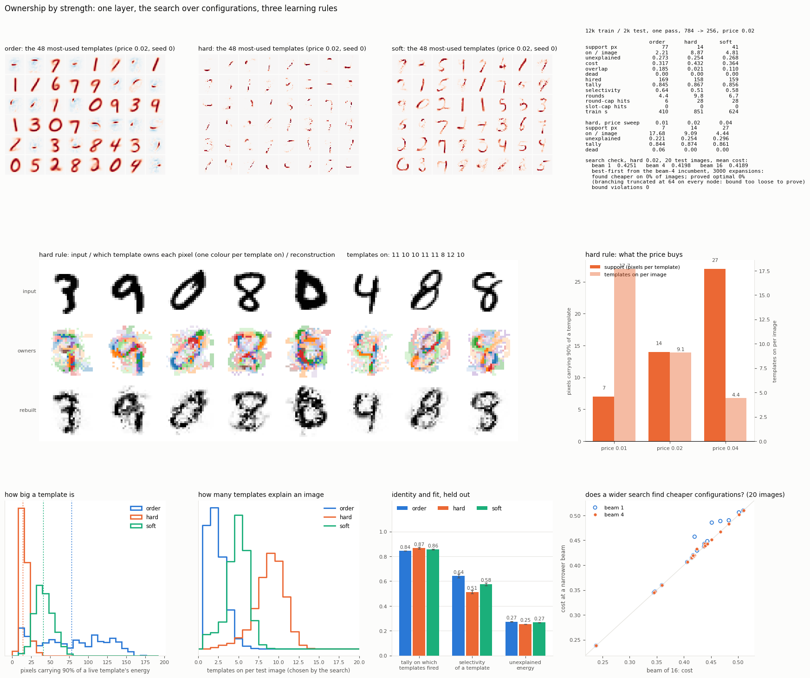
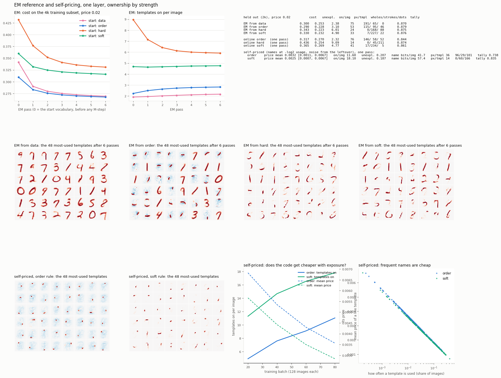

# Ownership by strength: one layer, a search over configurations

2026-09-13. One fully connected layer, 784 to 256, whole MNIST images, unit
norm in and unit norm templates. No convolution, no label in the network, no
backprop. 12,000 training images, one pass, 2,000 held out. Three learning
rules under the same search, at the same price, two seeds each; a price sweep
on one of them; a search check against wider beams and a best-first search.

The question: **if the search decides who learns and from what, and each
pixel belongs to the sharpest template on it, do parts fall out without
locality being imposed, and what does the price decide?**



## The objective and the search

A configuration is a set of templates. Each pixel is explained by exactly one
of them, the one whose weight on that pixel is largest. A template's
coefficient is fitted on the pixels it owns, so a small sharp template is
scored on its own region and never loses to a big blur for not covering the
rest.

```
cost(C) = share of the image's energy left unexplained  +  price x (templates on)
```

The price is the smallest share of the picture a thing must account for to
deserve a name. At 0.02, a template is switched on only if it explains at
least 2% of the image beyond what the others already do.

```
search    beam of 4 configurations; moves: add one, drop one, swap one for
          another; add candidates pre-filtered to the 16 best matches with the
          unexplained part, then scored exactly; the 4 cheapest survive; stop
          when no move on any of them makes the description shorter.
          Nothing fixes how many templates are on. Safety caps: 30 rounds,
          20 templates; hits are reported.
learning  from the winning configuration only, running counts, unit norm after
  order     each winner, largest coefficient first, learns the residual left by
            the ones before it (ownership by order, the previous rule)
  hard      each winner learns the input on the pixels it owns and zero on
            the pixels it lost
  soft      contested pixels are split in proportion to weight
hiring    never-winning or stale templates take the largest unexplained
          leftover, checked against duplicates
```

## Parts fall out of ownership, with no locality imposed

```
price 0.02, 2 seeds        order      hard      soft
pixels per template          77        14        41      carrying 90% of its energy, median
templates on per image      2.2       8.9       4.8     chosen by the search
unexplained energy        0.273     0.254     0.268
cost under the objective  0.317     0.432     0.364
overlap of parts on         0.185     0.021     0.110   mean pairwise Jaccard of supports
tally on which fired      0.845     0.867     0.856
selectivity                0.64      0.51      0.58
dead templates                0         0         0
```

Same search, same price, and the learning rule alone moves a template from
77 pixels to 14. The hard rule's parts never overlap, explain the image best,
and read the label best by identity alone. The owners row on the board shows
each digit split into ten or so regions and rebuilt from them. Whole-image
templates, no convolution: the claim that parts need locality was too strong.
Sharing is enough. What made them parts is that several templates had to
share one image and each could learn only the piece it was sharpest on.

## But the hard rule carves to the price's resolution, not to the data's

The hard templates are dots and short blobs, not strokes. The price sweep
says why:

```
hard rule, seed 0     price 0.01    0.02    0.04
pixels per template            7      14      27
templates on per image      17.7     9.1     4.4
unexplained               0.221   0.254   0.296
```

Ownership by strength has no notion of a natural part. A template
concentrated on fewer pixels is sharper there and wins them more securely,
so the feedback runs until the pieces are the smallest that still pay, and
the price is the only thing that stops it. The soft rule dampens the
feedback and lands on stroke-shaped pieces at 41 pixels, which is what a
digit is made of.

**And under the objective itself, the hard vocabulary is worse.** Whole
digits describe an image for 0.317 at this price, the hard parts for 0.432,
because nine names at 0.02 cost more than the energy they add. The learning
rule and the search objective disagree. The objective's own gradient touches
a template only on the pixels it owns and leaves the rest alone; the "toward
zero on lost pixels" term is an addition, and it is what over-carves. The
aligned rule, learn on owned pixels and leave the rest, was not run.

## The order vocabulary is wholes plus corrections, and the objective prefers it

```
templates by support, price 0.02     over 60 px    20 to 60 px    20 px or fewer
order                                    146            58              52
soft                                      17           234               5
hard                                       0            45             211
distinct configurations in 1,000 images  745           949             971
first pick is a whole                     89%            8%              0%
```

The order vocabulary is 57% wholes and 43% parts. The rule makes both: the
largest winner learns the whole residual and becomes a whole; every later
winner learns what the whole missed, and what a whole 7 misses on another 7
is a bar or a slash. So its parts are corrections, not a decomposition. A 7
is "whole 7, plus a bar". At 2% per name that is the cheapest description
of the three by a clear margin, and it is the reference the other rules
should be measured against. What it does not offer is composition: a whole
already names the digit, so a layer above it has nothing to combine, which is
why yesterday's upper layers became renames. Soft, with 234 stroke-sized
pieces, is the vocabulary a second layer could compose from, at five points
on the objective.

## A dense code cannot exist under ownership

The search run on backprop's own first layer (from `../search_mlp`), and on
the hard vocabulary, at three prices, 64 test images:

```
                            price    templates on     unexplained
backprop's layer 1            0          10.6            0.729
backprop's layer 1          0.02          2.6            0.758
hard vocabulary               0          20.4            0.172
hard vocabulary             0.005        14.4            0.187
hard vocabulary             0.02          9.3            0.243
```

A backprop layer rebuilds a pixel as a sum of two hundred small contributions.
Under ownership a pixel has one owner and one scalar. A diffuse template that
is added takes a large scattered set of pixels, and one coefficient cannot fit
a random scatter, so the fit gets worse and the search refuses it. At zero
price backprop's layer puts ten templates on and leaves 73% of the image
unexplained. The high end of the price axis is k-means, one template per
image; the low end is every part present in the image plus crumbs; a dense
blend is not on the axis. The search can only use, and therefore only
reinforce, concentrated templates.

## The search: beam 4 is not the bottleneck; a proof was out of reach

Twenty held-out images, hard vocabulary, price 0.02, mean cost:

```
beam 1     0.4251
beam 4     0.4198     cheaper than beam 1 on 7 of 20 images, by up to 0.037
beam 16    0.4189     cheaper than beam 4 on 4 of 20, by at most 0.009
```

Going from greedy to a beam of 4 buys five times what going from 4 to 16
buys. A best-first search over the add lattice, seeded with the beam's answer
and pruned by an optimistic bound on what any further add could gain, found
nothing cheaper than beam 4 on any image in 3,000 expansions, and proved
optimality on none: at every node more than 64 templates looked worth trying
under the bound, so the branching had to be truncated. The bound counts
gains as non-reinforcing and was never violated. So the honest statement is
convergence with width, not a proof: the beam finds what a search sixty times
wider finds, and the remaining gap to beam 16 is two tenths of a percent.

## Caveats

One pass over 12k. Two seeds for the main arms, one for the sweep. The round
cap was hit on about 30 of 12,000 training images per hard run, the slot cap
only at price 0.01. The pre-filter to 16 add candidates is part of the search
and part of what the width comparison measures. Training took 7 to 20 minutes
per arm with eight arms sharing the machine.

## Next, in order

1. **The objective-aligned rule**: learn on owned pixels, leave the rest.
   Expected to sit between order and soft, and to be the right reference.
2. **Corrections as a signal**: log corrections per image (swaps and drops
   after the greedy picks), and let a template the search tried and rejected
   lose its claim on the contested region. The search-speed arm.
3. **Own-fit gating**: each winner writes in proportion to how well it
   explained its own region.
4. **The composition numbers**: unexplained energy against vocabulary size,
   and distinct configurations against live templates, for order and soft.
   A tiler plateaus; a composer keeps falling.
5. **A second layer only on a composing vocabulary**, with the wrapper share
   as the number to watch.

## Files

```
engine.py    the search over configurations and the three learning rules
run.py       one arm, one seed: python run.py <rule> <price> <seed>
astar.py     beam widths 1/4/16 and the best-first check
run_all.sh   all arms in parallel, then the check, then the board
board.py     the figure
results/     board.png, <rule>_l<price>_s<seed>.json, weights_<rule>_l<price>.npz
             (seed 0: W, fire counts, eight test images with owner maps),
             astar_hard_l0.02.json, logs
```

---

# Second round: the EM reference, self-pricing, and the owned-only rules

Same bench, same price 0.02 unless stated, one seed.



## The EM reference: what the objective wants, with no learning rule in the way

Alternate the search (E) with the exact best templates for the explanations
it found (M: each template becomes the coefficient-weighted average of the
images on the pixels it owned; pixels it never owned are left alone; unit
norm; templates that owned nothing are re-seeded from the largest leftovers).
Six passes on a 4,000-image training subset, from four starting vocabularies,
then scored on the 2,000 held out. The training cost fell on every pass from
every start, which is the check that the M-step is right.

```
held out, price 0.02        cost   unexpl.  on/img  px/tmpl  wholes/strokes/dots  tally
EM from online order        0.290   0.228    3.10     53       115 /  95 / 46     0.879
EM from random images       0.300   0.253    2.38     75       191 /  65 /  0     0.870
EM from online soft         0.330   0.232    4.90     33         7 / 227 / 22     0.876
EM from online hard         0.343   0.223    6.01     24         0 / 168 / 88     0.875

online order, one pass      0.317   0.270    2.32     76       146 /  58 / 52     0.844
online soft                 0.365   0.269    4.77     41        17 / 234 /  5     0.861
online hard                 0.436   0.254    9.09     14         0 /  45 / 211    0.874
```

Three things.

**The objective wants wholes plus strokes, about three on per image.** The
best reference, 0.290, is 115 wholes, 95 strokes and 46 dots. From random
whole images it grows strokes (0 to 65) and lands at 0.300. So at this price
the mixed vocabulary is not an accident of the order rule; it is what the
objective asks for.

**The online order rule is within 0.027 of its own reference.** Nine percent
of the cost. The hard rule sits 0.09 above the reference it converges to, and
that reference is itself the worst of the four: EM cannot turn dots back into
wholes, because under ownership by weight a template can only own pixels it
already has weight on. Parts are a local optimum the objective cannot climb
out of. The learning rule decides which basin you are in; EM only finds the
bottom of it.

**The label reads the same from all of them.** Tally 0.870 to 0.879 whether
the vocabulary is wholes or dots. Identity carries the label; the shape of
the pieces does not matter for that.

## Self-pricing: the name cost worked, the exchange rate ran away

Names priced at −log₂ of their usage (decayed counts, newcomers priced as
typical), the noise level taken from the leftover the current explanations
leave, combined by the description-length rule price = 2σ² ln(1/p). One pass.

```
                     price mean [range]        on/img   unexpl.   name bits/img   px/tmpl   wholes/strokes/dots   tally
self-priced, order   0.0032 [0.0011, 0.0067]    11.6     0.207        41.7          36        96 /  29 / 101      0.738
self-priced, soft    0.0025 [0.0007, 0.0067]    18.1     0.187        57.4          14         0 /  60 / 166      0.835
```

**The Huffman half behaved.** Usage entropy is 6.9 and 7.2 bits against a
maximum of 7.8; the ten most-used templates carry 18 to 22 percent of all
uses. Reuse spread across many parts and did not collapse onto a few
super-cheap names. The rich-get-richer loop is bounded by fit, as argued.

**The noise-level half is a runaway.** Taking σ² from the residual sets the
price by the leftover, the leftover falls as more templates go on, so the
price falls again: 0.0067 at the start of the pass, 0.003 at the end, still
falling. Templates on per image rose from 5 to 12 under order and from 11 to
18 under soft over the pass. That is the opposite of the practice effect. The
reason is arithmetic: 784 pixels of leftover always outweigh a handful of
5-bit names under a Gaussian residual model, so "explain more" pays until the
leftover is noise-sized, and the style variation a 256-template layer cannot
explain is not noise-sized. The exchange rate cannot come from the residual.
It has to come from a firing budget (Levy and Baxter's rest-to-spike ratio,
held by homeostasis) or be fixed. The order vocabulary under this pricing
became blurred blobs plus dots and reads the label at 0.738.

## The owned-only rules, online

Learn only on the pixels a template owned and leave the rest (the M-step,
online, count-based rate per template), with the reader's partition or with
a k-means step by fit deciding who learns which pixel.

```
                                  on/img   unexpl.   cost    px/tmpl   hires   tally
order (reference)                  2.2     0.273    0.317     77       169    0.845
owned, reader's partition          3.4     0.298    0.365     54       184    0.838
owned, k-means step by fit         2.2     0.360    0.405     68       257    0.805
```

Both lost to order. The k-means-by-fit version is the worst rule run today:
learning by fit while reading by weight lets the two partitions drift apart,
templates go stale and get recycled (257 hires), and the tally falls to
0.805. The reader's-partition version is five points behind order. Stale
weight outside the digit is not the reason; the frame pixels are clean in
every vocabulary. What the batch M-step has and the online rule lacks is
per-pixel normalisation: each pixel of a template averaged over the images
where that pixel was owned, not dragged by the template's overall count.
That arm is running.

**Ownership by fit inside the search is disqualified.** On the order
vocabulary it dropped the unexplained energy from 0.27 to 0.06 with three
templates on, which is not a result but a warning: a region chosen by which
prediction fits the pixel best carries information about the input, and a
decoder holding only the templates cannot reproduce it. Synthesis peeked. As
a learning rule it is allowed; as the explanation it is not.

## Where this leaves the line

- The objective at this price wants a mixed vocabulary, wholes for the
  frequent and strokes for the rest, and the online order rule is close to
  its optimum. The Huffman view says the same: the frequent thing gets one
  name.
- The hard rule's parts are a basin the objective cannot climb out of; the
  "zero on lost pixels" term is what put it there.
- Names priced by usage work. The exchange rate must be a budget, not the
  residual. The clean test of usage pricing is the same Huffman shape with
  the mean price held at 0.02, which is running.
- Nothing about the search changed in any of this. Beam 4 held throughout.

## Files added

```
em.py             the EM reference: python em.py <data|order|hard|soft> [passes] [n_train]
selfprice.py      names at -log2 usage: python selfprice.py <rule> <seed> [free|fixed]
em_board.py       the second board
engine.py         + ASSIGN (weight|fit) in the exact scoring, LEARN_ASSIGN, rules owned / owned-px
results/          em_<start>.json, weights_em_<start>.npz, selfprice_*.json, em_board.png,
                  most_templates.png (the most-templates configuration per vocabulary)
```

## Follow-ups: usage pricing at a fixed exchange rate, and per-pixel counts

```
                                           on/img   unexpl.   cost    px/tmpl   wholes/strokes/dots   tally   on/img over the pass
order, uniform price 0.02 (reference)       2.2     0.273    0.317     77       146 /  58 / 52       0.845   2.0 -> 2.2
order, names at -log2 usage, mean 0.02      2.6     0.269    0.310     76       158 /  59 / 39       0.851   2.3 -> 2.6
owned, per-template count                   3.4     0.298    0.365     54                            0.838   3.4 -> 3.5
owned, per-pixel counts                     4.4     0.255    0.342     40                            0.857   4.1 -> 4.4
EM from order (the reference optimum)       3.1     0.228    0.290     53       115 /  95 / 46       0.879
```

**Usage pricing with the exchange rate held is benign and small.** Prices
spread over a four-fold range (0.008 to 0.035), usage entropy 7.2 of 8 bits,
the ten most-used templates carry 22% of uses. The vocabulary is the same
wholes-plus-corrections as under the uniform price, with a few more cheap
templates on per image, a hair less unexplained, a hair better tally. Nothing
ran away, and nothing got cheaper with exposure either: the count drifted up
from 2.3 to 2.6. Huffman naming is safe to keep; it is not where the practice
effect comes from.

**Per-pixel counts close half the gap and no more.** 0.365 to 0.342, still
0.025 behind the residual rule and 0.05 behind the batch reference that the
same M-step reaches from the order start. The online owned rule drifts into a
strokes vocabulary (40 pixels, 4.4 on) while the batch version, started from
wholes, stays with wholes. So the gap is not bookkeeping any more. Learning
only what you owned is itself a mild carving rule online: what a template
owns shrinks whenever a neighbour takes pixels, and nothing ever gives them
back. The residual rule stays in the wholes basin because its first winner
takes the whole image every time.

**So, for this objective at this price:** every rule that shares pixels among
the winners drifts toward a parts basin, the objective prefers the wholes
basin, and the residual rule is the online rule that stays there. If parts
are wanted for composition, this objective at this price does not want them,
and that is a fact about the price or the objective, not about the search or
the learning rule.
