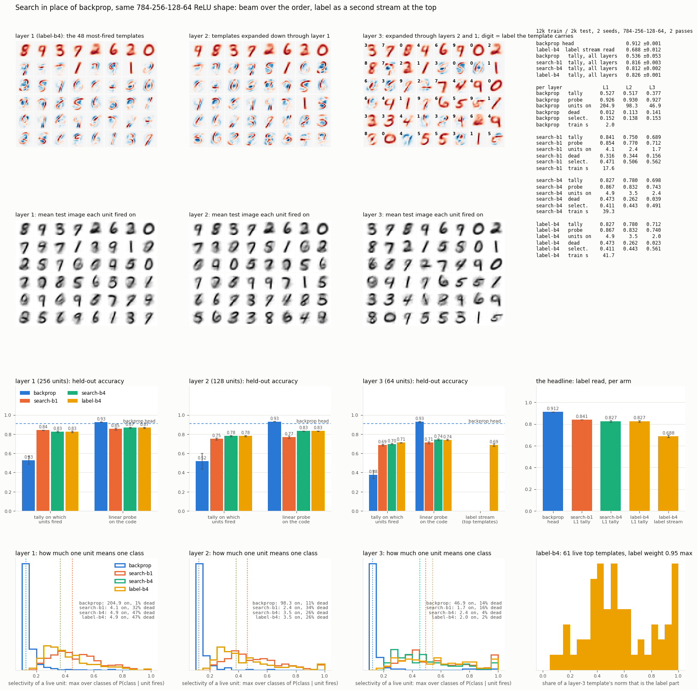

# Search in place of backprop, same MLP shape

2026-09-13. A 784-256-128-64 ReLU net, three hidden layers, same random
init, same data order, same two passes over 12,000 MNIST images, scored on
2,000 held out. All layers learn online at once. Two seeds. Two passes of
work: a first with greedy pursuit (kept in `results/first_pass_beam1/`), then
this one with a beam of 4 over the order and the label as a second stream
into the top layer.

The question: **if the search picks which units learn, instead of backprop
telling every weight its share of the blame, does identity fall out, and what
does it cost?**



## The mapping

A ReLU layer computes `max(0, w·x)` for every unit at once, on the whole
input. The search computes `max(0, w·r)` for one unit at a time, on what is
**left** after the previous picks: take the unit with the largest projection
onto the residual, keep that projection as its activation, subtract what it
claimed, pick again, stop when the next pick would explain less than 2% of
the input's energy. Same weights, same nonlinearity, same shape. The only
change in the forward pass is "all at once on the input" against "one at a
time on the residual", and the ReLU is no longer bolted on: a chosen unit's
activation is a projection, and chosen projections are positive.

```
backprop     softmax head, cross-entropy, Adam. The label shapes every layer.
search-b1    greedy pursuit. Only chosen units learn, each toward the residual
             it was shown, by a running count (a k-means step on leftovers).
             Units that never win, or stop winning for 60 batches, are hired
             from the largest unexplained residual. The label never touches a
             weight; it is read by a tally over which units fired and, as a
             capacity check, by a linear probe on the graded code.
search-b4    the same with a beam of 4 over the ORDER of picks: each partial
             explanation expands into its 4 best next picks, the 4 best totals
             survive, two orders reaching the same set are merged, and the best
             total at the end is the explanation and the only one that learns.
label-b4     search-b4, and the top layer's input is [layer-2 code ; 0.7 x
             one-hot label]. The label is one more thing the top templates
             explain. At read time it is absent: templates are scored by their
             norm over the code part only, and the label is read from the
             label part of the templates that fired.
```

## Identity falls out, with no rule asking for it

```
layer 1                    backprop     search-b1    search-b4
units on per input          205 / 256    4.1 / 256    4.9 / 256
selectivity of a live unit     0.15         0.47         0.41     max over classes of P(class | fires)
tally on which units fired     0.53         0.84         0.83
linear probe on the code       0.93         0.85         0.87
backprop head                  0.912
```

Backprop's units fire on four inputs in five and are at chance for every
class: a unit is a coordinate of a blend, and the blend is where the meaning
is. The search's units fire on one input in sixty and half the time a unit
means one class. The firing pattern alone reads the label at 0.84 under
search and 0.53 under backprop, from the same shape and init. And under
search the probe adds one or two points over the tally: the graded activation
carries almost nothing beyond who fired. Under backprop the probe adds forty.
That is the difference between the two rules stated as a measurement.

## The middle layers are the first layer again

The pictures in the top rows of the board are the finding of this pass. A
layer-2 template expanded down through layer 1, and a layer-3 template
expanded through both, look like layer-1 templates: whole digits. The mean
test image each unit fired on says the same. Measured:

```
                              search-b1        search-b4        label-b4
L2  lower units carrying >= half the top weight     1 (median)    1    1
L2  share of the norm in ONE lower unit          0.98           0.98   0.98
L2  wrappers (that share > 0.9)                   97%            94%    94%
L3  wrappers                                     100%            93%    69%
```

**Nearly every upper template is a wrapper: a unit that means "layer-1 unit
k fired" and nothing more.** Layer 2 is a copy of a subset of layer 1 with
128 slots instead of 256, layer 3 a copy of a subset of that with 64. That
is the whole of the depth loss: 0.84, 0.78, 0.70 is the label read through a
vocabulary that is shrinking, not composing.

The mechanism is yesterday's `encoder` result in a new coat. A search layer's
code is four or five nonzeros dominated by the first pick (a digit prototype
at 0.7, corrections at 0.2), so after normalisation the message up is nearly
one-hot. The upper template averages what it was shown, and the average of
nearly-one-hot vectors that share a top coordinate is that coordinate. A
template can learn what accompanies *it*; a group needs what accompanies
*each other*, and neither the residual nor the beam carries that.

## The beam does its own job, which is not the label

On a trained layer 1, beam 4 explains more energy than greedy (0.747 against
0.725) with more picks (4.9 against 3.9), and beats it on 77% of images and
ties on 21%. In the net:

```
tally           L1       L2       L3      dead L1    hires L1
search-b1     0.841    0.750    0.689      32%        175
search-b4     0.827    0.780    0.698      47%        135
```

Better explanations need fewer templates, so fewer residuals stay large,
fewer units are hired, and half of layer 1 is dead. Layer 2 gains three
points from the richer code, layer 1 loses one and a half from the smaller
vocabulary. The beam makes the search better at explaining, and explaining
is not the same objective as carrying the label.

## The label as a second stream at the top does not close the gap

```
label-b4    L3 tally 0.712    label stream read 0.688    L1 tally 0.827    backprop 0.912
            L3 hires 16 / 11 (search-b4: 42 / 41)   38% of live top templates are more label than code
```

Because the top templates are wrappers, the label attaches to "layer-1 unit
k fired": the label stream reads the same fact the layer-1 tally already had,
through 64 slots instead of 256 and through an averaged residual instead of
a count, and it comes out fifteen points worse. The top layer stops hiring
almost entirely, because a template that carries a label explains the label
part of every input of its class and residuals no longer clear the hiring
bar. The label being present at the top is not the missing piece; the top
having anything to say beyond layer 1 is.

Repulsion (first pass, greedy) raised selectivity and killed half of layer
3: `results/first_pass_beam1/`.

## What backprop has that this does not

The label in every layer. Backprop's head reaches 0.912 with the same budget;
the label-blind search reaches 0.84 from one layer's identity, and no layer
above adds to it. That gap is what top-down credit is worth on this problem,
and the search has no channel for it: a template learns from its own
residual, and nothing above can tell it which way to move.

## Caveats

Stop threshold, count window and label weight set once, not swept. The
linear probe on backprop's code converges slowly (numbers a hair under the
head). Two seeds, so anything under a point is noise. Wrapper statistics are
from seed 0.

## Next, in order

1. **Give the upper layer what goes with each other.** Yesterday's answer:
   carve upper templates out of a pair tally over lower units instead of
   averaging residuals, and refuse to hire from a residual with fewer than two
   strong members. The wrapper rate is the number to move.
2. **Change the message, not the learner, as a control.** Pass the binary
   fired set (every fired unit at equal weight) instead of the graded code,
   so the first pick cannot dominate the average.
3. **Prune by contribution** so the beam's smaller vocabulary does not leave
   half of layer 1 dead.

## Files

```
run.py        one arm, one seed: python run.py <arm> <seed>
run_all.sh    all arms and seeds in parallel, then the board
board.py      the figure
results/      board.png, <arm>_s<seed>.json, weights_<arm>.npz (seed 0: W1..W3,
              mean image each unit fired on, fire counts), first_pass_beam1/
```
