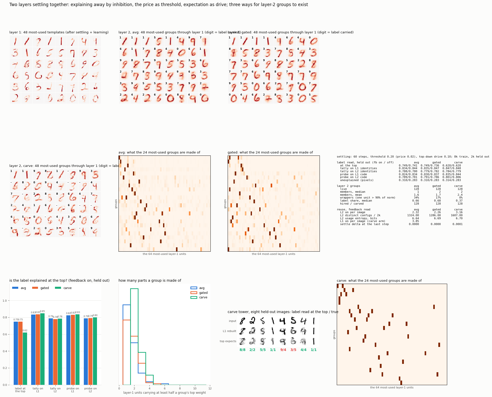

# Two layers settling together

2026-09-13, late. The beam search is gone. Every unit starts with its match
to the input, units that explain the same thing inhibit each other in
proportion to their overlap, a hard threshold is the price, the layer above
feeds its expectation down as extra drive to the units it predicts, and both
layers relax together for 60 steps. The settled state is the explanation;
the units on at the end learn. This is the locally competitive network, and
its fixed points are local minima of unexplained energy plus price times
units on, the same objective as the beam.

```
u1 <- (1-dt) u1 + dt ( W1 x + beta * expected-from-above - (G1 - I) a1 )    a1 = u1 if u1 > 0.20
u2 <- (1-dt) u2 + dt ( W2 z                              - (G2 - I) a2 )    a2 = u2 if u2 > 0.20
z  = [ unit(a1) ; label x 0.7 ]                                              label absent at read time
```

Layer 1 is this morning's stroke vocabulary, frozen. Layer 2 has 128 groups
over [256 identities ; label], and three arms differ only in how a group
comes to exist:

```
avg     hired from what layer 2 left unexplained (never fewer than two members), then
        learns the average of the codes it was on for -- the rule that eroded before
gated   the same, but each image counts by the group's own fit squared, so a partial
        match barely writes
carve   a clique of a pair-count table over layer-1 identities: seed on the pair that
        goes together most above chance, grow while candidates stay within 0.7 of the
        seed, never fewer than two members, never learned by averaging; the label is
        attached as a tag when it goes with the members above chance
```

8,000 training images, one pass, 2,000 held out, read with the top-down
drive on and off. Training takes four seconds per arm.



## The numbers

```
held out, top-down drive on / off      avg            gated          carve        beam tower (this evening)
label read at the top               0.749 / 0.741  0.749 / 0.736  0.620 / 0.620     0.611 / 0.613
tally on layer-1 identities         0.834 / 0.844  0.835 / 0.847  0.847 / 0.848     0.843
tally on layer-2 identities         0.788 / 0.780  0.779 / 0.782  0.784 / 0.779     0.782
probe on layer-2 code               0.789 / 0.781  0.791 / 0.786  0.801 / 0.806     0.791
unexplained pixels                  0.310 / 0.283  0.310 / 0.283  0.314 / 0.283
layer-1 units on                      3.8 / 4.2      3.8 / 4.2      3.8 / 4.2       6.2
layer-2 groups on                     2.3 / 2.4      2.3 / 2.4      3.2 / 3.8       5.0

layer-2 groups                         avg            gated          carve        beam tower
members, median (mean)               1 (1.6)        2 (1.7)        2 (2.4)          1 (1.5)
wrappers, one unit > 90% of norm       34%            17%             0%              82%
label share of a group's norm         0.66           0.68           0.37             0.08
```

## What moved and what did not

**Wrappers fell from 82 percent to 17, and to zero.** Refusing single-member
hires and settling instead of enumerating took the averaging arm from 82 to
34 percent. Gating the write by the group's own fit halved that again, to 17,
with the label read unchanged. The carve produced no wrapper at all, with two
to three members per group, which is the first upper layer in three days that
is not a copy of the layer below. The membership pictures on the board show
it: a diagonal for the averaging arms, scattered pairs for the carve.

**The label climbed, and still stops below the tally on the strokes.** The
groups hired from residuals carry the label at two thirds of their norm, so
reading the label from the groups that are on gives 0.75 against 0.61 for the
beam tower. But the tally on layer-1 identities reads 0.84 in every arm. A
group is a hard vote from two or three coarse units; the tally is a soft vote
from four strokes each carrying its own class counts. The carve's groups,
chosen by association alone, are the most honest groups and the worst label
readers at 0.62, because two strokes that go together are often shared by
two classes and the tag picks one.

**The top-down drive does a little, in one direction.** It lifts the label
read at the top by about a point in the averaging arms, and it changes the
bottom: fewer strokes on, 3.8 against 4.2, and more pixels unexplained, 0.31
against 0.28. The expectation tips ambiguous strokes on and, through the
inhibition, others off. It is a bias and it behaves like one.

**Settling reads the stroke vocabulary as well as the beam did**, tally 0.84
to 0.85 against 0.84, with fewer units on and in a hundredth of the time.

## The setup mistake in the first run, kept for the record

The first pass let layer 1 keep learning by the sparse-coding rule with a
newborn learning rate. In the first batches every stroke absorbed the whole
residual and layer 1 turned back into whole digits, so that run tested groups
over wholes, and its groups were "whole digit plus label" reading the label at
0.81. Also, in that run the label never joined a carved clique, because the
growth rule compares the label's association against the seed pair, and rare
stroke pairs always associate more strongly than a label that appears in a
tenth of images. Both fixed above: layer 1 frozen, label attached as a tag.
Results of that run are in `results/l1_drifted/`.

## Where this leaves the line

The averaging rule is not the whole wrapper story. Under settling, with no
single-member hires and fit-gated writes, it makes small groups that carry the
label. The carve makes real groups that do not. Neither reads the label at the
top better than counting over the strokes. What a group would need to beat
the tally is to be a combination that pins the class, chosen with the label
in the counts from the start rather than tagged after, and covering the image
well enough that the right group is on. That is a change to what the carve
optimises, not to the search.

## Files

```
settle.py    the settling tower and the three arms: python settle.py <avg|gated|carve>
board.py     the figure
results/     board.png, <arm>.json, weights_<arm>.npz, codes_<arm>.npz, logs, l1_drifted/
```
