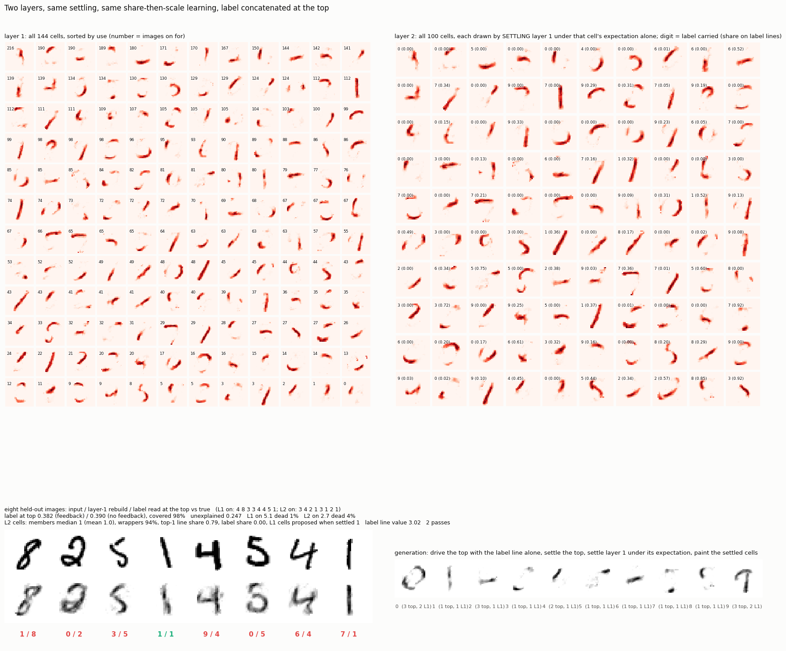
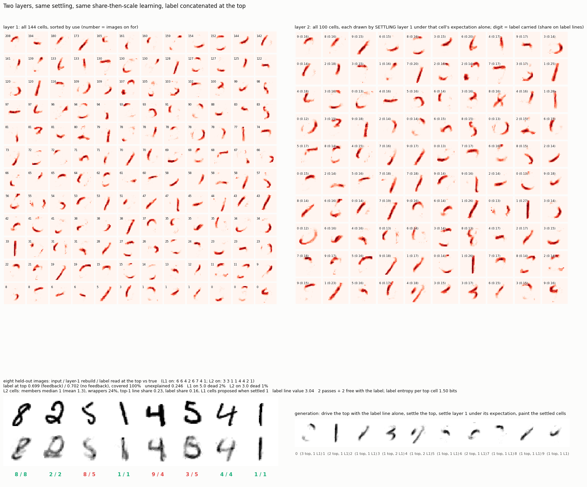

# Two layers of share-then-scale, label concatenated at the top

2026-09-13, night. Layer 1 as in `../neurons/share.py` (144 cells, raw
pixels, row and pixel budgets, settling, share the input then scale).
Layer 2: 100 cells over [144 layer-1 activities ; 10 label lines], same
rule, the label line valued at the running mean active layer-1 activity so
it counts as one more active unit; present in training, absent at read time
(top cells then read with the direction of their identity part). Both layers
settle together, the top's expectation as extra drive on layer 1; both learn
online. Label read from the top only. Two passes, 21 s.

Drawings are settled, not summed: a top cell's picture is layer 1 settled
under that cell's expectation alone (most expected cell driven to 1.5 times
its threshold, inhibition decides the rest), painted. Generation: settle the
top from the label line alone, settle layer 1 under the top's expectation,
paint the settled cells.



```
label read at the top, held out     0.382 (feedback) / 0.390 (no feedback), 98% covered
unexplained, layer 1                 0.25            rebuilds legible under every wrong read
layer 1                              5.1 on per image, 1% dead, all strokes
layer 2                              2.7 on per image, 4% dead
top cell = share of its weight on its top 1..5 layer-1 lines, median:   0.79  0.11  0.05  0.01  0.00
lines carrying >= 10% of a top cell's weight, median                     2
layer-1 cells a top cell proposes when layer 1 settles under it, median  1
top cells carrying > 10% label weight                                    36 of 96, used less (44 vs 64 images)
generations, settled                                                     1 to 2 layer-1 strokes per digit
```

**A top cell is a copy of one stroke with a faint second.** Seventy-nine
percent of its weight on one layer-1 line, eleven on a second, and when layer
1 settles under it only the main stroke clears its threshold. The label sits
on the less-used third of the top cells and on none of the busy ones. So the
read at the top has almost nothing to read, and a generation is the one
stroke the label-carrying cell copies.

**Same mechanism as the strokes.** The rule hands a cell a piece of its
input and rewards concentration. On a continuous image the smallest piece
that still clears a threshold is a stroke. On a vector of activities the
smallest piece is one line, and one line is enough: a layer-1 cell fires on
about 3.5 percent of images, the layer-2 target rate was 3 percent, so a cell
that copies one stroke meets its rate exactly and never needs a second.

**The lever, not run:** a cell becomes a conjunction only when it is rarer
than any of its inputs. Layer-1 cells are rarer than pixels and had to
combine them; layer-2 cells were as common as layer-1 cells and copied them.
The layer-2 target rate has to sit well below the layer-1 rate.

## Files

```
tower.py     python tower.py [passes]
board.py     both layers (settled drawings), held-out reads, settled generations
results/     board.png, tower.json, tower.npz
```

---

## Two phases: competition without the label, then free association with it

The user's proposal. Phase one, two passes: both layers share-then-scale,
no label anywhere. Phase two, two passes: the label line concatenated to the
top's input, the top learns what it saw with no sharing and no budget (an
active cell moves toward the activity-weighted mean of its input, label
included), layer 1 keeps sharing so its strokes stay strokes. Read: the
ten label lines are driven by the vote of the top cells on and inhibit each
other until one stands. `python tower.py 2 2`, 38 s.



```
label read at the top, held out     0.699 (feedback) / 0.702 (no feedback), 100% covered   (one phase: 0.38)
unexplained, layer 1                 0.25
layer 1                              5.0 on per image, 2% dead, strokes
layer 2                              3.0 on per image, 1% dead
top cell weight on its top line      0.23 (one phase: 0.79)      the halo of usual companions grew in
label share of a top cell            0.16 median
label entropy of a top cell          1.50 bits median (uniform would be 3.32); 69 of 99 cells have a majority label
layer-1 cells a top cell proposes    1 (settled)
generations, settled                 one class-typical stroke per digit, two for 0 and 3
```

**The vote works and lifts the read from 0.38 to 0.70.** Five of the eight
held-out images on the board read correctly; the misses are a 5 read as 8, a
4 as 9, a 5 as 3. Each top cell now carries a label distribution learned
from the images its stroke appears in, sharp enough that two thirds of the
cells have a majority class, and three cells' votes settle to a digit.

**What the top cell became.** Still one stroke when layer 1 settles under
it, now with a halo of the strokes that usually accompany it and a label
mix. Not a conjunction: the label is attached per stroke, and a generation
from a label is the single most typical stroke of that class.

**Why 0.70 and not more.** Three voters per image, each a blurred stroke
with a 1.5-bit label mix. The earlier table-tally read the same strokes at
about 0.84 with five voters and exact counts. More top cells on per image
is the obvious lever for the read; it would not change what a top cell is.
Not run.

---

## The label as a random sparse pattern: OR-ed onto layer 1's lines, or on lines of its own

Two-phase training as above. The label is a random sparse pattern per class,
K lines on, valued at the running mean active layer-1 activity. Two ways in:

- **OR** (`tower_or.py`): the pattern lives on layer 1's own 144 lines and is
  OR-ed (elementwise max) into the layer-1 code, so to the top "it is a 7" is
  a particular set of strokes being on. No label lines. Read: the top's
  expectation over the 144 lines matched against each class pattern, the
  ten matches settling against each other.
- **concat** (`tower_cat.py`): the pattern lives on 100 label lines of its
  own, concatenated to the 144; absent at read time, the top cells scored on
  their stroke part only. Read: the top's expectation over the label lines
  matched against the patterns.

```
                     read at top   covered   L2 on   L2 dead   members   top-1 share   label share   settled proposal   generations
OR,  K = 3              0.588        99%      2.1      10%        4          0.16          0.37             1
OR,  K = 5              0.615        98%      1.8      18%        6          0.13          0.53             2            digits
OR,  K = 10             0.466        81%      1.2      32%       10          0.08          0.76             3            digits
concat, K = 5           0.711        99%      2.7       7%        1 (1.7)    0.24          0.49             1            strokes
concat, K = 10          0.682        99%      2.6       4%        1 (1.5)    0.22          0.66             1            strokes
one-hot concat          0.699       100%      3.0       1%        1 (1.3)    0.23          0.16             1            strokes
```

Boards: `results/board_or_p2_2_k{3,5,10}.png`, `results/board_cat_p2_2_k{5,10}.png`.

**OR makes the top compose; concat makes it read.** With the pattern OR-ed
in, a top cell learns "these pattern lines and the strokes that come with
them", and drawn by settling layer 1 under it, it is a whole digit: the
layer-2 grid at K = 5 is 5s, 0s, 7s, 6s, 9s, 3s, 2s, 4s, and the generations
from a class pattern alone are real digits, the first of the day. But at read
time the pattern is absent, so the cell is missing most of what it expects
(K pattern lines against about five real strokes), fires rarely, and a fifth
to a third of the top dies; the read is 0.47 to 0.62 and the held-out reads
on the board are mostly wrong. With the pattern on its own lines, the top is
scored on its stroke part and reads at 0.71, but the top cell is what the
one-hot version was: one stroke plus a halo plus a label mix, and the
generations are single strokes.

**Why the two differ.** Under OR the label pattern is indistinguishable from
strokes, so the free-learning top averages pattern and strokes into one
picture and its expectation paints the class. Under concat the pattern is
separable from the strokes, the cell's drive at read time depends on the
stroke part only, and nothing binds several strokes to one cell, so it
stays a labelled stroke. The composition came from the label being forced
through the same lines as the parts; the reading came from keeping them
apart. The number in between is K: fewer pattern lines keeps more of the
top alive under OR, and more label lines sharpen the concat cells' labels.

---

## The top keeps sharing in phase two

Same two phases and sparse label patterns, but the top learns by
share-then-scale throughout, so the label's bits are divided among the top
cells like every other line. (First concat attempt had the label lines'
budget set at a tenth of their frequency and starved them; fixed, re-run;
the numbers below are the fixed run.)

```
                            read at top   covered   L2 on   L2 dead   wrappers   label share   top-1 share
OR,  5 on, top shares          0.235        68%      1.2      37%       57%         0.72          0.66
OR,  10 on, top shares         0.084        35%      0.6      48%       67%         0.88          0.79
concat, 5 on, top shares       0.000         0%      3.0       1%       86%         0.00          0.76
concat, 10 on, top shares      0.000         0%      2.8       0%       79%         0.00          0.77
```

**Sharing gives every line to one cell, and a label bit is a line.** Under
OR the label bits went to cells of their own: the layer-2 grid on the board
is label-bit copiers (label share 0.7 to 0.9, no stroke) beside stroke
copiers (no label), and since the bits are absent at read time the bit
copiers never fire and a third to a half of the top is dead. Under concat
the same split is total: the cells that are on at read time carry no label
weight at all, the cells that carry label weight have no stroke part to fire
on, and the read is undefined on every image. The digit's several bits were
indeed assigned to several cells, but each to a cell alone, never to a cell
that also holds a stroke.

**The rule, stated once more with the label included.** Under
share-then-scale a cell holds one line unless one line cannot clear its
threshold. At layer 1 a pixel cannot, so a cell holds a stroke. At layer 2 a
stroke line can and a label bit can, so a cell holds one or the other. The
free-learning top (previous section) is the only version so far where a cell
held strokes and label together, and it did so by averaging, not by dividing.
