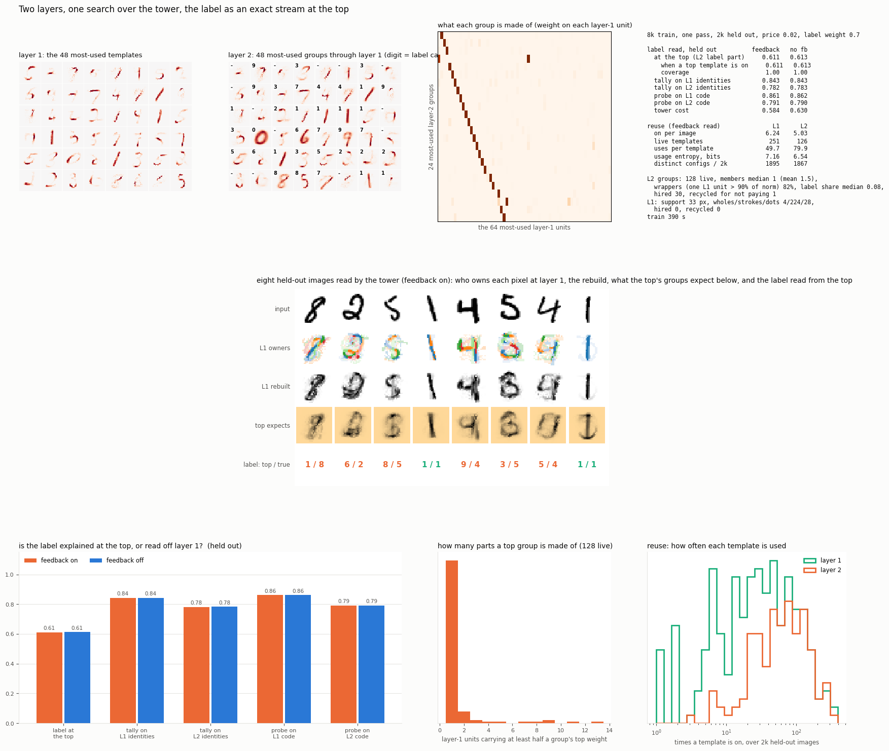

# Two layers, one search over the tower, the label as an exact stream at the top

2026-09-13, evening. The build agreed on after the single-layer work: a
second layer on a parts vocabulary, both layers read by the configuration
search, the top's winning groups expanded down to make the layer-1 units they
expect cheap for a second read, the label entering the top as one more
stream, names priced by usage, templates recycled when they stop paying for
themselves. One training pass over 8,000 images, scored on 2,000 held out
with the feedback on and off.



```
layer 1   784 -> 256, starts from this morning's stroke vocabulary (../ownership, soft
          rule, 41 px) and keeps learning with it. Message up: which templates are on.
layer 2   [256 identities ; label x 0.7] -> 128 groups. Same search, same ownership,
          residual learning. At read time the label is absent; groups are scored on the
          identity part and the label is read from the label part of the groups on.
read      up, expand the top down, expected layer-1 units at a quarter price, up again.
prices    -log2 usage, mean held at 0.02. Recycle: unused 60 batches, or value < 0.
```

## The label does not climb, and the top is a copy of the bottom

```
held out                          feedback on   feedback off
label read at the top                 0.611         0.613      every image covered
tally on layer-1 identities           0.843         0.843
tally on layer-2 identities           0.782         0.783
probe on layer-1 code                 0.861         0.862
probe on layer-2 code                 0.791         0.790

layer-2 groups: 128 live, members median 1 (mean 1.5), wrappers 82%, label share 0.08
layer 1:        251 live, 33 px, 4 wholes / 224 strokes / 28 dots, 6.2 on per image
layer 2:        5.0 on per image, 1867 distinct configurations in 2,000 images (layer 1: 1895)
```

**The top layer is wrappers again.** Eighty-two percent of the groups put
over ninety percent of their weight on one layer-1 unit. The membership
picture on the board is a diagonal: each of the most-used groups is one
stroke. Five groups on per image against six strokes on: the top renames the
bottom and drops one.

**So the label cannot climb.** A group that is one stroke appears in several
classes, and the label part it averages is a mixture, so its label share
collapses to 0.08 and the label read at the top is 0.61, twenty-three points
under the tally on the strokes themselves. Every image is covered, so this is
not a coverage problem. The groups simply do not know what they are.

**And the feedback cannot do anything**, which is why on and off are equal
to the third decimal. A wrapper expects exactly the unit that is already on.
The tower cost falls from 0.630 to 0.584 with feedback only because expected
units are priced lower by definition. That is bookkeeping, not explanation.

**Layer 1 is fine.** A stroke vocabulary, six on per image, nearly every
image its own combination. The bottom composes. The top does not read the
composition.

## Why, and why this is the third time

The whole-tower search changes which groups get selected. It does not change
what a group learns, and what a group learns is the average of the layer-1
patterns it was on for. A group born from six strokes and a label is picked
on every image sharing two or three of them, and across those images one
stroke is the common thread, the rest are each present half the time, and
the label is a mixture. The average erodes to the common thread. This is
the 09-12 `encoder` finding word for word, it is Saturday's `search_mlp`
finding at layers 2 and 3, and it is this run. Selection from above cannot
cure it, because a wrapper is selected happily: it explains its one unit at
the price of one name, and nothing in the cost prefers a real group over it
once the real group has eroded.

A group needs to be built from what goes with each other, which is a fact
about pairs of lower units and which no template can learn from its own
record. That is the pair tally over the lower layer, the carve from 09-12,
and it has been named as the next step three times and built zero times.

## Next, and only this

Layer-2 templates carved from the co-occurrence counts of layer-1 identities,
never learned by averaging; a group must have at least two members to be
hired; the label is one more identity in those counts. Then the same three
numbers: label at the top against the layer-1 tally, wrapper share, and
whether feedback moves anything.

## Files

```
tower.py     both layers, the tower read, training, scoring
board.py     the figure
results/     board.png, tower.json, weights.npz, codes_test.npz, log.txt
```
