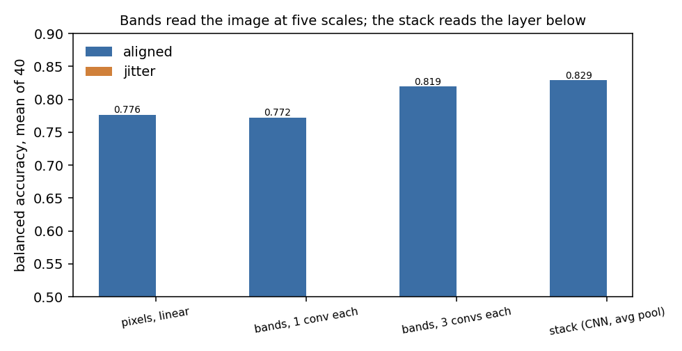
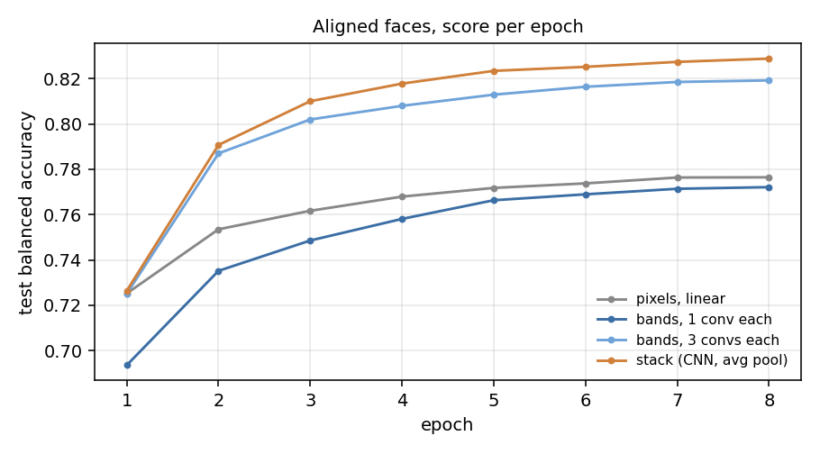
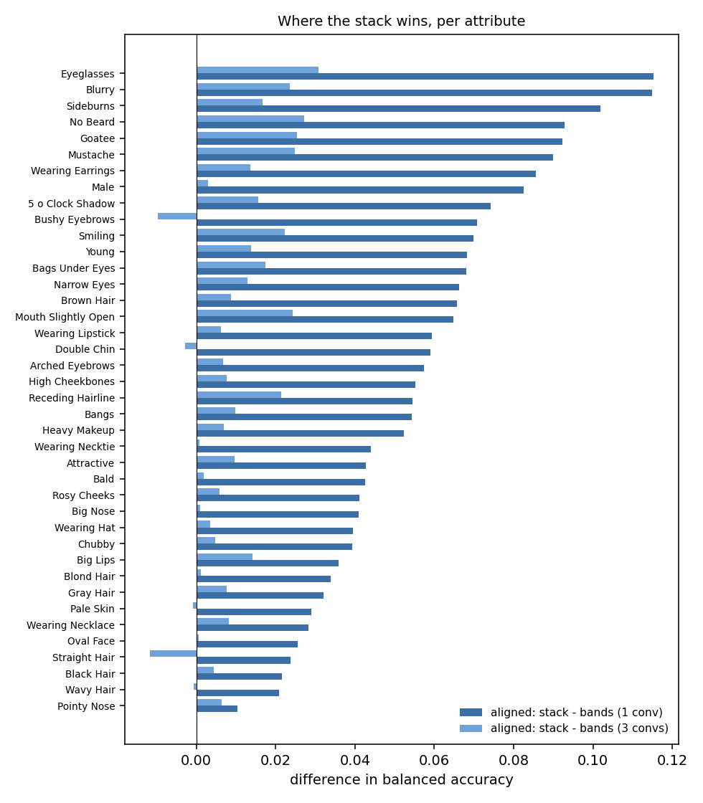

# `bands_vs_stack/` — does a layer need the layer below, or just a coarser image?

2026-09-23. Scripts: [`prepare.py`](prepare.py) (decodes the CelebA shards once),
[`run.py`](run.py) (one run: an arm, a condition, a seed), [`sweep.sh`](sweep.sh) (everything
below), [`plot.py`](plot.py) (the table and figures in [`results/`](results/)).

## Verdict

No. With the filters, the pooling and the readout held equal, a level that reads the image at
its own scale instead of the level below loses 5.7 points to the CNN (0.772 against 0.829),
and at this training budget loses even to a linear map on raw pixels (0.776). Giving each
scale three layers of its own instead of one, with more parameters than the CNN, reaches
0.819 and still trails it. The idea that a hierarchy needs only a coarser image, not the
level below, did not hold, and it is not being taken further.

## The question

A convolutional network is a stack: layer two reads layer one's outputs, layer three reads
layer two's, and the receptive field grows by pooling between them. The usual story is that
each layer composes the features of the one below. But the receptive field growing is also
the only way a layer can see longer wavelengths at all, since a filter can only be tuned to
a wave that fits inside it. So which is it? If a layer only needs the bigger window, it
could read the *image itself*, shrunk, and never look at another layer.

This came out of a conversation about the visual cortex: every area up the hierarchy is tuned
to coarser structure than the one below, and a band-pass version of a face looks like
Gabors at the fine end, edges in the middle and a blurred layout at the coarse end. Lavender's
proposal was that each level learns from its own band of the image rather than from the level
below. This experiment pits that against the stack with everything else held equal.

## The rig

Grayscale CelebA, the original 218 by 178 aligned images (39,910 of them, decoded from the
parquet shards). A 160 by 128 crop. Forty binary attributes. 32,910 training images, 2,000
for validation, the last 5,000 for testing.

**Four arms, one readout.** Every arm ends the same way: each of its maps is average-pooled
to a 5 by 4 grid (32-pixel cells at full resolution), the grids are concatenated, and one
linear map gives 40 logits. With 32 channels that is 3,200 numbers into the head.

| arm | what each level reads | levels | conv layers |
|---|---|---|---|
| `pixels` | the crop shrunk to 40 by 32, straight into the linear map | — | 0 |
| `bands1` | the image at its own scale: full, 1/2, 1/4, 1/8, 1/16. One 3x3 conv and a ReLU per level. No level sees another. | 5 | 5 |
| `bands3` | the same, three 3x3 convs per level. Composition *within* a scale allowed, *across* scales not. | 5 | 15 |
| `stack` | the level below, shrunk by two. A plain CNN. Its head reads all five levels, like the bands. | 5 | 5 |

The image pyramid is a 2x2 average and subsample, repeated. The stack shrinks the same way
(average pooling), so that the *only* difference between `bands1` and `stack` is whether a
level's input is the image or the previous level's features. A max-pooling stack is run too,
since that is the usual CNN. Kernels are 3 by 3 everywhere; at level five that spans 48
pixels of the original, a third of the crop.

**Two conditions.** `aligned`: the centre crop, so every face has its eyes in the same place
and position alone says which part a feature belongs to. `jitter`: the same crop at a random
position, in training and in testing, so the head's fixed grid no longer lines up with the
face. The stack's kernels see the *relative* positions of the features below them, which a
shift does not change; the bands' linear head sees only absolute grid positions. If
composition buys anything, it should show up as the gap opening under jitter.

**Training and score.** AdamW, one-cycle learning rate, 20 epochs, batch 128, bfloat16, one
seed. The loss is a class-balanced binary cross-entropy (positives weighted by the negative to
positive ratio), so that a threshold of zero is the right one. The score is balanced
accuracy per attribute, the mean of the accuracy on positives and on negatives, averaged over
the 40 attributes, at the epoch with the best validation score. Plain accuracy is misleading
here: Bald is 98% negative.

Sample images: [`face.png`](face.png), [`face_gray.png`](face_gray.png) (original size) and
[`face_48.png`](face_48.png) (the 48-pixel version the August experiments used).

## Results (aligned, 8 epochs, one seed)

Everything at the same budget: 8 epochs of one-cycle training. The full 20-epoch runs and
the jittered condition are in [`sweep_full.sh`](sweep_full.sh) and were not run; see the
caveats. The table and per-attribute numbers are in [`results/summary.md`](results/summary.md).

| arm | params | balanced accuracy | plain accuracy |
|---|---|---|---|
| pixels, linear on 40x32 | 51,240 | 0.7764 | 0.7699 |
| bands, 1 conv per scale | 129,640 | 0.7721 | 0.7644 |
| bands, 3 convs per scale | 222,120 | 0.8192 | 0.8155 |
| stack (CNN) | 165,352 | **0.8288** | 0.8234 |

**One conv per scale is not enough, and loses to raw pixels.** A single rectified 3x3 filter
bank at each scale, pooled to 20 cells, scores below a linear map on 1,280 pixels, on 23 of
the 40 attributes. Where it wins is telling: Bald, Black, Blond and Brown Hair, Straight and
Wavy Hair, Receding Hairline, Wearing Hat, Blurry. Texture and coarse layout, the things a
band-pass energy is. Where it loses is every attribute about a face part at a place: eyes,
mouth, beard, glasses. Part of this is the readout, which gives the pixel model a 40x32 grid
and the bands a 5x4 one.

**Depth inside a scale closes 83% of the gap to the CNN.** Three convs per scale, still
reading only the image at that scale, goes from 0.772 to 0.819. The stack is at 0.829. So of
the 5.7 points the CNN had over the one-conv bands, 4.7 came back without any level ever
seeing another level. What the stack has that the bands lack is mostly depth, not the
cross-scale wiring. But depth was not the question. The bands were meant to replace the
level below with the image, and at equal depth they do not; with three times the depth they
still do not draw level.

**The last point sits on small parts at a fixed place.** The stack's lead over the 3-conv
bands, per attribute:

Largest: Eyeglasses (+0.031), No Beard (+0.027), Goatee, Mustache (+0.025), Mouth Slightly
Open, Blurry (+0.024), Smiling (+0.022), Receding Hairline (+0.021). Glasses frames, hair
around the mouth, the state of the mouth. The 3-conv bands are ahead on Bushy Eyebrows,
Straight Hair and Double Chin, by a hundredth or less. Whether that last point is
composition across scales, or just that the stack's top level has five ReLUs behind it
against the bands' three, this design does not separate.

**Caveats, in order of weight.**

- **8 epochs undertrains the bands more than the rest.** An aborted 20-epoch run of the
  1-conv bands had reached 0.793 at epoch 18, against 0.772 here, while the pixel model only
  moves from 0.776 to 0.781 between 8 and 20 epochs. The bands-below-pixels result would
  likely flip at 20 epochs; the other two arms would also gain. The 20-epoch runs cost about
  19 minutes for the three models on this machine.
- **One seed.** The one-point gap between the 3-conv bands and the stack is within what a
  seed can move.
- **Aligned only.** The bands' head reads absolute grid positions and the stack's kernels
  read relative ones, so the jittered condition is where the two designs should separate
  most. It was not run.
- **The pixel floor is not like for like.** It reads a 40x32 grid; every other arm reads 5x4.

## What it says for the project

The idea was that a hierarchy learns from bands of the image, each level from its own, with
no level needing the one below. On the fairest test here it lost, and not by a little: the
same five filter banks, wired to the image instead of to each other, gave up 5.7 points and
fell below a linear readout of the pixels. Depth inside each scale bought most of that back,
but depth is what the stack has anyway, and even three layers per band with more parameters
did not draw level. The appeal for local learning was real, since every band is a short
stack from the image with nothing to send credit through between bands, but the bands cannot
bind a part to a place without a fixed grid. The aligned condition is the one that hands them
that grid; the jittered condition takes it away and was expected to widen the gap, so it was
not run. The line stops here.
