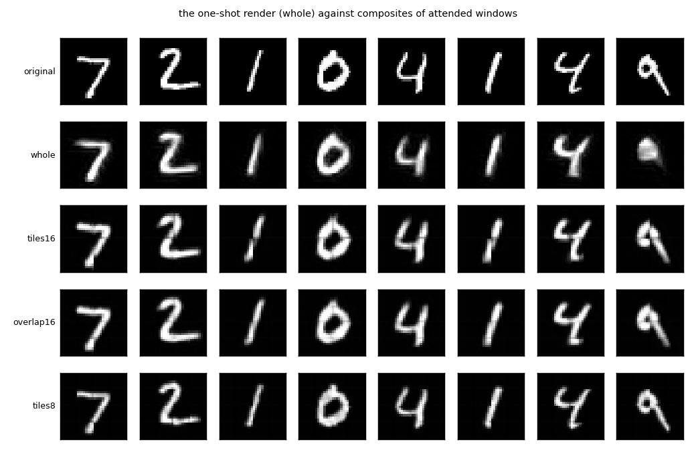
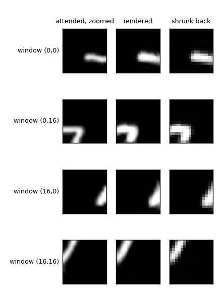
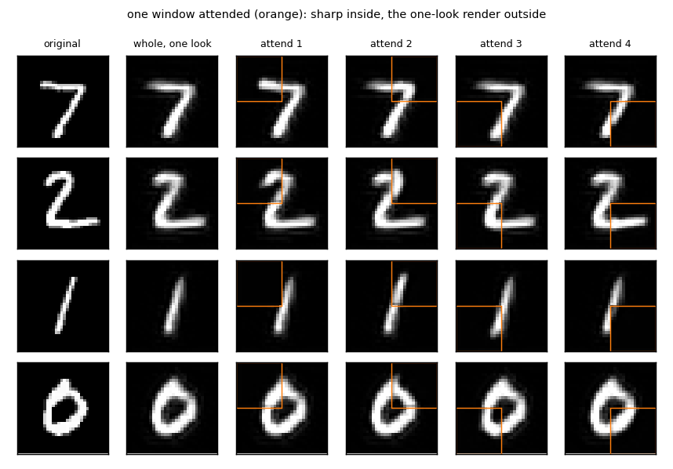
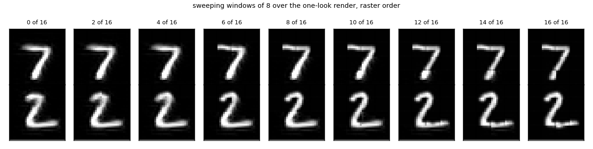

# `attend_parts/` — attend to a part, draw the part, sweep the parts

2026-09-26. [`run.py`](run.py) trains and scores everything in about 45 seconds and writes
[`results/`](results/) (`summary.md`, `metrics.json`, `composites.png`, `one_digit.png`,
`attend_one.png`, `sweep.png`, `run.log`).

## The question

The one-shot render in [`what_where/`](../what_where/) is the coarse image attended as a
whole, which is why it is blurry. Lavender's point: the claim worth testing is that
attending a *part* draws that part vividly, and that sweeping the attention over the field
rebuilds the whole. If that holds, the what and where split is a window, not a blob: the
what is the content of the window at canonical size, the where is the window's position and
size, and the render is the content drawn back at the window's place.

## The rig

Same forward stack (conv3x3 + ReLU + max pool, three levels, trained on the labels to 98.6%,
frozen), same judge (98.8%), MNIST at 32x32, one seed, five epochs.

**Attending a window.** Cut a w by w window at (top, left), resample it to 32x32, run the
forward stack, take the 4x4x64 top map. That is the what of the window. The where is the
triple (top, left, w). The render is the decoder's 32x32 output shrunk back to w by w and
pasted at (top, left). Where windows overlap the renders are averaged.

**Decoders.** Content alone, learned unpool (the none/learned arm of `what_where`), one per
window size, trained by local mismatch on zoomed random windows of that size. Nothing in the
decoder sees the where; the where is used only to paste.

**Window sets.**

| set | windows | size |
|---|---|---|
| whole | 1 | 32, the one-shot render |
| tiles16 | 4 | 16, non-overlapping |
| overlap16 | 9 | 16, stride 8 |
| tiles8 | 16 | 8, non-overlapping |

Scored by pixel error of the composite to the original and by the judge on the composite.

## Results

| window set | windows | pixel error | judge |
|---|---|---|---|
| whole | 1 | 0.0159 | 0.953 |
| tiles16 | 4 | 0.0128 | 0.973 |
| overlap16 | 9 | 0.0106 | 0.983 |
| tiles8 | 16 | **0.0040** | **0.985** |

**Smaller windows, sharper whole.** Every step down in window size lowers the pixel error
and raises the judge, monotonically. Sixteen windows of 8 cut the error to a quarter of the
one-shot render and bring the judge to 98.5%, which is the judge's own accuracy on real
digits (98.8%). The composite is, to the judge, a real digit.

**A window is drawn vividly.** The middle figure shows one digit's four windows of 16: the
zoomed part, its render, the render shrunk back. The rendered part is a clean stroke at the
zoomed scale. Shrunk back, it is a sharper version of that region than the whole render
gives, because the top map's 4x4 grid now covers 16 pixels instead of 32, and the same 64
features at 16 places describe a quarter of the digit.

**One window attended, the rest from the glance.** Lavender asked to see what the feedback
path gives for the unattended parts while one part is attended. The unattended parts are
what the one-look render gives: the coarse pass. The attended window is rendered sharp and
pasted over it. Sharp inside the orange box, soft outside, and the soft part is not wrong,
only coarse.

**The sweep.** Windows of 8 added one at a time in raster order over the one-look render.
The digit sharpens region by region and the rest stays as the glance left it.

**The where does not have to be in the decoder.** The decoder never sees the window's
position. The pointer is used only to place the render, which is what a pointer was supposed
to do. Content at canonical size plus a paste position is enough, and the split is clean
because the position cannot leak into the content: it is the same decoder for every window.

**Overlap helps a little, size helps a lot.** Nine overlapping windows of 16 beat four tiles
of 16, but sixteen tiles of 8 beat both by more.

## What it says

This is the resolution budget from the conversation, measured. The top is a fixed 4x4 grid of
64 features. Spend it on the whole image and you get the whole, blurred. Spend it on a
quarter and you get that quarter sharp. Sweep it and you get the whole sharp, at the cost of
sixteen passes instead of one. Attention buys vividness by moving a fixed budget, and the
decoder does not need to know anything about where it is looking.

It also closes the loop on `what_where`. The bag of features plus one pointer failed because
the pointer said where the object was and nothing about its parts. Here the pointer says
where a *window* is, the content is that window's parts at coarse places, and it works. A
part at a pose is the unit, not an object at a pose.

## Caveats

- **The field is not bigger than the budget, so the eye barely sees the gain.** The one-look
  render of a 32x32 digit is already clear; 64 features at 16 places is nearly enough for
  the whole digit. The numbers move (pixel error down four times, judge from 95% to 98.5%),
  the pictures move little. Lavender's reading is right: on this data, attention is doing
  little work. The test that would show it is a field the top cannot hold in one look,
  several digits on a 64x64 or 96x96 canvas or a face at full size, where the one-look render
  must be coarse and the window must buy the detail. Not run.
- One seed, five epochs. The decoders for 16 and 8 are trained on zoomed windows only, so
  the whole-image decoder and the window decoders are different networks; each is trained
  on what it renders.
- Zooming an 8 by 8 window by four gives thick blurry strokes, and the forward stack was
  trained on whole digits. That the features still round-trip says the decoder learns to
  invert them, not that the features are sensible at that scale.
- Windows are a fixed grid, not chosen. Where to put the window, and how many are needed to
  settle a question, is the loop from the conversation and is not tested here.
- The judge on composites scores recognisability, not sharpness. Pixel error is the sharpness
  number.
