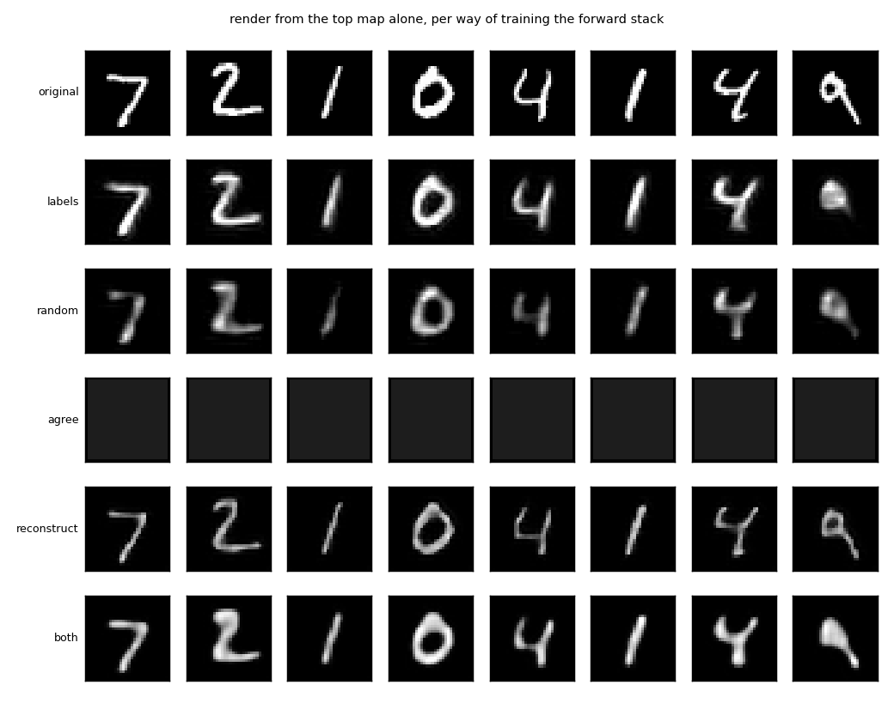
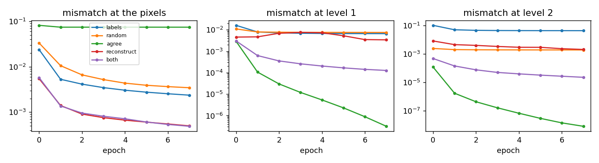
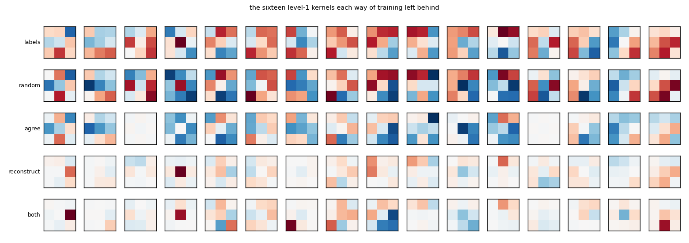
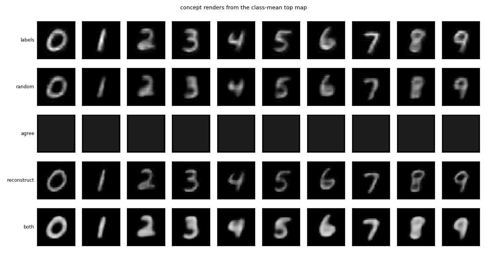

# `both_ways/` — both directions at once, from mismatch, with no labels

2026-09-26. [`run.py`](run.py) runs the five arms in about two and a half minutes and writes
[`results/`](results/) (`summary.md`, `metrics.json`, `renders.png`, `concepts.png`,
`kernels.png`, `curves.png`, `run.log`).

## The question

Every experiment today so far used a forward stack trained on the digit labels. Lavender's
question: train both networks at the same time, image to forward to code to backward to
image, with no labels anywhere, each level trying to copy its twin in the other network.
Does the code the network settles on come out meaningful?

## The rig

Same forward stack (conv3x3 + ReLU + 2x2 max pool, 16, 32, 64 channels) and the same backward
stack as [`what_where/`](../what_where/) (a learned unpool trained toward the pre-pool map,
a transposed conv trained toward the map below). MNIST at 32x32, one seed, eight epochs. The
graph is cut at every level boundary, so every loss reaches one level's weights and nothing
else. The backward levels are trained the same way in every arm. What differs is how the
forward kernels learn:

| arm | how the forward kernel of level l learns |
|---|---|
| `labels` | backprop on the digit labels, then frozen. The reference; the only arm that ever sees a label |
| `random` | it doesn't; frozen as initialised |
| `agree` | moves y_l toward p_l, the backward network's prediction of y_l from the level above. For level 3 the target comes from a small competitive top code (16 winners of 256, trained by winner-moves-toward-input with a conscience). Lavender's rule as stated: each state copies its twin |
| `reconstruct` | moves y_l so that its own backward level rebuilds y_{l-1} better. The error one level down reaches the forward kernel through the level's feedback weights |
| `both` | the two losses added |

**Measured afterwards, everything frozen.** `readout`: a linear classifier trained on the
top map with labels, test accuracy. This is the only place labels enter, and only as a
thermometer for whether the code discriminates; nothing in training asked it to. `recon`:
the render from the top map alone, named by the judge (a separate CNN, 98.8% on real
digits), and its pixel error. `concept`: the ten class-mean renders. `code`: cosine between
the top map and the top map recomputed from the render, with the cosine to a shuffled
digit's map as the floor. `alive`: the fraction of top channels that vary across the test
set. `activity`: the mean value of the top map.

## Results

| forward trained by | readout | recon | recon mse | concept | code (floor) | alive | activity |
|---|---|---|---|---|---|---|---|
| labels | 0.989 | 0.950 | 0.0153 | 10/10 | 0.96 (0.65) | 0.92 | 1.11 |
| random | 0.862 | 0.855 | 0.0272 | 10/10 | 0.97 (0.95) | 0.94 | 0.04 |
| agree | **0.114** | 0.114 | 0.0756 | 1/10 | 1.00 (1.00) | **0.00** | 0.001 |
| reconstruct | **0.938** | **0.949** | 0.0200 | 10/10 | 0.98 (0.92) | 0.81 | 0.21 |
| both | 0.644 | 0.888 | 0.0161 | 9/10 | 1.00 (1.00) | 0.66 | 0.01 |

**Copy your twin converges to silence.** The `agree` arm drives the level-1 and level-2
mismatches to a millionth and a hundred-millionth, the best agreement of any arm, and does
it by turning everything off: no top channel varies, the activity is a thousandth of the
label-trained stack's, the render is a flat grey, the readout is chance. Perfect agreement
is reached when there is nothing to disagree about. The one place that cannot go quiet is
the image, clamped at the bottom, and its mismatch stays the worst of any arm (0.075, the
decoder drawing the mean digit), but under this rule that error only ever reaches backward
weights, which cannot fix it from a code of zeros. Nothing in "copy your twin" rewards
carrying information.

**Rebuild the level below converges to something meaningful.** With no labels, the
`reconstruct` arm renders as well as the label-trained stack (94.9% against 95.0%), renders
all ten class means, closes the code round trip, and its top map reads out at 93.8% with a
linear classifier that nothing in training prepared it for. That is above the random stack
(86.2%, the floor for "meaningful" on this data, since a random conv stack plus a linear map
is already that good) and below the label-trained one (98.9%). It was never asked to
discriminate. It discriminates because keeping what the level below needs, through a
pooling bottleneck, keeps what the digit is.

**Adding the twin rule to it does harm.** `both` is a partial collapse: activity down fifty
times, a third of the channels dead, readout 64%. The agree loss can always be lowered by
silence and the reconstruct loss cannot, so with the two added the first wins ground
steadily. Weighting them differently might change this and was not tried.

**What the forward kernels look like.** The `labels` and `random` kernels are high-contrast
patterns. The `reconstruct` kernels are faint, and most of them are close to a single strong
pixel: the easiest way to be reconstructible is to pass the input through, and the pooling
is what stops the stack from being a pure copy. They are not edge detectors. Meaningful, but
not the features a sparsity or competition term would produce, and that is the next knob.

## What it says

Two rules that both sound like "the two networks learn to match each other" differ in which
error trains the forward synapse, and only one of them works. Training the forward weights
of level l by the disagreement at level l has a trivial solution and finds it. Training them
by the disagreement at level l-1, the error in what their level predicts below, carried back
through the feedback weights, has no trivial solution, because the bottom is the image and
the image does not go quiet. The second is the learning rule of predictive coding, and it is
what the cortical story needs: the feedback path delivers the prediction, the comparison is
made one level down, and the forward synapses answer for it.

That gives the project its first stack that learns both directions locally, with no labels,
from a rule with one line in it, and comes out able to render, to imagine a class, and to
tell digits apart at 94% without having been asked to.

## Caveats

- One seed, eight epochs, one dataset.
- "Local" here means the graph is cut between levels. The reconstruct gradient into the
  forward kernel passes through the level's own unpool and transposed conv, which is the
  error below carried up through feedback weights. Cortex would need those weights to carry
  it, or something like feedback alignment; that is assumed, not shown.
- The competitive top code is used only by `agree` and `both`, as the target for level 3.
  `reconstruct` trains level 3 by rebuilding level 2 and has nothing above it.
- The level-1 kernels of the reconstruct arm are near point samplers. The code is meaningful
  by the measures here, not by the look of its features.
- The readout is trained for five epochs on the frozen top map; it measures linear
  separability of the code and nothing else.
