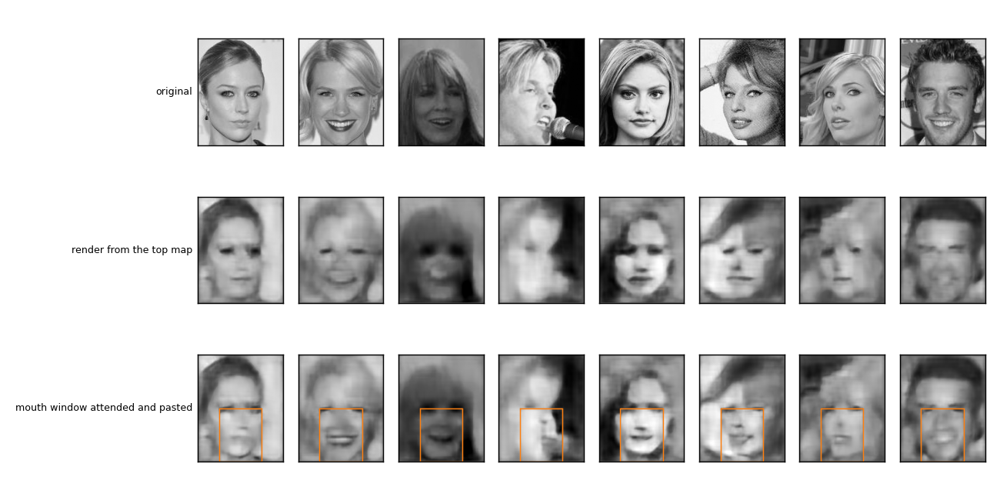
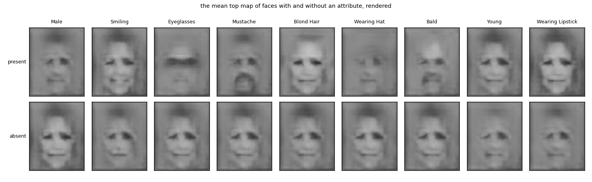
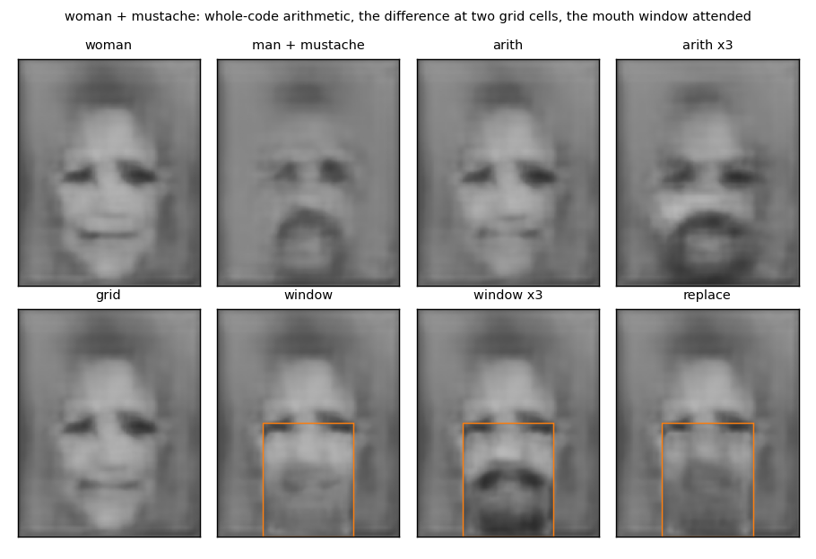
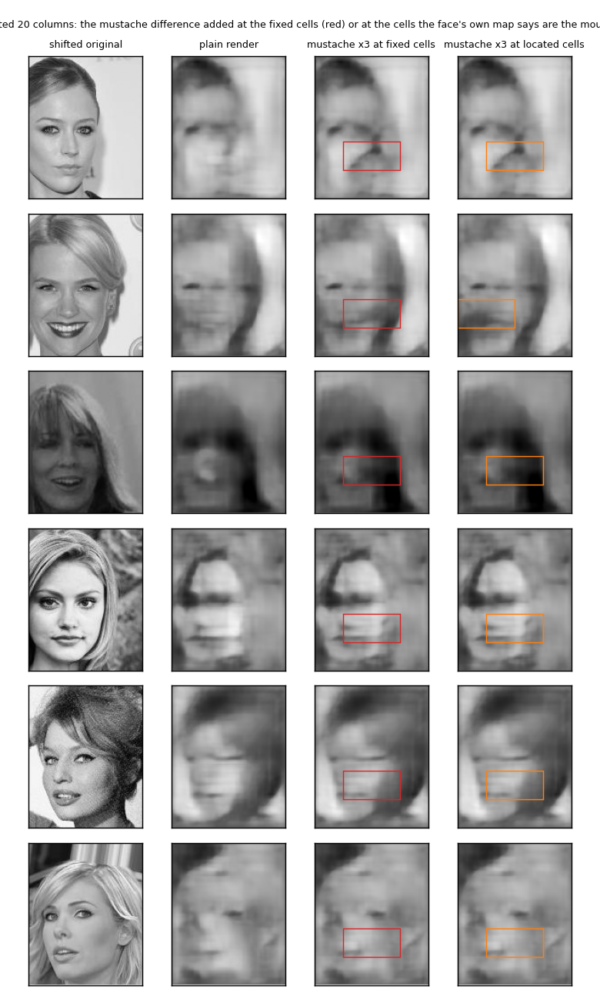

# `faces/` — a deeper stack on CelebA, a backward path from mismatch, and a mustache on a woman

2026-09-26. [`run.py`](run.py) trains the three networks in about four minutes, saves them
in `results/nets.pt` (not in git), and reuses them on later runs, which then take twenty
seconds. Writes [`results/`](results/) (`summary.md`, `metrics.json`, `recon.png`,
`concepts.png`, `compose.png`, `locate.png`, `run.log`).

## The questions

Does the backward path render faces? Does it render an attribute from the mean code of
faces that have it? And can a woman be given a mustache, either by arithmetic on the whole
code, or the way the digits were built on the 26th, by attending the mouth and drawing
there? Lavender's follow-up: can the network work out *where* the mustache goes from the
face itself, rather than being told?

## The rig

Grayscale CelebA from the 2026-09-23 cache, the 160x128 centre crop of the original 218x178,
not scaled. 32,910 training faces, 5,000 test. One seed.

**Forward stack.** Five levels of conv3x3 + ReLU + 2x2 max pool with 16, 32, 64, 128, 256
channels, so the top map is 5x4x256: 256 features at 20 places, each place a 32x32 patch of
the face. A linear head on the top map, trained on the 40 attributes with the balanced loss
of the 23rd, six epochs, then frozen. 83.8% balanced accuracy on the test faces, against the
23rd's 82.9% for its five-level stack.

**Two decoders, by mismatch only.** The learned unpool and transposed conv per level from
`what_where`, nothing crossing a level, four epochs. `whole` on the full crop. `mouth` on the
lower half of the face (rows 80 to 160, columns 32 to 96) zoomed twice to 160x128, trained on
random windows of that size.

**Judge.** There is no separate judge for faces. The stack's own attribute head reads every
render, as a probability per attribute.

## Results

### It renders faces

Pixel error 0.019 from the top map alone. The head reads the renders at 0.66 balanced
accuracy against the true attributes, against 0.84 on the real faces: the renders keep Male
(0.90), Blond Hair (0.83), Eyeglasses (0.83) and Wearing Hat (0.81), and lose the fine ones,
Mustache (0.66), 5 o'clock shadow (0.64).

**Attending the mouth sharpens it.** Inside the mouth region the whole render's pixel error
is 0.0161 and the mouth window's, rendered at twice the size and pasted back, is 0.0101. This
is the test the digits were too small for: a face is bigger than the budget, and the window
buys detail. Teeth appear.

### It renders attributes

The mean top map of faces with an attribute, and without, rendered, with the head's
probability of the attribute on each render:

| attribute | with | without |
|---|---|---|
| Male | 0.86 | 0.00 |
| Smiling | 0.93 | 0.07 |
| Eyeglasses | 0.81 | 0.00 |
| Mustache | 0.42 | 0.00 |
| Blond Hair | 0.94 | 0.46 |
| Wearing Hat | 0.03 | 0.00 |
| Bald | 0.69 | 0.00 |
| Young | 0.56 | 0.26 |
| Wearing Lipstick | 0.39 | 0.01 |

A smile, glasses, a mustache, bright hair, a bald head, dark lips: each appears in the render
of its mean, in the place it belongs, and the head reads most of them. Hats do not survive
averaging, since they sit in different places on different heads, and the mean mustache is
faint because mustaches vary.

### Woman + mustache

Codes: `woman` is the mean top map of women, `delta` is the mean of men with a mustache minus
the mean of men without one, so that maleness itself is not in the difference. The head's
readings:

| render | P(Male) | P(Mustache) | what was done |
|---|---|---|---|
| woman | 0.00 | 0.00 | the mean woman, rendered |
| man + mustache | 0.99 | 0.42 | the mean mustached man, rendered |
| arith | 0.00 | 0.00 | woman + delta, whole code |
| arith x3 | 0.73 | 0.74 | woman + 3 delta |
| grid | 0.00 | 0.00 | delta added at the two cells over the upper lip only |
| window | 0.06 | 0.00 | woman rendered, then the mouth window rendered from the women's mouth code + the mouth-window delta, pasted |
| window x3 | 0.84 | 0.94 | the same with 3 times the delta |
| replace | 0.62 | 0.06 | the mouth window rendered from the mustached men's mouth code, pasted |
| real women | 0.06 | 0.01 | |
| real men with mustache | 0.99 | 0.84 | |

**At natural strength the mustache does not take.** Adding the difference once, whole or at
the lip cells or through the window, leaves the render a woman with no mustache, to the head
and to the eye. The mean-of-differences mustache is a faint smudge on a bright, smooth face.

**At three times the strength it takes, and the face turns male.** The window version gets
P(Mustache) to 0.94, above real mustached men, and a dark mustache is plainly there, with a
beard under it. But P(Male) goes to 0.84. The difference between men with and without a
mustache is not a mustache. It is a mustache, a beard, sideburns, and age, because in this
data those come together, and the head reads the bundle as a man. A woman with only a
mustache is not something the code has a direction for, because there is no such face in
the data to have learned one from.

**Attending the part is the most targeted of the three** (P(Mustache) 0.94 against 0.74 for
whole-code arithmetic at the same strength) but it is not targeted enough to leave the
gender alone.

### Where does the mustache go? Finding the mouth from the face

Lavender's point: in the grid and window versions the place was given by hand. To compute
it, take a mouth signature, the mean feature vector at the two mouth cells over aligned
training faces, and match it by cosine against every cell of a face's own top map. The best
cell is the mouth. Tested on 300 test women shifted so that the mouth is not where the
signature was taken from:

| shift | row holding the mouth | found that row | found within one column too | where the 300 landed, by row |
|---|---|---|---|---|
| none | 3 | 0.96 | 0.96 | [2, 3, 0, 289, 6] |
| 20 columns left | 3 | 0.95 | 0.95 | [0, 4, 1, 286, 9] |
| 20 columns right | 3 | 0.97 | 0.96 | [0, 2, 0, 291, 7] |
| 24 rows down (face lower) | 4 | 0.19 | 0.17 | [1, 11, 48, 183, 57] |
| 24 rows up (face higher) | 3 | 0.01 | 0.01 | [0, 3, 275, 4, 18] |

**Sideways, it finds the mouth.** Shift the face by 20 columns either way and the matched
cell moves with it, 95 to 97% of the time. The figure shows women shifted right: the fixed
cells (red) miss the mouth, the located cells (orange) sit on it, and the mustache added at
the located cells lands on the lip.

**Up and down, it lands one cell high.** The cell that holds the mouth line in aligned faces
also holds the bottom of the nose, and the nose dominates the signature. Move the face down
and the nose moves into the centre of the same row, so the match stays there; move the face
up and the match follows the nose into the row above. What was learned as "mouth" was mostly
"nose". A 32-pixel cell is too coarse to separate the two, and a finer where would need the
match made at the level below, where cells are 16 pixels. The head could not be used to
score the shifted composites at all: trained on aligned faces, it reads absolute position and
calls shifted women male half the time, the 23rd's finding again.

## What it says

The backward path learned by mismatch renders faces at their original scale, renders the
attributes from their mean codes, and renders a part sharper when the part is attended. That
is the machinery from the digits carried to a field bigger than the budget, and it holds.

Composition by code arithmetic works as arithmetic and fails as intention: the direction for
"mustache" comes bundled with everything that co-occurs with mustaches, and there is no
unbundled direction to be had from means. Attending the part narrows the edit to the part
but not to the attribute. To put only a mustache on a woman, the mustache would have to be a
part in its own right, with its own code, placed at a pose found from the face, which is the
parts-at-poses table again, and not something a mean over faces provides.

Finding the pose from the face itself works at the grain of the top map for sideways
displacement and fails for vertical, for a reason that is about the grain and not the
idea: the cell is bigger than the part.

## Caveats

- One seed, six and four epochs, grayscale.
- The head is the only judge, and it is a linear map on the top of the same stack. It is
  blind to shifted faces and reads bundles, not parts.
- The mouth signature and the difference vectors are means over the training set. No
  per-face adaptation.
- The 3x scaling was the first value tried, not a search.
