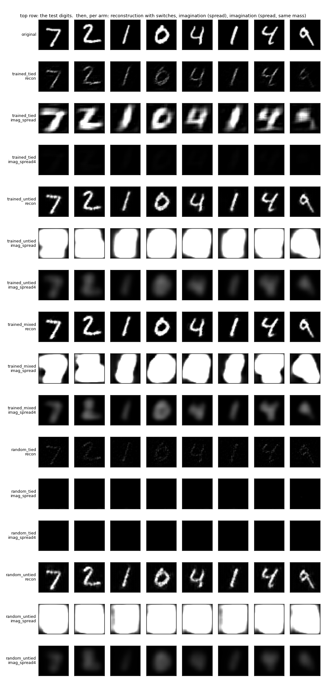
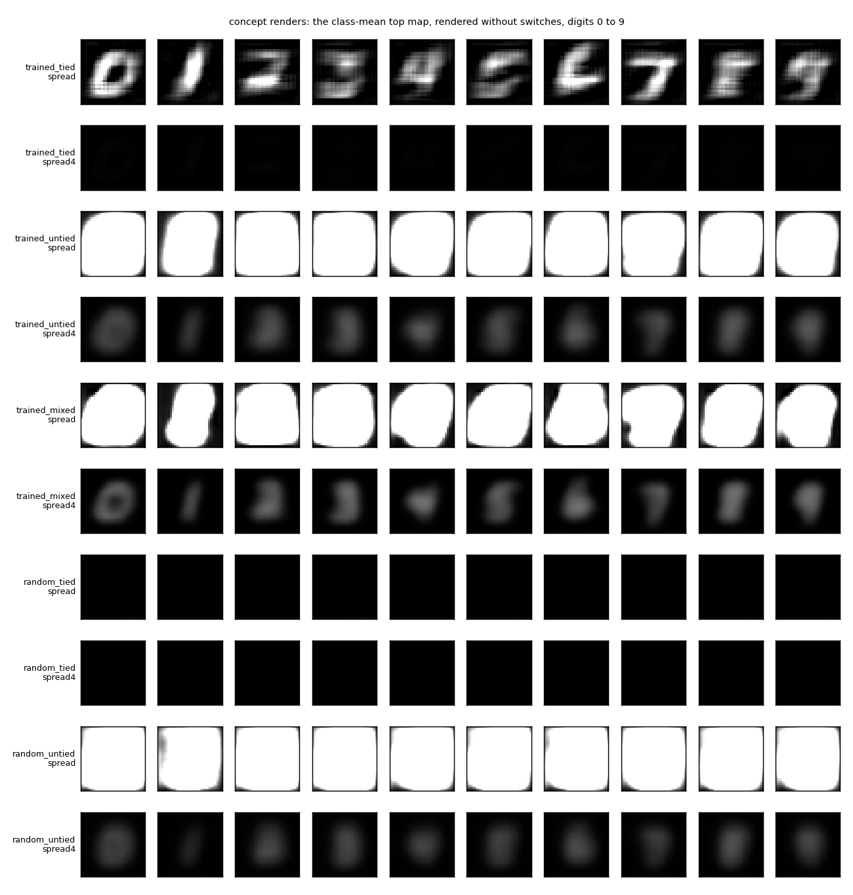
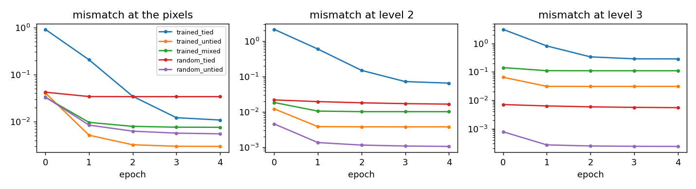

# `feedback_render/` — a backward path trained only by mismatch: does it render?

2026-09-26. One script, [`run.py`](run.py), trains everything and writes [`results/`](results/)
(`summary.md`, `metrics.json`, `renders.png`, `concepts.png`, `curves.png`, `run.log`). About
40 seconds on the laptop GPU.

## The question

The cortex has more feedback connections than feedforward ones, imagination shows up in the
early visual maps, and the proposal from the last three days was that the backward path is
a decoder learned from local coincidence: at every level, the mismatch between what came up
and what was predicted from above trains both directions, and nothing crosses a level. The
first thing to check is the backward half alone. Given a good forward stack, does a backward
path trained only by per-level mismatch render? With the winners' positions available, does
it reconstruct? With them taken away, does it imagine?

## The rig

MNIST digits padded to 32x32, 60,000 for training, 10,000 for testing. One seed.

**Forward network.** Three levels of conv3x3 + ReLU + 2x2 max pool, 16, 32, 64 channels, so
the top map is 4x4x64. Each pool also returns its switch: which of the four positions won.
Two versions: *trained*, three epochs of backprop on the labels, 98.65% on the test digits,
then frozen; and *random*, frozen as initialised.

**Backward network.** Three levels of unpool + transposed conv3x3. Level l takes the pooled
map of level l, unpools it, and predicts the pooled map of level l-1, or the image. Each level
is trained only by the squared mismatch between its prediction and the true map below,
starting from the true map above. Five epochs. Three versions:

| backward | what it is |
|---|---|
| `tied` | the forward kernels themselves, applied in transpose; the only trained numbers are one scalar gain per level |
| `untied` | its own kernels, learned, with the switches always available in training |
| `mixed` | its own kernels, learned half the time with switches and half with the mass-preserving spread below (trained forward only) |

**Rendering without switches.** Three ways to unpool when no forward pass supplies the
positions. `spread`: the pooled value copied into all four positions. `spread4`: a quarter
of it in each, so the mass is the same as with a switch. `corner`: the value in the top-left
position only.

**Checks.** `recon`: a test digit's top map rendered down with its switches, each level's
prediction feeding the next. `imag`: the same top map, no switches. `concept`: the mean top
map of each digit class over the training set, no switches, ten renders. Every render is
named by a separate judge network trained on real digits (98.76% on the test digits), twice:
as it is, clamped to [0, 1], and after dividing by its own maximum, so that a faint but
correct render is not counted as wrong for being faint.

## Results

Fraction of renders the judge named correctly, as rendered / brightness-normalised.

| arm | recon | imag, spread | imag, spread4 | concept, spread | concept, spread4 |
|---|---|---|---|---|---|
| trained, tied | 0.853 / 0.873 | 0.817 / 0.817 | 0.103 / **0.788** | 0.9 / 0.9 | 0.1 / **0.9** |
| trained, untied | **0.984** / 0.984 | 0.077 / 0.077 | 0.408 / 0.452 | 0.1 / 0.1 | 0.4 / 0.4 |
| trained, mixed | **0.985** / 0.985 | 0.104 / 0.104 | 0.613 / 0.609 | 0.1 / 0.1 | 0.6 / 0.6 |
| random, tied | 0.609 / 0.727 | 0.102 / 0.141 | 0.103 / 0.141 | 0.1 / 0.1 | 0.1 / 0.1 |
| random, untied | 0.972 / 0.972 | 0.114 / 0.114 | 0.279 / 0.341 | 0.1 / 0.1 | 0.2 / 0.3 |

The corner mode was below 0.25 everywhere and is left in `metrics.json`.

**Reconstruction with switches works for any learned backward path, and says nothing about
the features.** The untied decoder reaches 98.4% from the trained forward stack and 97.2%
from the random one. The mismatch rule trains a decoder fine. But if the positions are
given, almost any set of features can be inverted, so this check cannot tell a good forward
stack from a random one.

**Without positions, the best imaginer is the one with no learned weights of its own.** The
trained forward kernels run in transpose name 79 to 82% of digits from a top map with the
switches removed, and render 9 of the 10 class means as readable digits. The transpose of a
kernel is a picture of what that feature looks like. Stamping it wherever the feature was,
without knowing where inside the pool, gives a blurred but correct image. That is what
imagining a just-seen digit was predicted to look like, and it is what the second row of the
figure shows.

**A decoder trained with the positions available learns to need them.** The untied decoder,
which reconstructs almost perfectly, names 45% of digits and 4 of 10 class means without
switches. It was trained on inputs with three zeros in every pool and learned kernels that
count on that. Putting the no-position case into its training raises it to 61% and 6 of 10,
still behind the plain transpose. Five epochs of error-driven learning did not find what the
transpose gives for free.

**Imagination needs trained features. Reconstruction does not.** From the random forward
stack, the transpose imagines nothing (14%) and the learned decoder little (34%). The
transpose of a random kernel is a picture of noise.

**Two things about scale.** Copying the full pooled value into all four positions puts four
times the mass into every level and sixty-four times into the pixels, and the learned
decoders saturate to a white square. The tied transpose survives it only because its own
renders are faint, so the extra mass happens to bring them to normal brightness: with the
brightness-normalised judge, spread and spread4 give the same 0.79 to 0.82. The corner mode
puts every value in one fixed position and produces a grid, not a digit.

## What it says

The claim under test was that a backward path can be learned locally from mismatch and then
used to render. Half of it held: the mismatch rule trains a decoder that reconstructs, from
any features. The other half did not: what that decoder learned is an inverse that needs the
positions the forward pass handed it, and it cannot render from content alone. The forward
kernels run backward can, because they are position-free templates of the features.

For the cortex story this points somewhere specific. Feedback synapses that learn only while
the bottom-up state is present, with each cell's own drive supplying the where, would come
out like the untied decoder. Two ways around it, both testable. One is a phase where the
backward path learns with no bottom-up input at all, which the mixed arm approximates and
which improved things without closing the gap. The other is that Hebbian learning on
reciprocal connections tends to make them roughly symmetric, which would make the brain's
feedback close to the transpose whether or not anything ties it. A backward path trained by
plain coincidence rather than by error, compared with the transpose on the imagination
checks, is the next thing to run.

## Caveats

- One seed, five epochs, one dataset, one pooling size. The gap between mixed (0.61) and
  tied (0.79) may narrow with longer training.
- The "concept" is a class-mean top map, not a concept unit. Imagination from the image's
  own top map is imagining something just seen, not something recalled.
- The tied arm's three gains were fit with switches present, which is why its
  reconstructions are faint.
- The judge is a small CNN. It may read blur differently from a person, in either direction.
- The first run used only full spread and scored the tied arm at 81% and the untied at 7%.
  The mass-preserving spread, the mixed arm and the normalised judge were added after seeing
  the white squares in the first figure.
