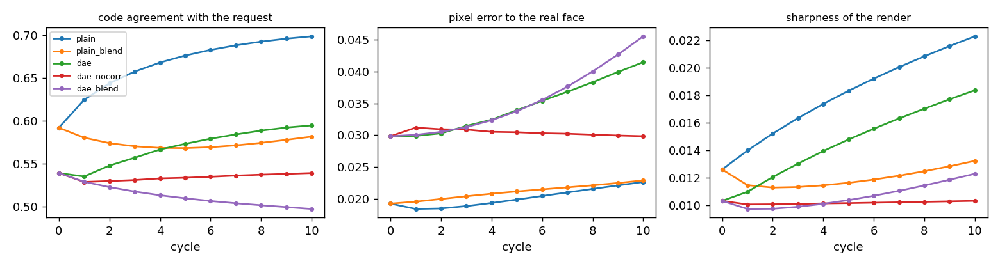
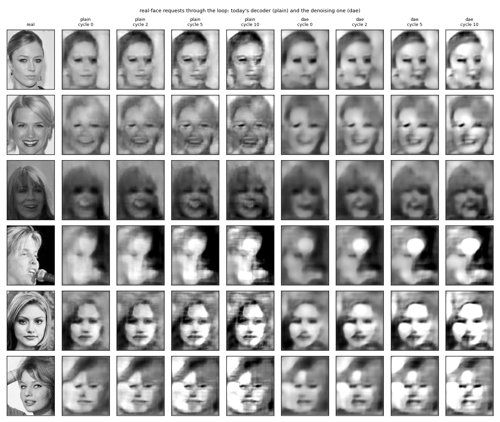
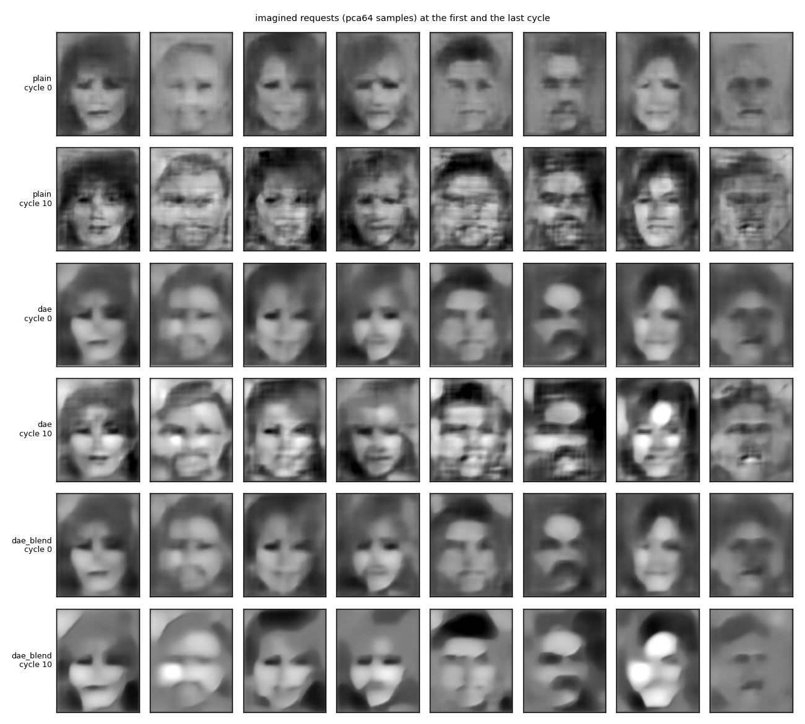

# `loop/` — render, read back, correct, render again

2026-09-26. [`run.py`](run.py) reuses the forward stack and the whole-face decoder from
[`faces/`](../faces/), trains one denoising decoder (saved in `results/dae.pt`, not in git),
and writes [`results/`](results/) (`summary.md`, `metrics.json`, `cycles.png`,
`loop_faces.png`, `loop_imagined.png`, `run.log`). Two minutes the first time, one after.

## The idea

Lavender's: run the two networks as a loop, the way a diffusion model runs its denoiser. Ask
for a code, render it, read the render back through the forward stack, compare what came back
with what was asked, correct, render again. The feedback path proposes, the forward path
checks, and the difference drives the next proposal. Two versions of the decoder: today's,
and one trained to clean, with noise added to every level's input code during its mismatch
training, so that every pass down is a denoising step and the noise can be scheduled down over
the cycles.

## The rig

One cycle, for a request c_req, a top code:

```
c_in   = relu(c + s_k * std(c) * noise)      s_k falls from 0.5 to 0 over the ten cycles (dae arms only)
image  = render(c_in)
c_read = forward(image)
c     <- relu(c + 0.5 * (c_req - c_read))    the correction, at the top
```

With blending, every level's rendered map is mixed half and half with the map the previous up
pass read at that level, a shortcut from the read to the next render.

| arm | decoder | correction | noise schedule | blend |
|---|---|---|---|---|
| plain | today's | yes | no | no |
| plain_blend | today's | yes | no | yes |
| dae | denoising | yes | yes | no |
| dae_nocorr | denoising | no | yes | no |
| dae_blend | denoising | yes | yes | yes |

Requests: the top codes of 500 test faces, so that pixel error to the real face can be
measured, and eight faces that never existed (samples from the 64-component Gaussian of
`sample_windows`). Per cycle: cosine between the request and the read-back code, pixel error
to the real face, sharpness (mean absolute Laplacian). At the end, the stack's own head on the
final renders against the true attributes; it reads real faces at 0.838.

## Results

| arm | code agreement, cycle 0 to 10 | pixel error | sharpness | head on final | imagined: agreement | imagined: sharpness |
|---|---|---|---|---|---|---|
| plain | 0.592 → **0.699** | 0.0192 → 0.0226 | 0.0126 → 0.0223 | **0.704** | 0.503 → 0.629 | 0.0087 → 0.0173 |
| plain_blend | 0.592 → 0.581 | 0.0192 → 0.0229 | 0.0126 → 0.0132 | 0.638 | 0.503 → 0.480 | 0.0087 → 0.0075 |
| dae | 0.539 → 0.595 | 0.0298 → 0.0415 | 0.0103 → 0.0184 | 0.657 | 0.500 → 0.549 | 0.0076 → 0.0147 |
| dae_nocorr | 0.539 → 0.539 | 0.0298 → 0.0298 | 0.0103 → 0.0103 | 0.631 | 0.500 → 0.500 | 0.0076 → 0.0076 |
| dae_blend | 0.539 → 0.497 | 0.0298 → 0.0455 | 0.0103 → 0.0123 | 0.592 | 0.500 → 0.470 | 0.0076 → 0.0080 |







**The correction does what it is told.** With today's decoder, ten cycles of correcting at
the top raise the agreement between the request and the read-back from 0.59 to 0.70, cycle by
cycle, and the stack's own head reads the final renders at 0.70 against 0.66 for the plain
render. The render becomes, to the stack, more like what was asked for.

**Fidelity improves for one cycle and then drifts.** Pixel error to the real face dips from
0.0192 to 0.0183 at the first cycle, the best any render of a whole face has reached today
without windows, and then climbs past where it started. The figure shows what the climb is:
contrast pushed up, highlights blown out, a hatched texture spreading over the face. Edge
energy nearly doubles, and none of it is detail from the face. The loop is finding what the
stack responds to, and the stack responds to contrast and stripes as readily as to eyes. This
is the encoder-fooling failure named before the run, and it arrives on the third cycle.

**The denoising decoder made things worse, not better.** Trained with noise on every level and
no knowledge of the noise level, it learned to render the average over noise levels: blurrier
at cycle 0 than today's decoder (pixel error 0.030 against 0.019), and no more resistant to
the drift once the correction runs. The scheduled noise adds error rather than removing it.
Without the correction it does nothing at all, which is the control behaving. A denoiser that
gives the loop a way back to the data has to know how much noise it is removing and be trained
at matched levels; this one was neither, and it is not diffusion.

**Blending the read into the render is harmful everywhere.** It pulls each render toward the
previous read, which is the previous render, and the loop settles into itself: smoother with
today's decoder, blobs with the denoising one.

**The imagined faces sharpen and harden.** At cycle 10 the plain loop's imagined faces have
defined eyes and mouths that the coarse render lacked, and the same hatching and contrast. A
person can read them as faces more easily and less comfortably.

## What it says

The loop works as a consistency loop: it makes the render read back as the request, and one
cycle of it improves fidelity. It fails as a generator beyond that, because nothing in it
knows what a face looks like except the stack, and the stack is satisfied by things that are
not faces. The read-back check is necessary, and it is what today's rebuilds lacked, but it is
not a prior. Diffusion has one, in a denoiser trained at every noise level to step toward real
data; the version built here does not.

What follows for the project: keep the loop at one or two cycles, where it helps; give the
correction a stopping rule from the fidelity dip; and, if the loop is to run longer, train the
denoiser with the noise level as an input and at matched levels, so each step has a direction
that is toward faces rather than toward the stack's approval. And judge with something the
loop is not optimising, which the head is not.

## Caveats

- One seed, one step size, one noise schedule, one blend weight; four epochs for the denoising
  decoder.
- The head is the same stack the loop is satisfying, so "head on final" measures the loop's
  success at its own objective, not at looking like a face. Pixel error to the real face is
  the honest number.
- The fidelity dip at cycle 1 is 5% and one seed.
