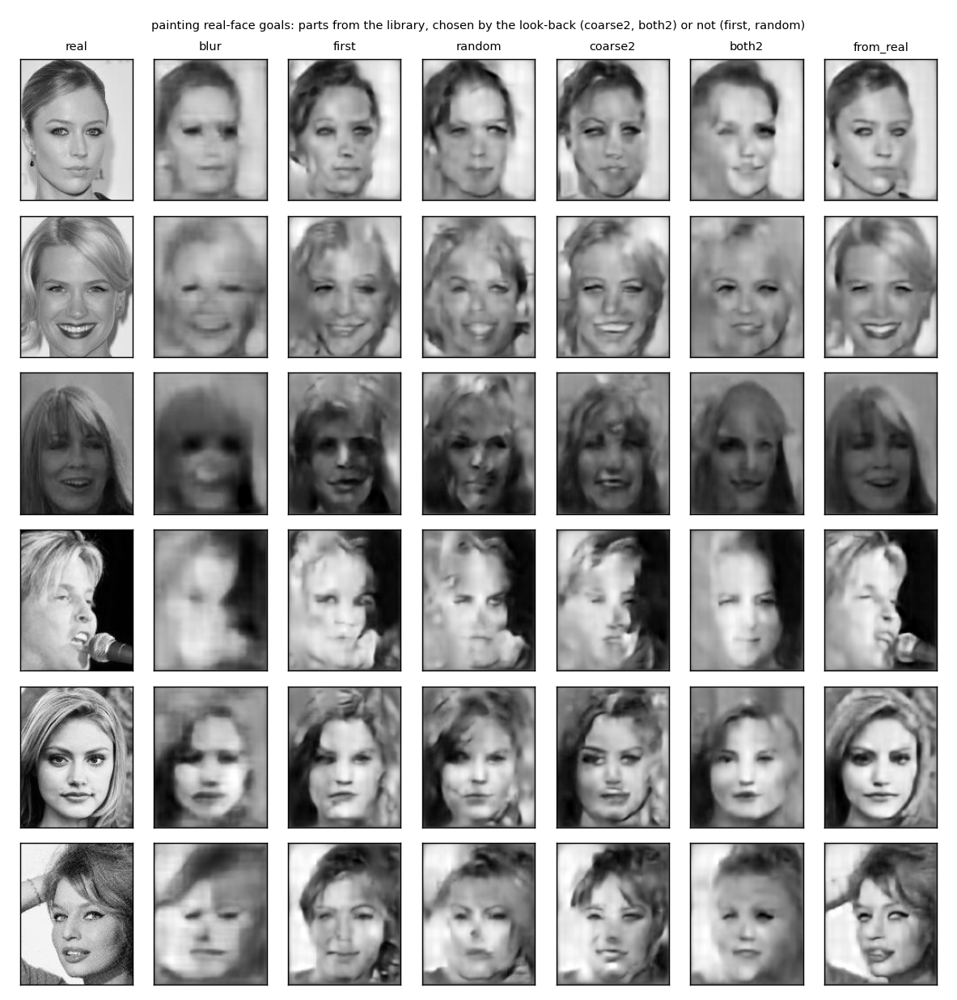
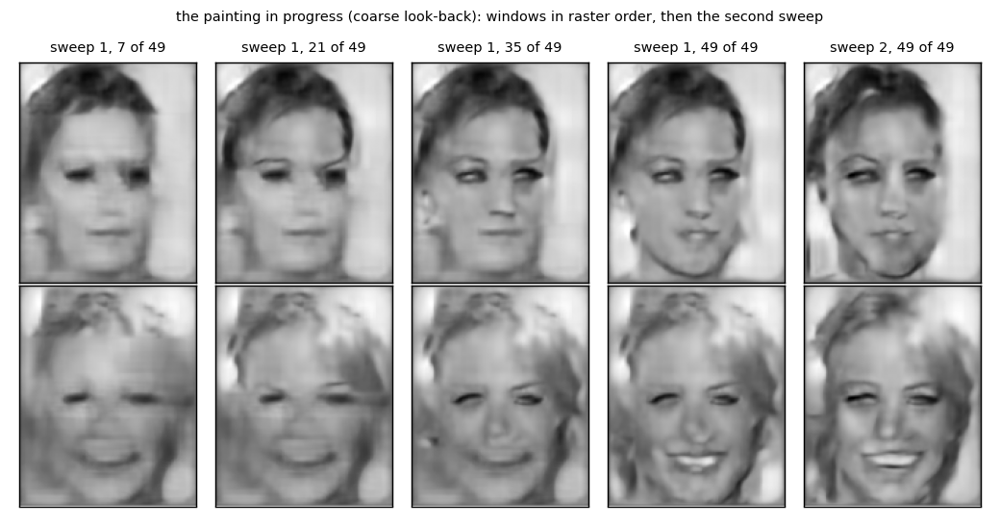
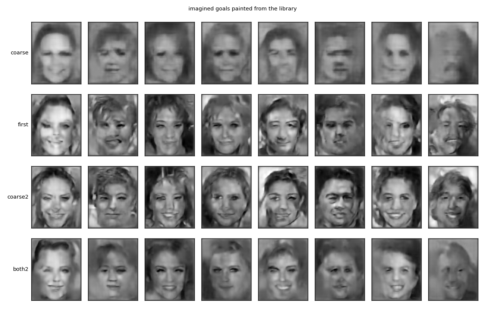
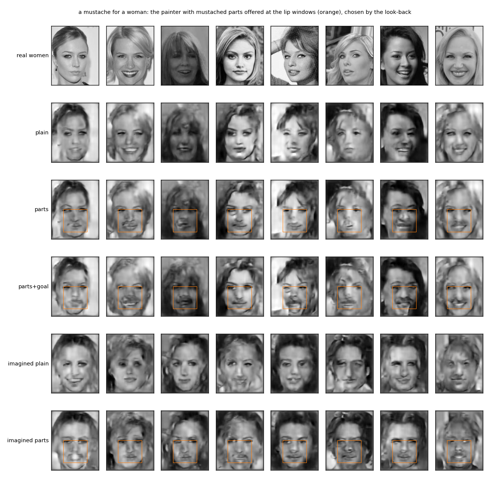
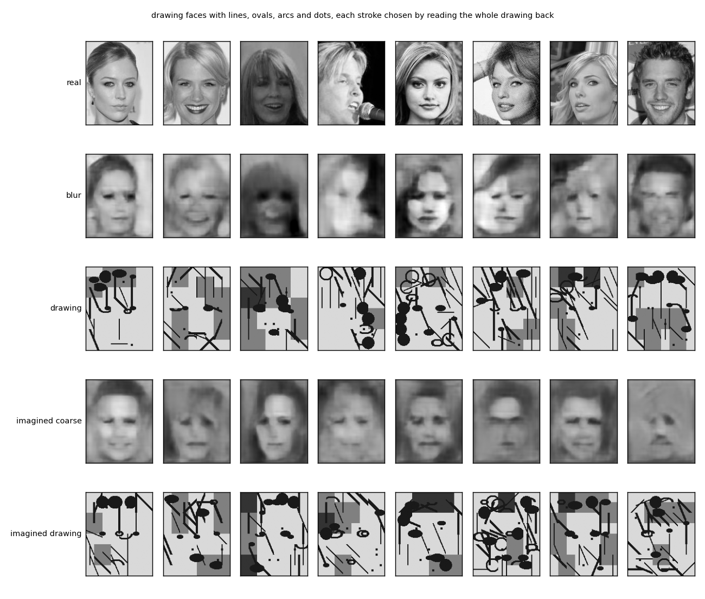
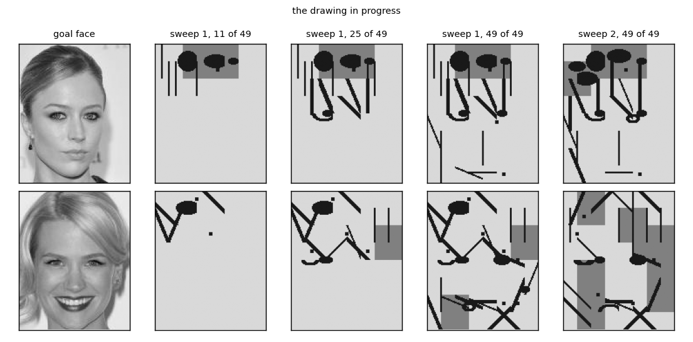

# `painter/` — draw parts from memory, look back at the whole, keep what fits

2026-09-26, the last experiment of the day. [`run.py`](run.py) reuses the forward stack and
whole-face decoder from [`faces/`](../faces/) and the 40x32 window decoder from
[`sample_windows/`](../sample_windows/), trains nothing, and writes [`results/`](results/)
(`summary.md`, `metrics.json`, `painter_faces.png`, `painting.png`, `painter_imagined.png`,
`run.log`). About five minutes.

## The idea

Lavender's description of how they imagine a face: a goal in the head, a coarse image from
it, then parts drawn sharp one at a time from what one already knows a part looks like, each
checked by looking back at the whole (does it still read as this face?) and at the part (does
it read as that part?), redrawn where off, in more than one pass. The detail does not come
from the coarse image. It comes from memory, chosen to fit, and the fit is checked by looking
back.

This is the answer to the two failures before it. The sampler in `sample_windows` gave
consistent parts that were averages. The nearest-window retrieval gave sharp parts that
agreed with nothing. The painter draws sharp parts from memory and chooses among them by the
look-back.

## The rig

Windows of 40x32 on a 7x7 grid at stride 20x16, feathered. A canvas holds the coarse render
underneath and the painted windows on top; a window can be replaced.

**The library.** For 1,000 training faces and every one of the 49 positions: the real
window's code, the part, and the code of the same window of that face's coarse render, the
key. 49,000 parts at poses. A part is looked up by key: the blurry region of whatever is on
the canvas now, which after the first few windows already includes painted neighbours.

**Painting a face from a goal code.**

```
canvas = the coarse render of the goal
for each sweep, for each of the 49 windows in raster order:
    key        = the code of that window of the current canvas, zoomed
    candidates = the 8 parts at this position with the nearest keys
    for each candidate: paste its render, read the whole canvas back, score it
    keep the best, paint it
```

Two scores. `coarse`: cosine between the goal and the read-back of the whole canvas with the
candidate in place. `both`: that plus the cosine between the candidate and the read-back of
its own window.

| arm | choice | sweeps |
|---|---|---|
| blur | nothing painted | 0 |
| first | the nearest part, no look-back | 1 |
| random | one of the 8 at random | 1 |
| coarse1 | the coarse look-back | 1 |
| coarse2 | the coarse look-back | 2 |
| both2 | both look-backs | 2 |
| from_real | the face's own parts; the ceiling, not available for an imagined face | 1 |

Goals: the codes of 300 test faces, so pixel error to the real face can be measured, and
eight imagined faces (pca64 samples). Scored by agreement, the cosine between the goal and
the read-back of the finished canvas, which is the measure of the parts agreeing with the
whole; pixel error; sharpness (mean absolute Laplacian, feathered, so seams do not count);
and the fine agreement of the chosen parts with their own read-back.

## Results

| arm | agreement with the goal | pixel error | sharpness | fine agreement |
|---|---|---|---|---|
| blur | 0.585 | **0.0194** | 0.0126 | |
| first | 0.592 | 0.0265 | 0.0165 | 0.866 |
| random | 0.561 | 0.0281 | 0.0161 | 0.857 |
| coarse1 | 0.746 | 0.0225 | 0.0177 | 0.853 |
| coarse2 | **0.768** | 0.0232 | **0.0183** | 0.837 |
| both2 | 0.562 | 0.0259 | 0.0126 | 0.923 |
| from_real | 0.800 | 0.0061 | 0.0191 | |

Imagined goals:

| arm | agreement | sharpness |
|---|---|---|
| coarse render | 0.502 | 0.0091 |
| first | 0.576 | 0.0149 |
| coarse2 | **0.763** | **0.0181** |
| both2 | 0.534 | 0.0090 |







**The look-back is what makes the parts agree.** The same library, the same candidates: taken
as retrieved, agreement with the goal is 0.59, no better than the coarse render; chosen by
looking back at the whole, 0.75 after one sweep and 0.77 after two, against 0.80 for the
face's own parts. Sharpness is at the ceiling too. Random choice among the candidates is
worse than the nearest, so the gain is the choosing, not the candidates.

**Sharp and consistent at once, for the first time today.** The `sample_windows` sampler was
consistent and blurry, its nearest-window arm sharp and inconsistent. The painted faces are
both. In the figure the smiling woman gets a smile, the singer an open mouth, and the parts
belong to one face each.

**Pixel error says whose parts they are.** The painted faces are further from the real pixels
than the coarse render, though closer than retrieval. The parts are other people's eyes and
mouths, chosen because they fit this face as the stack reads it. That is what imagining from
memory is, and the number is honest about it: agreement near the ceiling, pixels not.

**The second sweep matters.** Agreement rises again on the second pass, and the progress
figure shows why: the first sweep paints windows against a canvas that is mostly still blur,
and the second repaints them against a canvas of painted neighbours. The mouth in the second
row changes to the smile the goal asked for.

**Imagined faces come out as faces.** From a sampled code, the coarse render is a smudge with
a face in it; painted with the coarse look-back it is a sharp face that agrees with the code
it was imagined from, at 0.76 against the smudge's 0.50, and each is a different person.
These are the first imagined faces today that are sharp and coherent.

**The fine look-back, as weighted, does harm.** Adding the part's agreement with its own
read-back to the score let that term decide, since it runs near 0.9 while the coarse term
runs near 0.7, and it chooses parts that read back as themselves: smooth, generic ones.
Agreement drops to the coarse render's and sharpness with it. The fine check was mis-weighted,
not disproven; on its own it measures something different from fit.

## A mustache for a woman

[`mustache.py`](mustache.py), about two minutes. The painter chooses parts by fit, so to
get a mustache the lip windows have to be offered mustaches. At the six windows over the
upper lip the candidates are drawn only from the 34 mustached faces in the library, and the
look-back still chooses the one that keeps the whole reading as her (`parts`). A second
version also adds the mustache difference to the goal at the two top-map cells over the lip,
so the goal asks for it (`parts+goal`). 100 test women; the stack's own head on the finished
canvas.

| painting | P(Male) | P(Mustache) | P(No_Beard) |
|---|---|---|---|
| real women | 0.06 | 0.01 | 0.98 |
| plain | 0.05 | 0.00 | 0.99 |
| parts | 0.06 | 0.01 | 0.97 |
| parts+goal | 0.11 | **0.11** | 0.76 |
| real men with mustache | 0.98 | 0.85 | 0.07 |



**Offered mustaches and left to choose, the painter picks the faintest.** With the goal
unchanged, the look-back prefers, among the mustached windows, the one that changes her the
least, and the head sees no mustache at all. A faint shadow on the lip is visible on some
faces and on none to the stack.

**With the goal asking, she gets a faint one and stays a woman.** P(Mustache) rises from 0.00
to 0.11 and No_Beard drops from 0.99 to 0.76, while P(Male) moves from 0.05 to 0.11. In the
`faces` experiment the same edit by code arithmetic gave P(Mustache) 0.74 with P(Male) 0.73:
the bundle. Here the mustache is weaker and the gender is kept, because the parts are real
windows of a lip with a mustache, chosen to fit a woman's face, rather than a direction that
carries the beard and the man with it. It is a partial answer: a woman with a faint mustache,
by the head and by eye on about half the faces. The library has 34 mustaches, and the
look-back's whole-face check pulls toward the least of them. A stronger goal, more mustaches
in the library, or a fine check at the lip asking "is there a mustache here" would push it
further, and the last of those is the fine look-back again, with the right question.

## Lines, ovals and dots: does it draw like a child?

[`child.py`](child.py), under a minute. The same painter with a library of 118 drawn
primitives on a 40x32 window, lines at eight angles, three offsets and two thicknesses, oval
outlines and filled ovals, arcs up and down, dots, blanks and two grey fills, and a canvas of
blank paper with nothing of the face on it. Ink accumulates where windows overlap. For every
window every primitive is tried, the whole drawing is read back through the stack, and the
stroke that makes it read most like the goal is kept. Two sweeps, 16 test faces and 8
imagined ones.

| | agreement with the goal |
|---|---|
| blank paper | 0.118 |
| the coarse render | 0.584 |
| the drawing | **0.630** |

The head is right about the drawings as often as about the coarse renders: Male 0.88 against
0.88, Smiling 0.94 against 0.81, Blond Hair 1.00 against 0.75, Eyeglasses 0.94 against 1.00.
Imagined goals: 0.53 for the coarse render, 0.61 for the drawing.





**To the stack, the drawing is the face, better than its own render.** Twenty strokes chosen
by the look-back read back closer to the goal than the coarse render does, and carry the
attributes as well. The look-back does its job with any library.

**To a person, it is not a child's drawing.** A child draws a circle for the head, two ovals
for the eyes, an arc for the mouth: outlines of parts. The painter draws filled blobs where
the hair is dark, lines along the edges of the hair and jaw, grey fills for the background,
and a dot or a short line near the eyes and mouth. Of the strokes used in the eye region,
three were oval outlines and forty were filled ovals; in the mouth region, six were arcs and
forty-three were lines. What it draws is what the stack responds to, and the stack, trained
on photographs, responds to masses of shading and edges, not to the outlines a child uses.
The first face in the progress figure comes closest, two small ovals at eye level and a bar
for the mouth, and the rest are ink where the dark is.

**The choices are loose.** Half the windows are redrawn in the second sweep, because to the
stack many strokes are nearly equivalent. A child's strokes are not equivalent to a child.

**Lavender's reading.** That it has a style of its own, consistent from face to face, and
that the depictions are somewhat accurate: the blobs are where the hair is, the lines where
the edges are, the dots where the eyes are. Both readings stand. A fixed vocabulary of
strokes chosen by a fixed way of seeing is what a style is, and the stack's way of seeing is
a real one, only not a child's.

So the answer is: it draws like the stack sees, not like a child draws. A child's schema of a
face is a set of parts with outlines at poses, and the stack has no such thing; it has
shading. Which is one more way of saying what the day kept finding: the parts have to be in
the representation to be drawn, chosen, or reasoned about.

## What it says

The rebuild machinery was never the problem. Given the right window codes it rebuilds the
face. The problem was where the codes for an imagined face come from, and the answer that
works is Lavender's: from memory, a library of parts at poses, with the choice made by
looking back at the whole. The sampler failed because it asked one model to produce the part
from the blur; the retrieval failed because nothing checked; the painter draws from memory
and checks, and gets sharp and consistent together.

It is also the loop from the first day of the conversation, run for imagination rather than
recognition: a goal at the top, attention to a part, a candidate from the table of parts at
poses, a comparison against the goal, and another pass. The same table that recognises by
predicting parts at poses generates by choosing them.

## Caveats

- One seed; a library of 1,000 faces; 8 candidates; two sweeps; raster order. No search over
  any of these.
- The stack judges its own painting, so agreement can be satisfied by things a person would
  not accept, as the `loop` experiment showed. Here the candidates are real parts, which
  bounds the damage, and the pictures agree with the numbers, but a judge outside the stack
  has still not been used today.
- The fine look-back needs a weight, and possibly a different question (is this a plausible
  part, rather than does it read back as itself).
- Where to attend next is still a fixed order. The painter Lavender described goes where the
  disagreement is.
