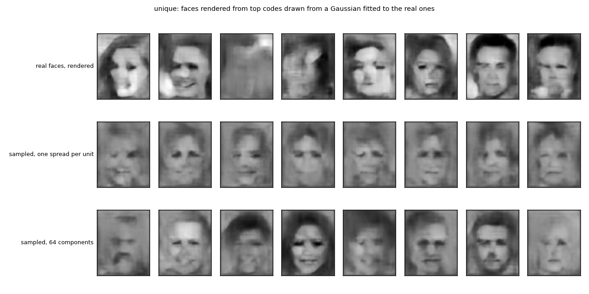
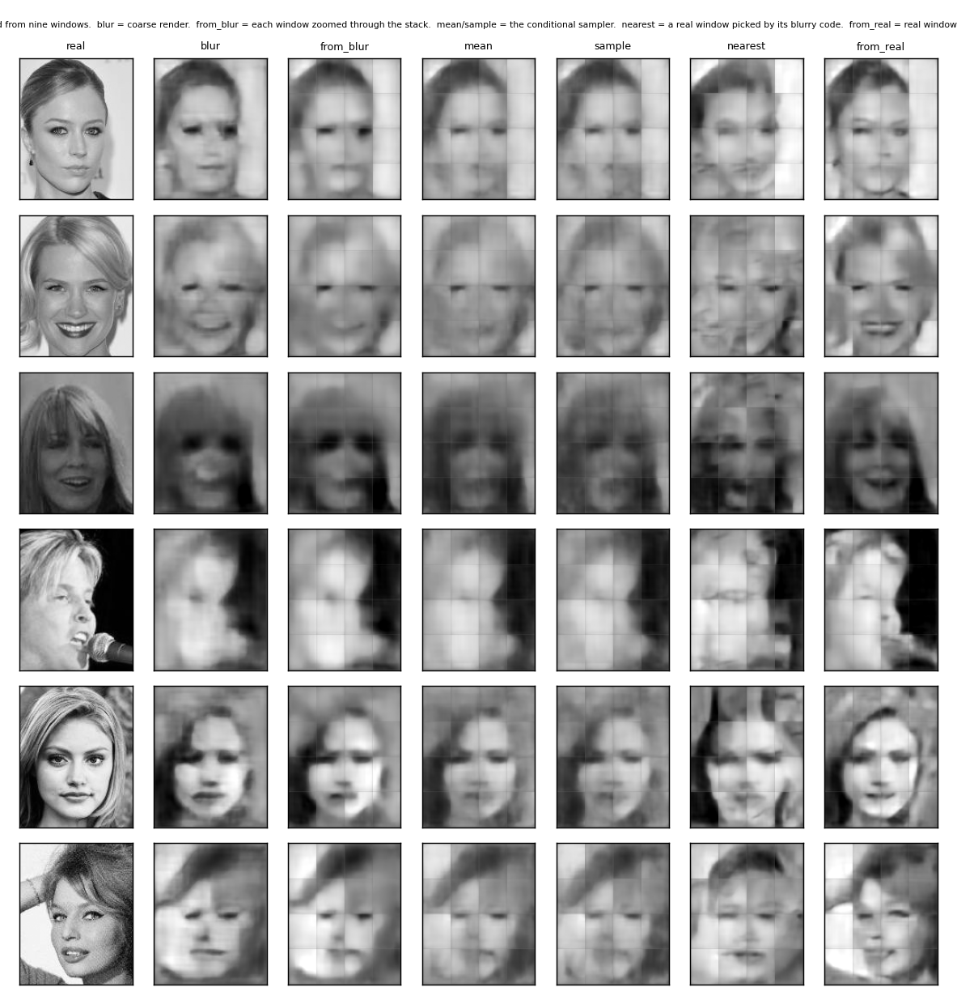
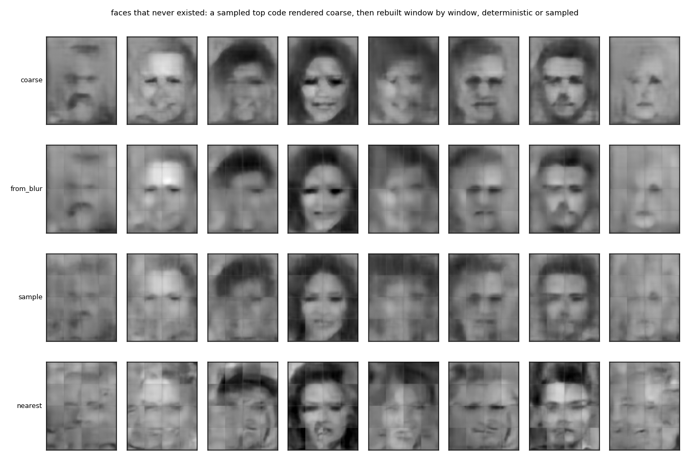
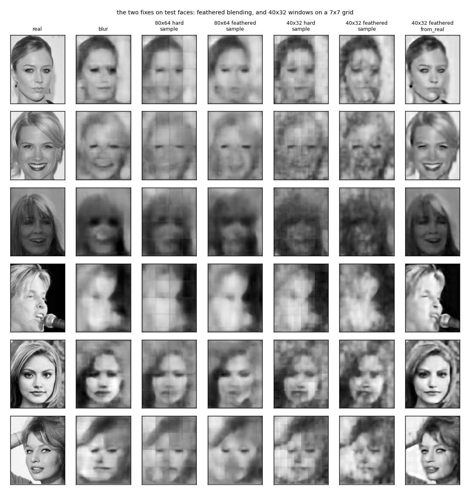
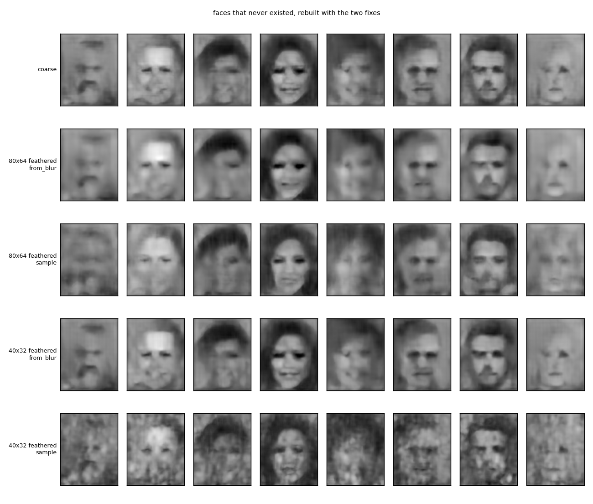

# `sample_windows/` — unique and crisp: sample a face, then sample its parts under a sliding window

2026-09-26. [`run.py`](run.py) reuses the three networks the [`faces/`](../faces/) experiment
trained, trains a 40x32 window decoder (saved in `results/win40.pt`, not in git) and two small
samplers, and writes [`results/`](results/) (`summary.md`, `metrics.json`, `samples.png`,
`rebuild.png`, `imagined.png`, `fixes.png`, `imagined_fixed.png`, `run.log`). Five minutes the
first time, two after.

## The idea

Lavender's proposal: make the forward output a distribution, sample the top code for a face
that never existed, render it coarse, then slide an attention window over the whole face and
sample each window's missing detail *conditioned on the coarse face*, so that the parts agree
with the whole and with each other, and the blurry parts get redrawn crisp. Unique from the
first sample, crisp from the second.

## The rig

**Unique.** A Gaussian fitted to the real top maps (5x4x256) of the training faces, two ways.
`diag`: a mean and a spread per unit, sampled independently. `pca64`: a Gaussian in the space
of the top 64 principal components, which keeps 52% of the variance and, more to the point,
the covariance between units. Sampled codes rendered with the whole-face decoder. Diversity
is the mean pixel distance between rendered faces, against the same for real faces rendered.

**Crisp.** A window of 80x64 (half the face) is zoomed twice to 160x128 and run through the
stack. Done to the coarse render, that gives `c`, the code of the blurry region. Done to the
real face, it gives `t`, the code the window decoder renders sharply. A conditional sampler
learns p(t | c): an encoder q(z | t, c), a prior p(z | c) and a decoder g(z, c), small MLPs
on the standardised 5120-dimensional codes, trained with squared error on t plus the KL
between q and p, on one random window per training face. The sampler never sees the window's
position; c says what is there.

**Rebuild.** Nine windows at stride 40x32 cover the face. Each window's code comes from one
of five sources, is rendered by the window decoder, shrunk, pasted, overlaps averaged:

| source | what it is |
|---|---|
| `from_blur` | the blurry region's own code, no sampler |
| `mean` | the sampler with z at the prior mean |
| `sample` | the sampler with z drawn from p(z \| c) |
| `nearest` | the real window code of the training window whose blurry code is nearest: a crisp candidate picked rather than an average |
| `from_real` | the real face's window code; the ceiling, not available for an imagined face |

Scored on 1,000 test faces by pixel error to the real face and by sharpness, the mean
absolute Laplacian, against the coarse render (`blur`) and the real face.

## Results

### Unique: sample along the covariance, not per unit

| codes drawn from | diversity |
|---|---|
| real faces, rendered | 0.259 |
| diag | 0.079 |
| pca64 | 0.168 |

Independent noise per unit averages out in the render and every sample is the mean face.
Sampling along the principal directions keeps the units moving together and gives distinct,
plausible, blurry faces: a bearded man, a dark-haired woman, a bald head. Two thirds of the
real spread from half the variance.

### Crisp: a sampled average is still an average

| way | pixel error | sharpness |
|---|---|---|
| real | 0 | 0.0607 |
| blur | 0.0192 | 0.0126 |
| from_blur | 0.0203 | 0.0119 |
| mean | 0.0205 | 0.0115 |
| sample | 0.0228 | 0.0115 |
| nearest | 0.0328 | **0.0162** |
| from_real | **0.0088** | 0.0173 |

**Zooming the blur through the stack does not sharpen it.** A blurry region's code is the
code of a blur, and it renders as one (0.0119 against 0.0126 for the blur itself).

**The sampler does not sharpen it either.** Mean and sample come out equally smooth, at
0.0115, below the blur. The latent is used, the KL settles at 72 nats and two samples of the
same face differ by 0.037 per pixel, but the difference is in shading, not in edges. A model
trained by squared error to predict the crisp code from the blurry one predicts the average
crisp code, and randomness added to an average is a shaded average. This is the blur of a
VAE, and moving it from the whole image to the window does not remove it.

**The eye and the numbers disagree here, and the record should say so.** Lavender's reading
of the rebuild figure is that the sampled faces are somewhat sharper than the mean ones and
that their details are more often right than averaged, a bit of a mess on some faces but
right. The Laplacian score does not see this (0.0115 for both), and the pixel error is worse
for the sample than for the mean (0.0228 against 0.0205), which is what any draw around an
average costs. The score is a crude measure of edge energy and cannot tell a right detail
from a wrong one. A judge that could, a person or a detector of parts, was not used. The
claim that stands from the numbers is only that the sampler does not add edge energy; whether
its draws are more often correct in their detail is open.

**Picking a real part is sharp and wrong, and it is a shortcut.** The nearest real window by blurry code gives
sharpness of 0.0162, close to the ceiling that the real codes give (0.0173), the only source
that sharpens without seeing the real face. But its pixel error is the worst in the table,
and the pictures say why: the tiles are crisp pieces of other people, an eye from one face
next to a cheek from another, and they agree neither with each other nor with the whole.
Part of the measured sharpness is the seams. It was run as a probe of the tension between
sharp and consistent, not as a proposal: retrieving a stored window is not generating one,
and Lavender's objection that it is a lot of shortcut is right.

**Even the ceiling is soft.** Real window codes cut the pixel error to less than half of the
blur's but reach only 0.0173 of the real face's 0.0607 sharpness. The window decoder, trained
by squared error on pixels, draws smoothly whatever its code. Sampling the code cannot buy
sharpness the decoder does not have.

### Both halves

Faces that never existed, rendered coarse from pca64 samples, then rebuilt. The deterministic
and the sampled rebuilds are the coarse face with tile seams. The nearest rebuild is a
patchwork of real crisp parts that do not belong together.

## Two fixes for the seams

The seams in the rebuilds are the window grid, not the kernels, which are 3x3 everywhere:
nine windows of 80x64 at stride 40x32 give steps every 40 rows and 32 columns, where the
number of windows covering a pixel changes and each window's own brightness shows. Two fixes,
both against the hard-edged grid above: feathering, each window's render fades to its edge
under a raised-cosine weight and overlaps are summed by weight; and smaller windows, a 40x32
decoder trained by mismatch on random quarter-size windows zoomed four times, with its own
sampler, on a 7x7 grid at stride 20x16.

| windows | source | pixel error | sharpness |
|---|---|---|---|
| 80x64 hard | from_blur | 0.0203 | 0.0119 |
| 80x64 hard | sample | 0.0227 | 0.0114 |
| 80x64 hard | from_real | 0.0088 | 0.0173 |
| 80x64 feathered | from_blur | 0.0204 | 0.0077 |
| 80x64 feathered | sample | 0.0228 | 0.0076 |
| 80x64 feathered | from_real | 0.0090 | 0.0130 |
| 40x32 hard | from_blur | 0.0193 | 0.0128 |
| 40x32 hard | sample | 0.0220 | 0.0155 |
| 40x32 hard | from_real | **0.0038** | 0.0237 |
| 40x32 feathered | from_blur | 0.0192 | 0.0078 |
| 40x32 feathered | sample | 0.0231 | 0.0095 |
| 40x32 feathered | from_real | **0.0038** | 0.0190 |

**Feathering removes the seams and a third of the "sharpness."** Pixel error does not move;
the Laplacian score drops by about a third for every source. That much of the earlier
sharpness was seams, and the feathered numbers are the ones to compare from now on.

**Smaller windows show what the window decoder can do with the right codes.** With the real
40x32 codes the rebuild's pixel error is 0.0038, a fifth of the coarse render's and less than
half of the 80x64 rebuild's, and the faces in the last column of the figure are recognisably
the people: teeth, eyes, the microphone. This is attention as a budget on a field bigger than
the budget, at full strength: 49 looks at a quarter of the face each.

**The sampler remains the bottleneck, and smaller windows make it worse.** Its 40x32 rebuilds
have a pixel error above the coarse render's and, on the imagined faces, come out as a
mottled texture: 49 codes each guessed from a blur, none agreeing with its neighbours. The
gap between the sampled and the real-code rows is the whole problem, and it is not a problem
of blending or of window size.

## What it says

The two halves are not symmetric. Uniqueness comes from sampling the coarse code, and it
works as soon as the sampling respects how the code's units move together. Crispness was
supposed to come from sampling the detail the coarse code leaves out, and with a squared-error
model it cannot: whatever is sampled, the model returns an average, because an average is what
it was trained to return.

Picking a real part instead of averaging gives the sharpness and loses the agreement. That is
the actual shape of the problem. Sharp and consistent pull in opposite directions here: the
average agrees and is blurry, the candidate is sharp and disagrees. The fixes sharpen the
picture of the problem rather than the faces: with correct window codes the rebuild is
nearly the face, so the codes are what has to be produced, and one-shot regression from a
blur cannot produce them. What would give both is a
part chosen or redrawn under a check against its neighbours and the whole, which is the
routine's compare step run on the parts, and which the fixed nine-window grid with
independent draws does not do. A library of real parts constrained by agreement, the
September parts-and-counting line, is the version that stays inside the project's rules.
Iterative redrawing and losses that reward sharp candidates are the versions the literature
uses.

## Caveats

- One seed; the sampler had ten epochs, one latent size, one weight on the KL. A different
  weight could trade the code error against the latent's use, but not the averaging.
- The nearest-neighbour library is thin: one random window per training face, 32,910 in all.
- The sharpness measure is a mean absolute Laplacian and rewards noise and seams as well as
  edges. Pixel error is the honest number and sharpness the suggestive one.
- Windows are a fixed grid. Where to attend, and redrawing under a check against the
  neighbours, is the loop, and it was not run.
