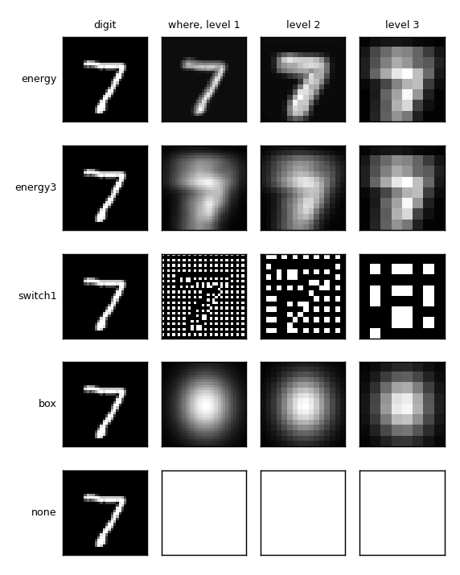
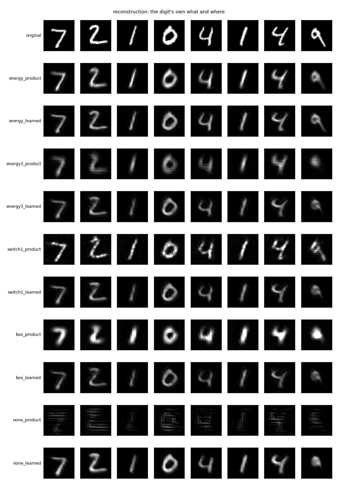
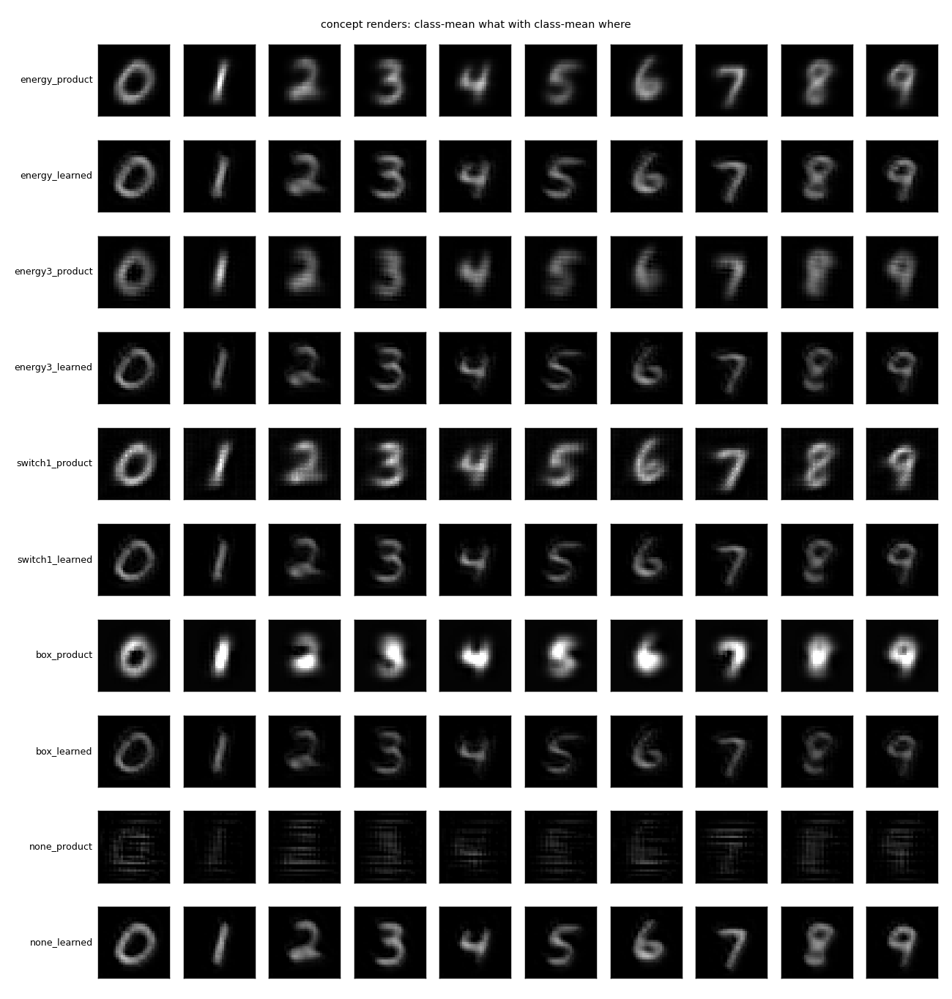
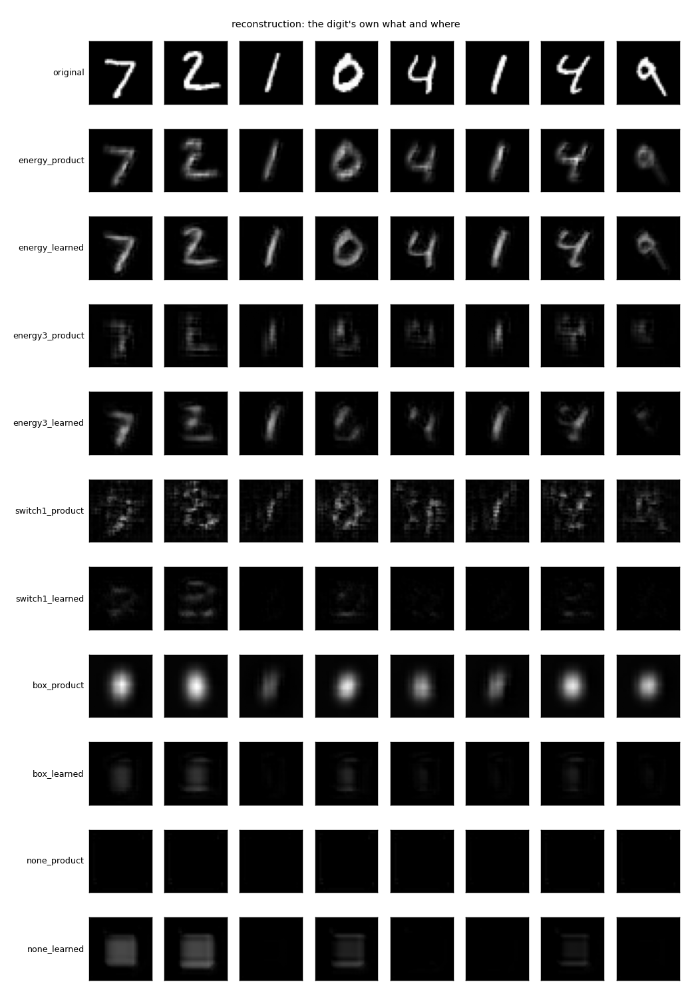
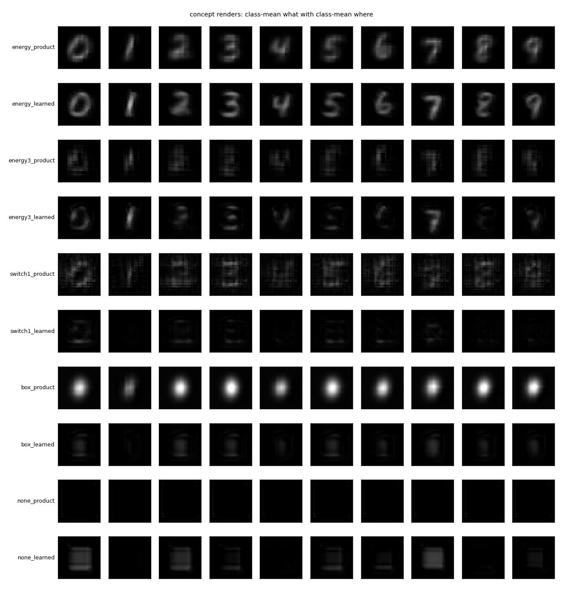

# `what_where/` — content and a content-free pointer: what can the backward path render?

2026-09-26. [`run.py`](run.py) trains and scores everything; `python run.py` writes
[`results/`](results/) (the what is the 4x4 top map) and `python run.py --what global`
writes [`results_global/`](results_global/) (the what is one 64-vector). About 100 seconds each.

## The question

[`feedback_render/`](../feedback_render/) showed that a backward path trained with the
winners' positions available learns to need them, and that those positions, the per-channel
switches, are most of the image anyway. Lavender's proposal was the dorsal and ventral split
done explicitly: extract a *where* code the same way the top map is a *what* code, by
throwing the other thing away, and give the backward path both. And do not unpool by hand:
let the backward path produce the full pre-pool map, near zero where nothing won, from the
content and the where. So: how coarse can the where be, and does the decoder render from
content plus a pointer?

## The rig

Same forward network as before (conv3x3 + ReLU + 2x2 max pool, 16, 32, 64 channels, trained
on the labels to 98.6%, frozen), same judge (98.9%), MNIST at 32x32, one seed, five epochs.

**Where codes.** All computed by summing across channels, so none of them knows what is
anywhere, only that something is. One map per level, at the pre-pool resolution.

| code | what it is |
|---|---|
| `energy` | the pre-pool activity summed over channels, divided by its max; 32x32, 16x16, 8x8 |
| `energy3` | the level-3 energy map alone (8x8), upsampled to the other levels |
| `switch1` | per pool, the one position where the summed activity peaks; two bits per pool, shared by all channels |
| `box` | the centre and spread of the level-1 energy, four numbers, as a Gaussian bump at every level |
| `none` | a map of ones: content alone |

**Two unpools.** `product`: the pooled content is copied into all four positions and
multiplied by the where map, no parameters. `learned`: a 3x3 conv reads the spread content
and the where map as one extra channel and is trained against the true pre-pool map. Either
way the transposed conv after it is trained on exactly what the unpool produces, and every
loss is local to its level.

**Two whats.** `grid`: the 4x4x64 top map as it is. `global`: the top map max-pooled over
its 4x4 grid to one 64-vector and broadcast back, so that no position survives in the
content and any position must come from the where code.

**Checks.** `recon`: the digit's own what and where. `where alone`: the all-class-mean what
with the digit's own where; if the judge names the digit, the where code is carrying content
and the rung is disqualified. `swap`: the digit's own where with the class-mean what of the
next class; the judge saying the next class means content decides, saying the digit's own
class means where decides. `concept`: class-mean what with class-mean where, ten renders.
Fractions named correctly by the judge; recon brightness-normalised.

**Own recogniser.** The judge is a stranger. The recogniser that matters for imagination is
the forward stack that produced the what. So every render is also fed back through the
forward stack: `own` is its head's accuracy on the render, and `code` is the cosine between
the what that was rendered and the what recomputed from the render, with the cosine to a
shuffled digit's what as the floor. If the code comes back, the network can tell what it
imagined even when the picture is poor.

## Results with the 4x4 top map as the what

| where | unpool | recon | where alone | swap: content / where | concept | own: recon / concept | code cos (floor) |
|---|---|---|---|---|---|---|---|
| energy | product | 0.958 | 0.953 | 0.01 / 0.89 | 10/10 | 0.945 / 10 | 0.95 (0.65) |
| energy | learned | 0.971 | 0.924 | 0.14 / 0.72 | 10/10 | 0.965 / 10 | 0.97 (0.65) |
| energy3 | product | 0.840 | 0.357 | 0.63 / 0.11 | 10/10 | 0.797 / 10 | 0.84 (0.60) |
| energy3 | learned | 0.914 | 0.140 | 0.93 / 0.02 | 10/10 | 0.905 / 10 | 0.92 (0.62) |
| switch1 | product | 0.923 | 0.566 | 0.25 / 0.36 | 9/10 | 0.942 / 10 | 0.96 (0.67) |
| switch1 | learned | 0.923 | 0.119 | 1.00 / 0.00 | 10/10 | 0.915 / 10 | 0.93 (0.62) |
| box | product | 0.764 | 0.098 | 0.93 / 0.00 | 10/10 | 0.754 / 9 | 0.83 (0.64) |
| box | learned | 0.909 | 0.101 | 1.00 / 0.00 | 10/10 | 0.892 / 10 | 0.91 (0.61) |
| none | product | 0.389 | 0.089 | 0.51 / 0.10 | 5/10 | 0.469 / 3 | 0.69 (0.54) |
| **none** | **learned** | **0.928** | 0.101 | 1.00 / 0.00 | 10/10 | 0.922 / 10 | 0.93 (0.63) |

(Second run of the same script; a few numbers moved by a point from the first run.)

**Content alone renders, once the unpool is learned.** The 4x4 top map with no where at all,
through a learned unpool, reconstructs 93% of the test digits and all ten class means. The
box, the only pointer that passes the where-alone control cleanly, adds nothing to that
(91%). Swapping the content in under a digit's own where produces the other class every
time. With this what, the where is not needed.

**And the network recognises its own renders.** Fed back through the forward stack, the
renders from content alone are named by its own head 92% of the time, all ten class means
included, and the recomputed what has cosine 0.93 to the what that was rendered, against a
floor of 0.63 to another digit's. The round trip closes: what was imagined is what comes
back.

**This overturns the previous experiment's "learned decoders cannot imagine."** There the
decoder was trained with the switches present and tested without, and the mixed arm reached
61%. Here the unpool is trained to produce the pre-pool map from spread content, using the
3x3 neighbourhood to decide where inside the pool a thing sits, and the transposed conv is
trained on that same input. The failure was a mismatch between what the decoder was trained
on and what it was given, not a limit of learning by mismatch.

**The fixed product needs a where; the learned unpool does not.** Content times a map of
ones is 40%; content times the box is 69%; the learned unpool ignores the where when the
content is there (where-alone at chance or near it for everything but the drawing).

**The where-alone control catches three of the five codes.** The per-level energy map is
the drawing (95% from where alone) and disqualified. The channel-free switches leak through
the product (57%) and the 8x8 blob leaks a little (34%): the shape of the blob says
something about the digit. Only the box and none are clean.

## Results with a position-free what

The same ten arms with the content max-pooled to one 64-vector.

| where | unpool | recon | where alone | swap: content / where | concept | own: recon / concept | code cos (floor) |
|---|---|---|---|---|---|---|---|
| energy | product | 0.949 | 0.942 | 0.00 / 0.93 | 10/10 | 0.918 / 10 | 0.97 (0.91) |
| energy | learned | 0.938 | 0.934 | 0.00 / 0.93 | 9/10 | 0.918 / 9 | 0.98 (0.91) |
| energy3 | product | 0.477 | 0.439 | 0.07 / 0.42 | 4/10 | 0.345 / 1 | 0.89 (0.85) |
| energy3 | learned | 0.451 | 0.438 | 0.06 / 0.43 | 5/10 | 0.351 / 3 | 0.90 (0.86) |
| switch1 | product | 0.376 | 0.301 | 0.09 / 0.29 | 6/10 | 0.501 / 5 | 0.94 (0.91) |
| switch1 | learned | 0.167 | 0.183 | 0.06 / 0.20 | 2/10 | 0.134 / 1 | 0.72 (0.71) |
| box | product | 0.117 | 0.097 | 0.12 / 0.09 | 1/10 | 0.209 / 2 | 0.88 (0.87) |
| box | learned | 0.107 | 0.097 | 0.10 / 0.10 | 1/10 | 0.115 / 1 | 0.68 (0.68) |
| none | product | 0.199 | 0.101 | 0.20 / 0.10 | 2/10 | 0.114 / 1 | 0.63 (0.63) |
| none | learned | 0.073 | 0.114 | 0.11 / 0.10 | 1/10 | 0.136 / 1 | 0.72 (0.71) |

The floor is high here because global whats are alike: every digit has most of the 64
features somewhere. What matters is the gap between the cosine and its floor, and for the
clean pointers there is none.

**A bag of features plus one pointer cannot render a digit.** With the position taken out of
the content, the box and nothing are at chance. The 8x8 blob and the channel-free switches
give 20 to 48%, but their where-alone scores are the same numbers and the swap says where
decides, so that is the where code's own leak, not content being placed. Only the full
energy map renders, and with it the content does not matter at all (swap 0.00 / 0.93): it is
the drawing, filled in.

**Not even the network's own recogniser gets it back.** Lavender's question was whether a
blurry imagination from a bag plus a pointer, unreadable to a stranger, would still be read
by the network that imagined it, the way one knows what one is thinking of without seeing
it clearly. No. The forward stack's own head names its renders from the box at 12% and from
nothing at 14%, chance. And the what recomputed from the render is no closer to the what
that was imagined than to a random other digit's: cosine 0.68 against a floor of 0.68. The
picture did not lose vividness. It lost the code. Knowing what one is imagining, in this
system, has to come from holding the code at the top, not from re-reading the render.

## What it says

The arrangement of the parts has to be somewhere. With the 4x4 top map it is in the what: 64
features at 16 coarse places, parts at positions, and from that the decoder can fill in the
rest on its own. Take the grid away and no single pointer for the whole object can put it
back, because a pointer says where the object is and nothing about where its parts are. So
the dorsal code that would work is not one location per object but one per part, which is
the table of parts at relative poses from the conversation, and the reason the cortex keeps
a retinotopic grid at every level rather than a bag at the top.

For the generative path: a decoder learned by local mismatch renders from content, and
imagines from a class mean, provided it is trained on the input it will be given and the
content keeps a coarse grid. The network recognises those renders as its own, and the code
survives the round trip; from a bag plus a pointer, it does not, and neither does the code. Position inside the pool comes from context, from the
neighbours, which is one of the three sources of where that were guessed at earlier. The
pointer's job is not to draw. It is to say which part of the grid to render, and at what
size, and that has not been tested here because every render was of the whole image.

## Caveats

- One seed, five epochs. The learned-unpool arms are within a few points of each other and
  the order among them should not be read.
- The where-alone renders through a learned unpool come out as one generic digit for every
  input (an 8 or 9 in the figure), which is what a decoder does with a mean content.
- The class-mean where maps used for the concept renders are blobs; for `switch1` they are
  soft distributions, not switches.
- The global what is a max over the grid, which is harsher than a class label with a
  learned embedding would be. A label plus pointer might do better than 64 numbers plus
  pointer, but the point stands for any code with no parts in it.
- The judge is a small CNN; the brightness-normalised score is the one quoted.
