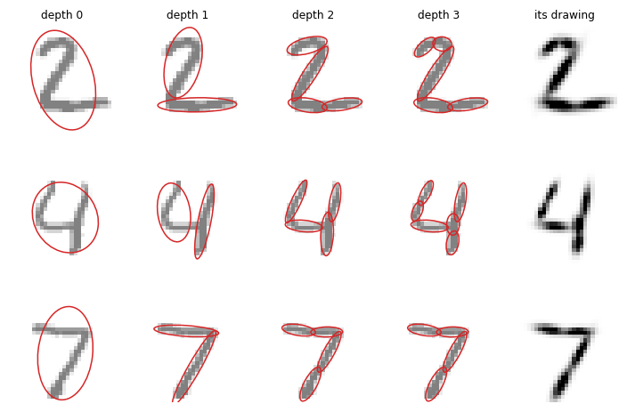
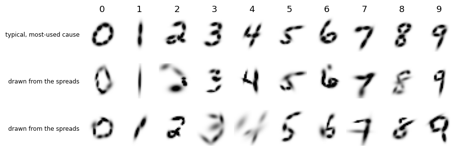
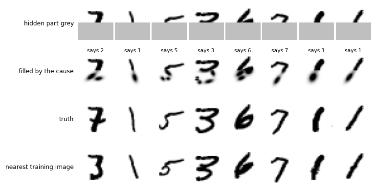
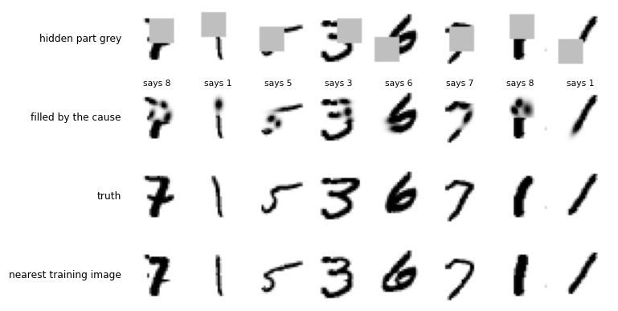

# `splat_causes/` — causes as trees of splats: explain the digit, name it, draw it, fill it in

2026-09-29. [`run.py`](run.py) runs the pilot, learns on 50,000 images, reads the test set,
draws from the label and fills in hidden parts, about ten minutes on the GPU.
[`controls.py`](controls.py) reads the same table with parts of the cost removed, runs the
same learning rule on raw pixels, and tries two smaller pixel-noise settings, about three
minutes. Both write to [`results/`](results/) (`summary.md`, `metrics.json`, `controls.json`,
`run.log`, `trees.png`, `draw_from_label.png`, `fill_bottom.png`, `fill_box.png`).

## The idea

The conversation that led here is in the [day README](../README.md). In short: recognition as
a search for an explanation, where each cause predicts what should be below it, is checked
against the input, and keeps what worked. There is one kind of atom, a splat (a Gaussian
fitted to some ink: where it is, which way it points, how long, how thick, how much ink). A
cause keeps, for each of its parts, a typical pose and how far that pose may vary, so the
tolerance belongs to the cause. Every choice is priced in one number, the cost of the
explanation. The label is part of the input, and at test it is missing, not contradicted.

This first version has whole-digit causes only: no part is shared between causes.

## The rig

**A cause** is one row of the table: a binary tree of splats. The root is the whole digit.
Each child is stored in its parent's frame (offset in units of the parent's length, shape
and ink relative to the parent's), so size and position come free. For every node and each
of its six numbers: a running average and a running spread, learned by counting. Plus how
often each label came with the cause. Shape is kept as the log of the covariance, so round
splats and angles that wrap around cause no trouble.

**Explaining an image.** Fit the root splat to all the ink. Shortlist 16 causes by how close
their typical drawing and root are to the image. Walk down each cause's tree: where the cause
splits a splat, split the image's ink the same way, children placed where the cause expects
them, then settled on the ink (four rounds of: each pixel to the likelier child, refit).
Placing the children first also settles which part is which.

**The cost**, in nats:

```
cost(image, cause) = − log(share of images this cause has explained)
                   + Σ over nodes and numbers: (value − typical)² / (2 spread²) + log spread + C0
                   + Σ over pixels: (image − drawing)² / (2 SIG_PIX²)
```

C0 is the price of writing one number to a precision of 0.1, so every splat costs something.
The drawing is the sum of the leaves' Gaussians, clipped at full ink. The cheapest cause is
the explanation, and its commonest label is the answer.

**Learning.** A right answer: the winning cause takes in the image's numbers. A wrong answer:
hire a new cause from the image, which is ART's hire on error. The label acts only here, as
the check: a cause learns only from images whose label it would have given. A new cause grows
as deep as its first image pays for. Its tree is split all the way down, then pruned from the
bottom: a split is kept only where the whole subtree under it draws more ink than its nodes
cost. After that, each leaf tries a split on every image the cause explains, and the split
becomes part of the cause when it has paid on average over ten images. A cause that keeps
being picked and keeps being wrong is retired; one that is only unused is kept.

**Drawing from a label.** Pick a cause in proportion to its count for the label. Walk down
its tree with typical values, or with values drawn from its spreads, and paint the leaves.

**Filling in.** With part of the image hidden (and the label hidden too), the hidden pixels
start as the cause's typical drawing. The cause is fitted to visible plus imagined ink, its
drawing replaces the imagined ink, and this repeats four times. Only visible pixels are
priced, and a node pays only for the share of its ink that is visible.

**Two fixes made after a 3,000-image trial run, before the reported run.**
- New causes first grew one level at a time, keeping a split only if it paid on its own.
  Splitting a big blob into two big blobs rarely draws the ink better, so 133 of 460 causes
  stopped at the root. Grow-then-prune replaced it, and root-only causes fell to 21 of 400.
- With half the image hidden, nodes whose ink was all hidden were still charged for their
  numbers, so causes with the fewest nodes won and filled with a smudge. Charging only the
  visible share raised the trial's hidden-half label score from 0.57 to 0.73.

**Controls.**
- The same table read with only the pixel term, or only the tree's surprise.
- The same learning rule on raw pixels: keep an image when the nearest kept image names it
  wrongly. This is Hart's condensed nearest neighbour (1968), with the same steps of 32.
- The nearest of as many random training images as the table has causes.
- The nearest of all 50,000 training images.
- The 09-27 counted table and CNN.

## Results

Every number is in [`results/summary.md`](results/summary.md). Two standard errors at 0.96
over 10,000 test images is 0.004; over the 1,000 hidden-part images it is 0.012.

| label hidden, whole image | test | numbers stored |
|---|---|---|
| **causes as trees of splats** | **0.9593** | 424,968 |
| same table, pixel term only | 0.6407 | |
| same table, tree surprise only | 0.8164 | |
| fast path alone (nearest typical drawing) | 0.8774 | |
| pixels, the same rule (Hart), 4,362 kept | 0.9322 | 3.4 million |
| pixels, 2,645 random training images | 0.9196 | 2.1 million |
| pixels, all 50,000 training images | 0.9666 | 39.2 million |
| counted table, 09-27 | 0.9725 | 144,000 |
| CNN, 09-27 | 0.9908 | 118,346 |

**The representation carries weight.** With the same learning rule, keeping a tree of
splats per cause beat keeping the raw image by 2.7 points (0.9593 against 0.9322), with
fewer items (2,628 against 4,362) and an eighth of the numbers. It also beat an equal number
of random training images by 4 points. It did not reach the nearest of all 50,000 images
(0.9666), the counted table (0.9725) or the CNN (0.9908).

**Both halves of the cost are needed, and the spreads do more.** Read with the pixel term
alone, the table falls to 0.64. Every shortlisted cause is fitted to the image before it is
priced, so any tree can be made to draw the ink, and how well it draws says little about
which digit it is. Read with only the tree's surprise, it reads 0.82: how far the parts had
to move from where this cause expects them, measured against this cause's own spreads. That
is the tolerance-belongs-to-the-cause idea, and it carries most of the answer. Together they
give 0.96. The search over the shortlist adds 8 points over the fast path's nearest typical
drawing (0.877).

**How deep the trees grew.** The depth was not set. Causes have a median of 7 leaves and at
most 17. Five of the 2,628 reached the safety cap of depth 6. Almost all of the depth was
decided on each cause's first image: the rule for growing a leaf later fired 93 times in
50,000 images.

**The table keeps growing.** 2,645 causes were hired in 50,000 images, still about 47 per
thousand at the end, and 17 were retired. That is the utility problem from the conversation.
Nothing yet merges causes, and every new cause makes the shortlist larger.

**The trees are what we meant** ([`trees.png`](results/trees.png)). A 7 splits into bar and
stem at depth 1, then each into halves. A 2 splits into its curve and its base. A 4 splits
into its left arm and its stem, then the crossbar separates. The drawing of each tree is a
smooth, slightly blurred version of the digit.



**Drawing from the label** ([`draw_from_label.png`](results/draw_from_label.png)). The
typical drawing of the most-used cause is readable for all ten digits. Drawn from the
spreads, most stay readable (0, 1, 5, 6, 7, 9), but some come apart where strokes should
join or smear into a blob (a 2, a 3, a 4). Each number is drawn on its own, so the relations
between sibling parts, which the tree does not store, are lost. This was predicted in the
conversation. With whole-digit causes this is retrieval of a stored prototype with a little
wobble: a probe of what the table holds, not generation.



**Hidden parts.** Naming the digit, label hidden too:

| | bottom half hidden | 12x12 box over ink |
|---|---|---|
| causes, fitted to visible + imagined ink | 0.841 | 0.862 |
| the same 1,000 images whole | 0.956 | 0.956 |
| nearest of all 50,000 training images, visible pixels | 0.915 | 0.931 |
| nearest of 2,645 random training images | 0.856 | 0.864 |
| nearest of Hart's 4,362 | 0.789 | 0.798 |

Fill error over the hidden pixels: 0.0659 (bottom half) and 0.1141 (box) for the causes.
The nearest of all 50,000 images gives 0.0668 and 0.1088, and the average training image
0.0703 and 0.1374.

Naming a partly hidden digit, the causes are level with an equal number of random images and
well below the nearest of all 50,000. By the error, the causes' fill is the best of the lot for
the bottom half and second for the box. But the error rewards blur: the average training
image, which is one grey smudge, is almost as good. The figures show what the error cannot.
The causes continue the right strokes into the hidden part, but faintly and in blobs, and the
1s in the figure get a heavy drop at the foot. The nearest training image fills with a real digit,
sharp, and sometimes the wrong one.





**The pixel noise.** The pilot chose 0.2 from 0.2, 0.3 and 0.5. Since that was the edge of
the grid, 0.1 and 0.15 were run afterwards: 0.15 read 0.9445 against 0.2's 0.9390 on 2,000
images, within the noise. The full run was not repeated.

## Reading

The first version of the design works end to end on the whole digit, with nothing fitted by
gradient:
- one table names the digit, draws it from its label, and fills in a hidden part;
- its trees are readable part by part;
- tolerance per cause is what does most of the naming.

As a way of storing what was learned, it beats raw pixels under the same learning rule, with
an eighth of the numbers. It does not yet beat simply keeping every training image, and it is
further still from the counted table and the CNN.

Three things are missing. Each is a step named in the conversation:

- **Shared parts.** Every cause has its own bar and its own loop. Naming a part that many
  causes use would shrink the table, give the growth rule something to do, and turn drawing
  from retrieval into composition.
- **What moves together.** Sampled drawings come apart at the joins because each number is
  drawn alone. A few moves-together directions per cause would hold the strokes together.
- **Merging and forgetting.** The table grows by about 47 causes per 1,000 images and nothing
  merges them. The test this design was meant for, learning digits 0–4 and then 5–9 without
  losing the first, was not run today.
